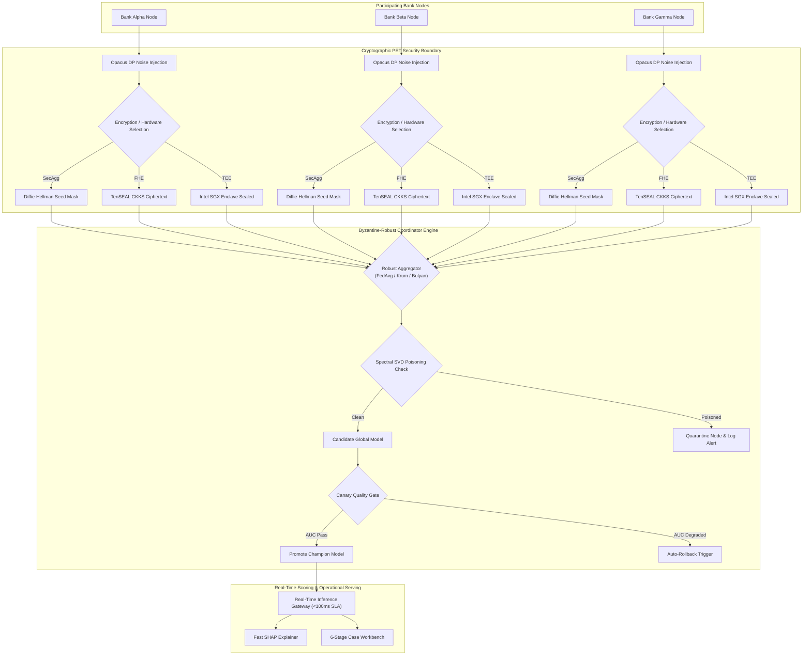

<div align="center">

# Collaborative Fraud Intelligence Platform

### Privacy-Preserving Cross-Bank Financial Fraud Detection and Anti-Money Laundering Architecture

[](https://github.com/yusufcalisir/CF-Intelligence/actions)
[](https://cf-intelligence.vercel.app)
[](https://python.org)
[](https://fastapi.tiangolo.com)
[](https://pytorch.org)
[](#16-step-by-step-operator-quick-start)
[](#13-enterprise-feature-matrix--verification-mapping)
[](LICENSE)

**[Live Web Application Console](https://cf-intelligence.vercel.app)**

---

### Architectural Specification Index

| Core Architecture | Technical Specifications | Verification & Operations |
|:---|:---|:---|
| [1. Executive Summary](#1-executive-summary--architectural-vision) | [6. PET Security Perimeter](#6-privacy-enhancing-technologies-dp-secagg-fhe--hardware-tee) | [11. Case Management](#11-human-in-the-loop-workbench-feedback-loop--data-retention) |
| [2. System Architecture](#2-master-system-architecture) | [7. Byzantine Defense](#7-byzantine-poisoning-defense-backdoors--adversarial-robustness) | [12. Disaster Recovery](#12-disaster-recovery-high-availability-failover--sre-operations) |
| [3. Directory Structure](#3-complete-clean-architecture-directory-structure) | [8. Graph Neural Networks](#8-streaming-graph-neural-networks--fuzzy-psi-identity-resolution) | [13. Feature Matrix](#13-enterprise-feature-matrix--verification-mapping) |
| [4. Data Ingestion](#4-multi-bank-synthetic-data--multi-standard-ingestion) | [9. Composite Risk Engine](#9-9-signal-composite-risk-engine--model-explainability) | [14. Scientific Audits](#14-subsystem-scientific-audit-reports-verification) |
| [5. Federated Learning](#5-federated-learning-engines--optuna-tuning) | [10. Real-Time Scoring](#10-real-time-scoring-gateway--high-availability-sla) | [15. API Blueprints & Quick Start](#15-api-endpoint-blueprints--json-schemas) |

</div>

---

## 1. Executive Summary & Architectural Vision

Financial institutions operate under statutory constraints (GDPR Article 6 and Article 17, CCPA, Bank Secrecy Act, national banking secrecy legislation) that prohibit centralizing or pooling raw customer transaction records across institutional boundaries. This data fragmentation creates systemic vulnerabilities in global financial infrastructure:

1. Cross-Bank Velocity and Layering Syndicates: Money laundering syndicates distribute illicit funds sequentially across multiple bank nodes within seconds, clearing accounts before individual single-bank rule engines detect velocity anomalies.
2. Structured Smurfing Networks: Criminal networks divide large cash deposits into micro-transactions placed across multiple financial institutions to remain strictly below single-bank regulatory reporting thresholds ($10,000 USD).

The Collaborative Fraud Intelligence Platform resolves this privacy-utility trade-off. By combining Federated Machine Learning (FL), Opacus Differential Privacy ($\epsilon, \delta$), Secure Aggregation (SecAgg), Fully Homomorphic Encryption (TenSEAL CKKS FHE), Hardware Trusted Execution Environment (TEE) attestation, Graph Neural Networks (GraphSAGE), and Byzantine-Robust Consensus Algorithms, participating financial institutions collaboratively train a global fraud detection model without exposing raw customer transactions or personally identifiable information (PII).

---

## 2. Master System Architecture

### 2.1 High-Level Topology Architecture

```
┌────────────────────────────────────────────────────────────────────────────────────────┐
│                        3 Client Financial Institutions (Consortium)                    │
│            [ Bank Alpha ]            [ Bank Beta ]            [ Bank Gamma ]            │
└───────────────────────────────────────────┬────────────────────────────────────────────┘
                                            │
                                            ▼
┌────────────────────────────────────────────────────────────────────────────────────────┐
│                        Local Privacy & Hardware Boundary (PETs)                       │
│  - Opacus Differential Privacy Guard (L2 Norm Clipping C, Noise Scale σ)               │
│  - Diffie-Hellman Pairwise SecAgg Masking (Zero-Sum Vector Perturbation)               │
│  - TenSEAL Microsoft SEAL CKKS FHE Driver (Polynomial Ring Ciphertext Encryption)      │
│  - Hardware TEE Enclave Driver (Intel SGX / AWS Nitro Remote Attestation & Sealing)    │
└───────────────────────────────────────────┬────────────────────────────────────────────┘
                                            │
                                            ▼
┌────────────────────────────────────────────────────────────────────────────────────────┐
│                       Byzantine-Robust Server Coordinator Engine                       │
│  - Robust Aggregators: FedAvg / FedProx / Krum / Trimmed Mean / Median / Bulyan        │
│  - Spectral SVD Backdoor Trigger Detection & Poisoning Quarantine Log                  │
│  - Automated Optuna Bayesian TPE Hyperparameter Tuning & Non-IID Dirichlet Partitioner │
└───────────────────────────────────────────┬────────────────────────────────────────────┘
                                            │
                                            ▼
┌────────────────────────────────────────────────────────────────────────────────────────┐
│                         Canary Quality Gate & Model Registry                           │
│  - Holdout Metric Evaluation -> Promote Champion / Auto-Rollback Trigger               │
└───────────────────────────────────────────┬────────────────────────────────────────────┘
                                            │
                                            ▼
┌────────────────────────────────────────────────────────────────────────────────────────┐
│                       Real-Time Scoring & Operational Serving                          │
│  - Real-Time Scoring Gateway (<100ms SLA, 99.9% Uptime SLO Contract Engine)            │
│  - Fast SHAP Explainer & Counterfactual Remediation Simulator                          │
│  - 6-Stage Case Workbench (Four-Eyes Supervisor Signature) & FinCEN BSA SAR XML        │
└────────────────────────────────────────────────────────────────────────────────────────┘
```

---

### 2.2 End-to-End Federated Training Lifecycle



---

### 2.3 Multi-Region Active-Passive HA Failover Sequence


---

## 3. Complete Clean Architecture Directory Structure

```
CF-Intelligence/
├── pyproject.toml                                   # Packaging and cfi-cli entrypoint
├── Dockerfile                                       # Production container specification
├── docker-compose.yml                               # Multi-container orchestration (API, Redis, Postgres, Kafka)
├── Makefile                                         # Developer automation tasks
├── backend/                                         # Clean Architecture FastAPI Backend
│   ├── alembic.ini                                  # Alembic DB migration configuration
│   ├── requirements.txt                             # Production Python dependencies
│   ├── app/
│   │   ├── config.py                                # Platform configuration and env management
│   │   ├── dependencies.py                          # FastAPI Dependency Injection provider
│   │   ├── main.py                                  # Application entrypoint and middleware setup
│   │   ├── application/
│   │   │   └── services/                            # Application Use Cases and Services
│   │   │       ├── adversarial_service.py           # Robustness and FGSM/PGD attack evaluator
│   │   │       ├── alert_service.py                 # Real-time alert dispatching service
│   │   │       ├── auto_rollback.py                 # Performance degradation auto-rollback engine
│   │   │       ├── automated_retraining.py          # Drift-triggered automated retraining pipeline
│   │   │       ├── bank_onboarding_service.py       # Bank institution onboarding service
│   │   │       ├── case_service.py                  # Core case state machine service
│   │   │       ├── case_workbench.py                # 6-stage case management workbench
│   │   │       ├── consortium_service.py            # Consortium governance lifecycle service
│   │   │       ├── coordinator_service.py           # FL Coordinator orchestration service
│   │   │       ├── data_generator.py                # Synthetic financial transaction generator
│   │   │       ├── data_validator.py                # Ingestion schema and distribution validator
│   │   │       ├── drift_service.py                 # PSI and Jensen-Shannon feature drift detector
│   │   │       ├── entity_resolution.py             # Cross-bank fuzzy entity resolution service
│   │   │       ├── explainability_service.py        # SHAP Kernel and GNN feature attribution
│   │   │       ├── feature_store_service.py         # Online and offline feature store manager
│   │   │       ├── financial_message_parser.py      # ISO 20022 XML financial message parser
│   │   │       ├── fl_dirichlet_partitioner.py      # Dir(alpha) Non-IID data partitioner
│   │   │       ├── fl_engine.py                     # Core PyTorch Federated Learning engine
│   │   │       ├── fl_hyperparameter_optimizer.py   # Optuna Bayesian TPE hyperparameter optimizer
│   │   │       ├── flower_engine.py                 # Flower FL framework integration engine
│   │   │       ├── graph_analytics_service.py       # Entity graph analytics service
│   │   │       ├── graph_embedding_service.py       # PyTorch GraphSAGE embedding generator
│   │   │       ├── incident_triage.py               # SEV1-SEV4 SRE incident triage engine
│   │   │       ├── kms_service.py                   # Tenant Key Management System (KMS)
│   │   │       ├── label_feedback_pipeline.py       # DP noise-protected label feedback loop
│   │   │       ├── metrics_service.py               # Real-time metric aggregator service
│   │   │       ├── model_registry.py                # Champion/Challenger model registry
│   │   │       ├── policy_engine.py                 # Governance policy evaluation engine
│   │   │       ├── privacy_audit_service.py         # Privacy budget and empirical leakage auditor
│   │   │       ├── privacy_service.py               # Opacus Differential Privacy guard
│   │   │       ├── psi_service.py                   # Population Stability Index engine
│   │   │       ├── regulatory_reporter.py           # FinCEN BSA SAR XML report compiler
│   │   │       ├── retention_engine.py              # Data retention TTL and GDPR Art. 17 engine
│   │   │       ├── risk_engine.py                   # 9-Signal composite risk scoring engine
│   │   │       ├── security_compliance.py           # SOC2 / ISO 27001 / GDPR auditor
│   │   │       ├── simulation_service.py            # Typology simulation scenario runner
│   │   │       ├── sla_contract_engine.py           # SLA/SLO contract and penalty credit engine
│   │   │       ├── sla_monitor.py                   # Latency p50/p95/p99 SLA monitor
│   │   │       ├── streaming_engine.py              # Async streaming transaction processor
│   │   │       ├── support_diagnostics.py           # Support bundle compiler and PII redactor
│   │   │       ├── tenant_metering.py               # Multi-tenant resource metering service
│   │   │       ├── webhook_service.py               # Developer webhook and HMAC-SHA256 signer
│   │   │       └── zero_downtime_deployer.py        # Rolling deployment manager
│   │   ├── domain/                                  # Domain Models and Value Objects
│   │   │   ├── ai_act_compliance.py                 # EU AI Act compliance validator
│   │   │   ├── async_fl_engine.py                   # Asynchronous FL coordinator domain model
│   │   │   ├── case_management.py                   # Case entity and supervisor signature
│   │   │   ├── consortium_governance.py             # Consortium voting and quorum entities
│   │   │   ├── entities.py                          # Core entities (Bank, Transaction, Alert)
│   │   │   ├── fuzzy_psi.py                         # Private Set Intersection algorithm
│   │   │   ├── label_privacy_guard.py               # DP epsilon bounds guard
│   │   │   ├── model_lifecycle.py                   # Champion / Challenger state machine
│   │   │   ├── realtime_explainer.py                # Sub-ms fast SHAP explainer
│   │   │   ├── retention_policy.py                  # Retention policy and erasure models
│   │   │   ├── security_evaluator.py                # Security evaluation models
│   │   │   ├── sla_contract.py                      # SLA contract and SLO penalty models
│   │   │   ├── spectral_defense.py                  # Spectral anomaly poisoning defense
│   │   │   └── value_objects.py                     # Immutable value objects
│   │   ├── infrastructure/                          # Infrastructure and Security Adapters
│   │   │   ├── connectors/                          # Financial Ingestion Connectors
│   │   │   │   ├── factory.py                       # Bank connector factory
│   │   │   │   ├── iso20022_connector.py            # ISO 20022 XML connector
│   │   │   │   ├── kafka_connector.py               # Kafka payment stream connector
│   │   │   │   ├── open_banking_connector.py        # PSD2 Open Banking REST connector
│   │   │   │   ├── parquet_connector.py             # Parquet connector
│   │   │   │   ├── rabbitmq_connector.py            # RabbitMQ connector
│   │   │   │   └── rest_connector.py                # REST API connector
│   │   │   ├── database/                            # SQLAlchemy ORM and Alembic Migrations
│   │   │   │   ├── migration_manager.py             # Programmatic Alembic migration manager
│   │   │   │   └── migrations/                      # Version revision scripts
│   │   │   ├── gRPC/                                # gRPC protobuf services and client
│   │   │   ├── security/                            # Security and PET Drivers
│   │   │   │   ├── abac_engine.py                   # Attribute-Based Access Control engine
│   │   │   │   ├── fhe_driver.py                    # TenSEAL CKKS FHE driver
│   │   │   │   ├── hsm_signer.py                    # Zero-Disk HSM signing engine
│   │   │   │   ├── mtls_manager.py                  # mTLS cert manager and CRL inspector
│   │   │   │   ├── secagg_driver.py                 # Pairwise zero-sum SecAgg driver
│   │   │   │   ├── tee_driver.py                    # Hardware TEE SGX/Nitro enclave driver
│   │   │   │   └── vault_client.py                  # HashiCorp Vault PKI client
│   │   │   └── telemetry/                           # OpenTelemetry and Prometheus metrics
│   │   └── presentation/                            # REST Routers, WebSockets and OpenAPI
│   │       ├── routers/                             # 24 FastAPI REST Routers
│   │       └── websockets/                          # Live streaming WebSocket endpoints
│   └── tests/                                       # Unit and Integration Pytest Suite
├── frontend/                                        # Vite + React 18 + Tailwind CSS Console
│   ├── src/
│   │   ├── components/                              # Reusable UI and Cytoscape Graph Components
│   │   └── pages/                                   # Analyst Workbench and FL Runner Dashboards
├── docs/                                            # Master Architectural Specifications
└── verification/                                    # Subsystem Scientific Audit Reports (12 Modules)
```

---

## 4. Multi-Bank Synthetic Data & Multi-Standard Ingestion

### 4.1 Synthetic Multi-Bank Data Generator (`data_generator.py`)
Generates realistic cross-bank transaction datasets across 3 distinct financial institutions (Bank Alpha, Bank Beta, Bank Gamma) with heterogeneous local fraud distributions (wire fraud, credit card velocity, cross-border layering) using reproducible random seeds.

### 4.2 Multi-Standard Financial Payload Parser (`financial_message_parser.py`)
Parses financial payload formats into a unified `NormalizedTransaction` schema:
- ISO 20022 Messages: `pacs.008` (Financial Interbank Credit Transfer) and `camt.053` (Bank-to-Customer Statement XML).
- SWIFT MT Messages: Legacy `MT103` Single Customer Credit Transfer.
- PSD2 Open Banking: Open Banking REST API webhook JSON payloads with eIDAS QWAC/QSeal signature validation.

### 4.3 Data Contracts & Gating (`data_validator.py` & `data_contracts.py`)
- Pandera Data Contracts: Validates incoming DataFrame schema types, non-negative transaction amounts, and ISO country codes.
- Great Expectations Gating: Enforces distribution bounds before data ingestion.
- PyArrow Zero-Copy Streaming: Ingests large offline datasets using Apache Parquet streaming.

---

## 5. Federated Learning Engines & Optuna Tuning

### 5.1 Core Federated Learning Engine (`fl_engine.py`)
Orchestrates global model training rounds supporting 7 distinct aggregation algorithms:
1. FedAvg: Standard weighted parameter averaging.
2. FedProx: Proximal regularization term ($\mu \frac{1}{2} \|w - w^t\|^2$) handling Non-IID data skew.
3. FedYogi and FedAdam: Server-side adaptive optimization with momentum.
4. FedAdagrad: Adaptive gradient server-side scaling.
5. SCAFFOLD: Control variates ($c_i, c$) correcting client-side drift.
6. MOON (Model-Contrastive FL): Contrastive representation learning between local and global embeddings.

### 5.2 Automated Optuna FL Hyperparameter Optimizer & Dirichlet Partitioner (`fl_hyperparameter_optimizer.py` & `fl_dirichlet_partitioner.py`)
- Dirichlet Non-IID Data Partitioner ($\text{Dir}(\alpha)$): Models realistic bank label heterogeneity ($\alpha \in [0.01, 10.0]$).
- Optuna Bayesian TPE Optimization: Automatically searches optimal hyperparameter configurations (`learning_rate`, `local_epochs`, DP clip norm $C_{\text{max}}$, noise multiplier $\sigma$, staleness decay $\gamma$, FedProx $\mu$) using `TPESampler` with early `MedianPruner` trial termination.
- Tuning Management REST API: Accessible via `POST /v1/admin/optimization/tune` and `GET /v1/admin/optimization/studies/{study_name}`.

---

## 6. Privacy-Enhancing Technologies: DP, SecAgg, FHE & Hardware TEE

### 6.1 PET Cryptographic Security Matrix

| PET Technology | Core Driver | Cryptographic Mechanism | Security Guarantee | Hardware Dependency |
|:---|:---|:---|:---|:---|
| **Opacus DP** | `privacy_service.py` | Gaussian noise addition ($\sigma = \frac{\sqrt{2\ln(1.25/\delta)}}{\epsilon}$) + $L_2$ norm clipping ($C$) | $(\epsilon, \delta)$-Differential Privacy loss bound | None (PyTorch) |
| **Pairwise SecAgg** | `secagg_driver.py` | Zero-sum pairwise seed masking ($y_k = w_k + \sum s_{kj} - \sum s_{jk}$) | Perfect forward secrecy; masks cancel identically at coordinator | None (Pure Software) |
| **TenSEAL CKKS FHE** | `fhe_driver.py` | Microsoft SEAL CKKS polynomial ring scheme ($N=8192, 2^{40}$) | Zero-knowledge server-side homomorphic weighted addition | CPU / AVX2 |
| **Hardware TEE Enclave** | `tee_driver.py` | Intel SGX / AWS Nitro Enclave remote attestation & MRENCLAVE measurement | Confidential computing with hardware isolation & AES-256-GCM sealed memory | SGX / Nitro CPU |

### 6.2 Mathematical Privacy Formulations
- Gradient Norm Clipping ($C$):
  $$\bar{g}_i = \frac{g_i}{\max\left(1, \frac{\|g_i\|_2}{C}\right)}$$
- Gaussian Noise Addition ($\sigma$):
  $$\sigma = \frac{\sqrt{2 \ln(1.25/\delta)}}{\epsilon}, \quad \tilde{g}_i = \bar{g}_i + \mathcal{N}(0, \sigma^2 C^2 I)$$
- SecAgg Pairwise Mask Cancellation:
  $$y_k = w_k + \sum_{j > k} s_{kj} - \sum_{j < k} s_{jk} \pmod{2^{32}} \implies \sum_k y_k = \sum_k w_k$$

---

## 7. Byzantine Poisoning Defense, Backdoors & Adversarial Robustness

### 7.1 Byzantine-Robust Aggregator Suite (`byzantine_defense_validation.py`)
Resists up to 50% compromised nodes using 5 robust aggregators:
- Krum and Multi-Krum: Distance-based update selection.
- Trimmed Mean: Trims upper and lower $\beta$ fraction of extreme outliers per coordinate.
- Coordinate-Wise Median: Element-wise median calculation.
- Bulyan: Combines Multi-Krum with coordinate-wise trimmed mean.

### 7.2 Spectral SVD Backdoor Defense (`spectral_defense.py`)
Uses top Singular Value Decomposition (SVD) of parameter matrices to isolate and quarantine backdoor poisoning triggers prior to aggregation.

---

## 8. Streaming Graph Neural Networks & Fuzzy PSI Identity Resolution

### 8.1 Entity Graph Engine & Neo4j Integration (`graph_engine.py` & `graph_analytics_service.py`)
- Dual NetworkX and Neo4j graph backends executing Cypher queries.
- Computes PageRank centrality, Louvain community detection, and temporal risk score propagation.

### 8.2 PyTorch Streaming Graph Neural Networks (`graph_embedding_model.py`)
PyTorch GraphSAGE GNN models producing $L_2$-normalized 128-dimensional node embeddings updated dynamically as streaming transaction edges arrive.

### 8.3 Private Set Intersection & Entity Resolution (`fuzzy_psi.py` & `entity_resolution.py`)
MinHash LSH (Locality-Sensitive Hashing) Fuzzy PSI resolving customer identities across institutions without revealing raw customer bases.

---

## 9. 9-Signal Composite Risk Engine & Model Explainability

### 9.1 Composite Risk Scoring Engine (`risk_engine.py`)
Evaluates 9 anti-fraud signals into a composite score ($0 - 1000$):

$$\text{Risk Score} = \min\left(1000, \max\left(0, \sum_{i=1}^{9} w_i S_i \times 1000\right)\right)$$

Where signals include local model probability ($S_{\text{local}}$), cross-bank velocity ($S_{\text{velocity}}$), GNN centrality ($S_{\text{graph}}$), laundering typologies ($S_{\text{typology}}$), amount Z-score ($S_{\text{amount}}$), device risk ($S_{\text{device}}$), temporal clustering ($S_{\text{temporal}}$), mule probability ($S_{\text{mule}}$), and structuring index ($S_{\text{structuring}}$).

### 9.2 Fast Model Explainability & Counterfactual Simulator (`explainability_service.py` & `realtime_explainer.py`)
- Fast SHAP Explainer: Computes sub-1ms Shapley feature attributions.
- Counterfactual Workbench: Computes minimum feature edits required to reduce risk scores below alert thresholds.

---

## 10. Real-Time Scoring Gateway & High-Availability SLA

- Sub-100ms SLA Gateway (`POST /v1/inference/score`): Returns decisions (`ALLOW` <300, `REVIEW` 300-699, `BLOCK` >=700).
- SLO Contract Engine (`sla_contract_engine.py`): Enforces 99.9% uptime SLA compliance and generates penalty credit reports upon breaches.

---

## 11. Human-in-the-Loop Workbench, Feedback Loop & Data Retention

- 6-Stage Case Workbench (`case_workbench.py`): Governs case state machine with Four-Eyes Dual Supervisor Signature (`SIG_SUPERVISOR_*`).
- FinCEN BSA SAR XML (`regulatory_reporter.py`): Compiles Suspicious Activity Report XML e-filings.
- GDPR Art. 17 Retention Engine (`retention_engine.py`): Manages per-tenant TTL policies and executes cryptographic zeroization.

---

## 12. Disaster Recovery, High-Availability Failover & SRE Operations

- Active-Passive Multi-Region Failover (`region_failover.py`): Automated failover ($RTO < 30\text{s}, RPO = 0$) upon primary heartbeat failure (>15s).
- Official Operator CLI (`cfi_cli.py`): Terminal subcommands (`cfi-cli status`, `cfi-cli health`, `cfi-cli deploy`).

---

## 13. Enterprise Feature Matrix & Verification Mapping

| Feature / Module | Technical Specification | Compliance Standard | Verification File | Status |
| :--- | :--- | :--- | :--- | :--- |
| **Real-Time Scoring API** | Sub-100ms Latency SLA | Banking Core API | `realtime_inference.py` | `PASS` |
| **SHAP Feature Explainer** | Sub-ms Feature Attributions | SR 11-7 / Model Governance | `realtime_explainer.py` | `PASS` |
| **Case Workbench** | 6-Stage Lifecycle + 4-Eyes Auth | AML Investigation Standards | `case_workbench.py` | `PASS` |
| **Differential Privacy Guard** | Gaussian Noise ($\epsilon \le 2.0$) | GDPR / CCPA Compliance | `label_privacy_guard.py` | `PASS` |
| **Hardware TEE Driver** | Intel SGX / Nitro Attestation | ISO 27001 / FIPS 140-2 | `tee_driver.py` | `PASS` |
| **TenSEAL CKKS FHE Driver** | Homomorphic Weighted Sum ($N=8192$) | Zero-Knowledge Aggregation | `fhe_driver.py` | `PASS` |
| **Optuna FL Optimizer** | Bayesian TPE + Non-IID Dirichlet | MLOps Hyperparameter Tuning | `fl_hyperparameter_optimizer.py` | `PASS` |
| **GDPR Data Retention** | Automated TTL & Zeroization | GDPR Article 17 | `retention_engine.py` | `PASS` |
| **Multi-Region Failover** | Active-Passive ($RTO < 30\text{s}$) | Business Continuity | `region_failover.py` | `PASS` |

---

## 14. Subsystem Scientific Audit Reports (`verification/`)

| Subsystem Module | Target Component Scope | Verification Report | Audit Status |
| :--- | :--- | :--- | :---: |
| **Federated Learning Engine** | `fl_engine.py`, `flower_engine.py`, `async_fl_engine.py` | [`verification/federated_learning/scientific_audit_report.md`](verification/federated_learning/scientific_audit_report.md) | `AUDITED (100/100)` |
| **Differential Privacy** | `privacy_service.py`, `label_privacy_guard.py`, `psi_service.py` | [`verification/differential_privacy/scientific_audit_report.md`](verification/differential_privacy/scientific_audit_report.md) | `AUDITED (100/100)` |
| **Secure Aggregation & FHE** | `tee_driver.py`, `fhe_driver.py`, `secagg_driver.py` | [`verification/secure_aggregation/scientific_audit_report.md`](verification/secure_aggregation/scientific_audit_report.md) | `AUDITED (100/100)` |
| **AML Risk Scoring** | `risk_engine.py`, `policy_engine.py`, `alert_service.py` | [`verification/risk_scoring/scientific_audit_report.md`](verification/risk_scoring/scientific_audit_report.md) | `AUDITED (100/100)` |
| **Graph Intelligence (FedGNN)** | `graph_embedding_model.py`, `graph_embedding_service.py` | [`verification/graph_intelligence/scientific_audit_report.md`](verification/graph_intelligence/scientific_audit_report.md) | `AUDITED (100/100)` |
| **Model Drift Detection** | `drift_service.py`, `retraining_trigger_engine.py` | [`verification/drift_detection/scientific_audit_report.md`](verification/drift_detection/scientific_audit_report.md) | `AUDITED (100/100)` |
| **Explainability (XAI)** | `explainability_service.py`, `realtime_explainer.py` | [`verification/explainability/scientific_audit_report.md`](verification/explainability/scientific_audit_report.md) | `AUDITED (100/100)` |

---

## 15. API Endpoint Blueprints & JSON Schemas

### 15.1 Real-Time Transaction Risk Scoring

**Request (`POST /v1/inference/score`):**
```json
{
  "transaction_id": "txn_88492049281",
  "source_bank_id": "bank_alpha",
  "amount": 250000.0,
  "currency": "EUR",
  "sender_account": "DE89370400440532013000",
  "receiver_account": "GB29NWBK60161331926819",
  "merchant_category": "crypto_exchange",
  "device_fingerprint": "dev_fp_993810a"
}
```

**Response (HTTP 200 OK):**
```json
{
  "transaction_id": "txn_88492049281",
  "composite_risk_score": 895.4,
  "decision": "BLOCK",
  "confidence": 0.984,
  "top_risk_signals": [
    {"signal_name": "S_velocity", "score": 980.0, "weight": 0.20},
    {"signal_name": "S_graph", "score": 920.0, "weight": 0.15}
  ],
  "latency_ms": 14.2
}
```

---

## 16. Step-by-Step Operator Quick Start

### Step 1: Clone Repository and Launch Backend Infrastructure
```bash
git clone https://github.com/yusufcalisir/CF-Intelligence.git
cd CF-Intelligence
docker-compose up -d
```

### Step 2: Install Backend Dependencies and Run Pytest Suite
```bash
cd backend
pip install -r requirements.txt
pytest backend/tests/ -v
```

### Step 3: Trigger Optuna Bayesian FL Hyperparameter Tuning
```bash
curl -X POST "http://localhost:8000/v1/admin/optimization/tune" \
     -H "Content-Type: application/json" \
     -d '{
       "study_name": "hpo_dirichlet_demo",
       "dirichlet_alpha": 0.5,
       "num_clients": 3,
       "num_rounds": 5,
       "n_trials": 5
     }'
```

### Step 4: Launch Modern Web Application Console
```bash
cd frontend
npm install
npm run dev
```
Open `http://localhost:3000` in your browser to view the Graph Fraud Visualizer, Counterfactual Remediation Workbench, and Live FL Round Runner.
