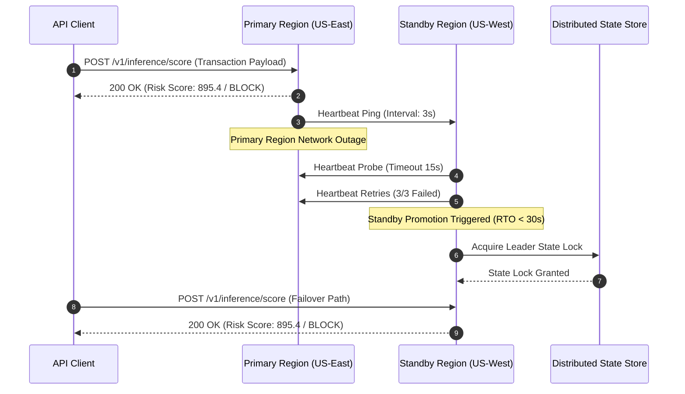
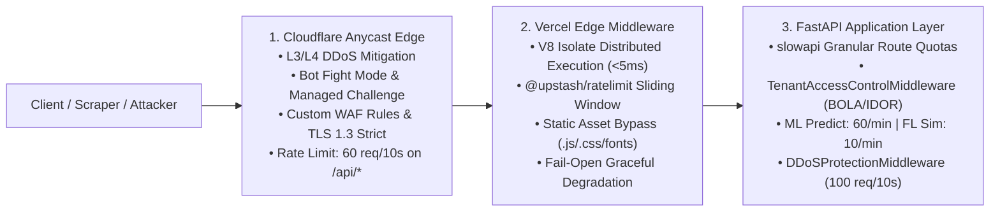
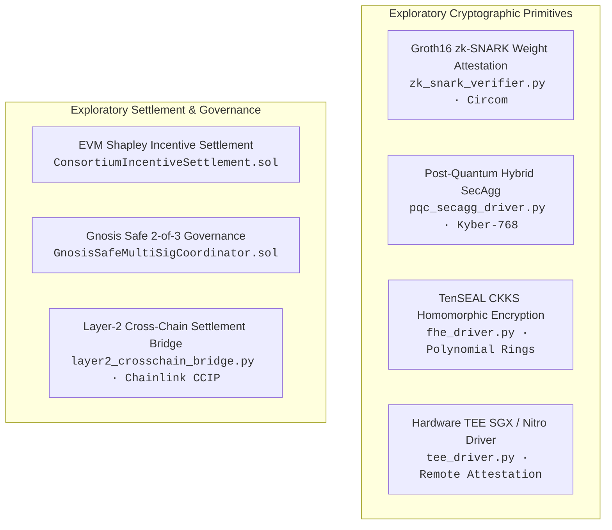

<div align="center">

# Collaborative Fraud Intelligence Platform

### Privacy-Preserving Cross-Bank Financial Fraud Detection and Anti-Money Laundering Architecture

[](https://github.com/yusufcalisir/CF-Intelligence/actions/workflows/ci.yml)
[](https://cf-intelligence.vercel.app)
[](https://python.org)
[](https://fastapi.tiangolo.com)
[](https://pytorch.org)
[](https://github.com/yusufcalisir/CF-Intelligence/actions)
[](LICENSE)

**[🌐 Live Demo Deployment](https://cf-intelligence.vercel.app)** | **[📖 Interactive API Reference](https://cf-intelligence.vercel.app/developer)**

---

### Architectural Specification Index

| Core Production Architecture | Engineering Rationale & Validation | Research & Operations |
|:---|:---|:---|
| [1. Executive Summary](#1-executive-summary--architectural-scope) | [13. Design Decisions & Trade-Offs](#13-design-decisions--trade-offs) | [20. Research & Exploratory Modules](#20-research--exploratory-modules) |
| [2. Master System Architecture](#2-master-system-architecture) | [14. Limitations & What This Is Not](#14-limitations--what-this-is-not) | [21. Prerequisites & System Requirements](#21-prerequisites-and-system-requirements) |
| [3. Directory Structure](#3-clean-architecture-directory-structure) | [15. Empirical Benchmarks](#15-empirical-performance--benchmark-suite) | [22. Quick Start Guide](#22-step-by-step-operator-quick-start) |
| [4. Data Ingestion & Parsing](#4-multi-bank-synthetic-data--multi-standard-ingestion) | [16. Platform Comparison](#16-platform-comparison--architectural-positioning) | [23. AI Collaboration Methodology](#23-development-methodology--ai-collaboration) |
| [5. Federated Learning](#5-federated-learning-engines--non-iid-optimization) | [17. Regulatory Concepts Explored](#17-regulatory-concepts-explored) | [24. Related Work & References](#24-related-work-and-references) |
| [6. Core PET Security Perimeter](#6-core-privacy-enhancing-technologies-dp--secagg) | [18. Subsystem Self-Verification](#18-subsystem-self-verification-reports-verification) | [25. Citation](#25-academic-citation-and-reference-format) |
| [7. Byzantine Defense](#7-byzantine-poisoning-defense--adversarial-robustness) | [19. API Blueprints](#19-api-endpoint-blueprints--json-schemas) | [26. Author & Maintenance](#26-author-and-maintenance) |
| [8. Graph Intelligence](#8-graph-intelligence--fuzzy-entity-resolution) | | |
| [9. Composite Risk Engine](#9-9-signal-composite-risk-engine--model-explainability) | | |
| [10. Multi-Layer Defense & Gateway](#10-multi-layer-defense-gateway--rate-limiting) | | |
| [11. Case Management & SAR](#11-human-in-the-loop-workbench--regulatory-reporting) | | |
| [12. Disaster Recovery & SRE](#12-disaster-recovery-high-availability--sre-operations) | | |

</div>

---

## 1. Executive Summary & Architectural Scope

Financial institutions operate under strict regulatory and statutory constraints (GDPR Articles 6 and 17, CCPA, Bank Secrecy Act, national banking secrecy legislation) that prohibit centralizing or pooling raw customer transaction records across institutional boundaries. This data fragmentation creates systemic blind spots in fraud detection:

1. **Cross-Bank Velocity & Layering Syndicates:** Criminal networks distribute illicit funds sequentially across multiple bank nodes within minutes, clearing accounts before individual single-bank rule engines detect velocity anomalies.
2. **Structured Smurfing Networks:** Money laundering rings break large deposits into micro-transactions placed across multiple financial institutions to remain strictly below single-bank regulatory reporting thresholds ($10,000 USD / €10,000 EUR).

The **Collaborative Fraud Intelligence Platform (CF-Intelligence)** addresses this fragmentation through a privacy-preserving federated architecture. Participating institutions collaboratively train shared machine learning models and graph embeddings without centralizing raw transaction records or customer PII.

```
┌──────────────────────────────────────────────────────────────────────────────────┐
│                             CORE PRODUCTION PIPELINE                             │
│                                                                                  │
│   [ Bank Alpha ]       [ Bank Beta ]       [ Bank Gamma ]    (Local Nodes)       │
│         │                    │                    │                              │
│         ▼                    ▼                    ▼                              │
│   ┌────────────────────────────────────────────────────────┐                     │
│   │ Local Privacy Boundary: Opacus DP + Curve25519 SecAgg  │ (Zero Raw PII)      │
│   └──────────────────────────┬─────────────────────────────┘                     │
│                              ▼                                                   │
│   ┌────────────────────────────────────────────────────────┐                     │
│   │ Byzantine Coordinator: FedProx/SCAFFOLD + Krum/Bulyan  │ (Drift & Poisoning) │
│   └──────────────────────────┬─────────────────────────────┘                     │
│                              ▼                                                   │
│   ┌────────────────────────────────────────────────────────┐                     │
│   │ Canary Gate & Champion/Challenger Model Registry       │ (Quality Gating)    │
│   └──────────────────────────┬─────────────────────────────┘                     │
│                              ▼                                                   │
│   ┌────────────────────────────────────────────────────────┐                     │
│   │ Real-Time Scoring (<100ms) + SHAP + 6-Stage Case WB    │ (Serving & SAR)     │
│   └────────────────────────────────────────────────────────┘                     │
└──────────────────────────────────────────────────────────────────────────────────┘
```

The core production path focuses on seven defensible engineering components:
- **Federated Learning Engines:** `FedAvg`, `FedProx`, and `SCAFFOLD` optimization handling extreme Non-IID Dirichlet label skew ($\alpha \le 0.50$).
- **Differential Privacy Guard:** Local gradient perturbation via Opacus with Gaussian noise and Rényi DP accounting ($\epsilon = 1.0, \delta = 10^{-5}$).
- **Secure Aggregation (SecAgg):** Peer-to-peer Curve25519 Diffie-Hellman pairwise zero-sum masking for masked parameter aggregation.
- **Byzantine Consensus:** `Krum` (single representative selection), `Trimmed Mean`, and `Bulyan` (Krum candidate selection + coordinate trimmed mean) aggregators paired with Spectral SVD backdoor filtering.
- **Graph Intelligence:** PyTorch `GraphSAGE` relational embeddings and MinHash LSH Private Set Intersection (Fuzzy PSI) for entity resolution.
- **Real-Time Composite Scoring:** Sub-100ms inference gateway combining 9 statistical, behavioral, and topological signals.
- **Multi-Layer Defense & Rate Limiting:** 3-layer architecture (Cloudflare WAF $\rightarrow$ Vercel Edge Middleware $\rightarrow$ FastAPI `slowapi` & BOLA isolation).
- **Explainability & Governance:** Real-time SHAP feature attributions and a 6-stage case management workbench with automated FinCEN BSA SAR XML compilation.

*Note: Exploratory cryptographic research modules (zk-SNARK attestation, TenSEAL CKKS FHE, Post-Quantum Kyber-768, Hardware TEE drivers, EVM incentive contracts, and Cross-Chain bridges) are isolated in the [Research & Exploratory Modules](#20-research--exploratory-modules) section.*

---

## 2. Master System Architecture

### 2.1 Core System Topology

```
┌──────────────────────────────────────────────────────────────────────────────────────┐
│                     Consortium Banking Institutions (Client Nodes)                   │
│          [ Bank Alpha ]            [ Bank Beta ]            [ Bank Gamma ]           │
│          (Retail / POS)          (Commercial Wires)         (Fintech / ACH)          │
└──────────────────────────────────────────┬───────────────────────────────────────────┘
                                           │ Local SGD Updates
                                           ▼
┌──────────────────────────────────────────────────────────────────────────────────────┐
│                             Local Privacy Boundary (PETs)                            │
│  - Opacus Differential Privacy Guard (L2 Norm Clipping C=1.0, Noise Scale sigma)     │
│  - Curve25519 ECDH Pairwise SecAgg Masking (Zero-Sum Vector Perturbation)            │
│  - Shamir (t, n) Threshold Secret Sharing (Galois Field Z_p Dropout Recovery)        │
└──────────────────────────────────────────┬───────────────────────────────────────────┘
                                           │ Masked Gradients (Zero Raw PII)
                                           ▼
┌──────────────────────────────────────────────────────────────────────────────────────┐
│                      Byzantine-Robust Server Coordinator Engine                      │
│  - Aggregators: FedAvg / FedProx (mu=0.01) / SCAFFOLD (Control Variates) / Bulyan    │
│  - Anomaly Filter: Spectral SVD Top Eigenvalue Backdoor Trigger Detection            │
│  - Non-IID Partitioner: Dirichlet Dir(alpha) Distribution Modeling                   │
└──────────────────────────────────────────┬───────────────────────────────────────────┘
                                           │ Candidate Global Weights
                                           ▼
┌──────────────────────────────────────────────────────────────────────────────────────┐
│                         Canary Quality Gate & Model Registry                         │
│  - Holdout Verification (PR-AUC, ROC-AUC) -> Promote Champion / Auto-Rollback        │
└──────────────────────────────────────────┬───────────────────────────────────────────┘
                                           │ Active Champion Model
                                           ▼
┌──────────────────────────────────────────────────────────────────────────────────────┐
│                       Real-Time Scoring & Operational Serving                        │
│  - Real-Time Scoring Gateway (<100ms SLA, P99 Latency Monitor)                       │
│  - Multi-Layer Perimeter Defense: Cloudflare WAF + Vercel Edge + slowapi Rate Limit  │
│  - Broken Access Control (BOLA/IDOR) Multi-Tenant Isolation Middleware               │
│  - Fast SHAP TreeExplainer & Counterfactual Feature Sensitivity                      │
│  - 6-Stage Case Workbench (Four-Eyes Supervisor Signature) & FinCEN BSA SAR XML      │
└──────────────────────────────────────────────────────────────────────────────────────┘
```

---

### 2.2 Core Federated Training Lifecycle


---

### 2.3 Multi-Region Active-Passive HA Failover Sequence



---

## 3. Clean Architecture Directory Structure

```
CF-Intelligence/
├── pyproject.toml                                   # Root packaging and cfi-cli entrypoint
├── Dockerfile                                       # Multi-stage production container specification (Hugging Face Spaces)
├── docker-compose.yml                               # Enterprise multi-container orchestration (Gateway, SPA, API, Postgres, Redis)
├── docker-compose.multinode.yml                     # 3-Node distributed bank consortium cluster
├── docker-compose.dev.yml                           # Local developer stack with hot reloading & Jaeger
├── .env.example                                     # Hardened production environment configuration template
├── Makefile                                         # Developer & CI automation tasks
├── benchmark.py                                     # Master multi-model & multi-dataset benchmark suite
├── vercel.json                                      # Vercel deployment configuration & serverless rewrites
├── pytest.ini                                       # Global pytest test runner configuration
│
├── docker/                                          # Production Enterprise Container Manifests
│   ├── Dockerfile.frontend                          # Multi-stage Node 20 builder & Alpine Nginx SPA container
│   ├── Dockerfile.backend                           # Hardened Python 3.12 slim non-root API & ML container
│   ├── nginx/
│   │   ├── nginx.conf                               # Gateway reverse proxy, HTTP/2, TLS 1.3 & WebSocket upstream
│   │   └── frontend-nginx.conf                      # Internal SPA routing fallback & caching configuration
│   └── postgres/
│       └── 01-init.sql                              # Cold-boot idempotent schema, tables & consortium seed script
│
├── backend/                                         # Clean Architecture Python 3.12 Backend
│   ├── alembic.ini                                  # Alembic DB migration configuration
│   ├── pyproject.toml                               # Backend dependency & pytest/coverage config
│   ├── requirements.txt                             # Pinned production dependencies (FastAPI, PyTorch, Opacus, TenSEAL, Bcrypt, Locust)
│   ├── app/
│   │   ├── config.py                                # Platform configuration, CORS whitelists & Sentry/env management
│   │   ├── dependencies.py                          # FastAPI Dependency Injection & Tenant Resolution
│   │   ├── main.py                                  # Application entrypoint, strict CORS, SecurityHeaders & error middleware
│   │   │
│   │   ├── domain/                                  # Enterprise Domain Entities, Value Objects & Security Invariants
│   │   │   ├── entities.py                          # Core domain entities (Bank, Transaction, Alert, ModelCheckpoint)
│   │   │   ├── entities_phase2.py                   # Extended consortium entities & audit tracking
│   │   │   ├── value_objects.py                     # Immutable value objects (NormalizedTransaction, ModelWeights)
│   │   │   ├── value_objects_phase2.py              # HMAC salted identifiers & tokenized entity descriptors
│   │   │   ├── value_objects_pqc.py                 # NIST Level 3/5 Kyber-768 & Dilithium-3 metadata
│   │   │   ├── value_objects_rdp.py                 # Rényi Differential Privacy accounting structures
│   │   │   ├── value_objects_zkp.py                 # Groth16 zk-SNARK attestation proof structures
│   │   │   ├── value_objects_unlearning.py          # Exact / Approximate federated unlearning definitions
│   │   │   ├── value_objects_copilot.py             # AML agentic copilot reasoning & investigation artifacts
│   │   │   ├── value_objects_bridge.py              # Layer-2 cross-chain settlement bridge envelopes
│   │   │   ├── model_lifecycle.py                   # Champion / Challenger state machine & rollback policies
│   │   │   ├── model_governance.py                  # SR 11-7 model risk governance, bias audit & audit trail
│   │   │   ├── byzantine_defense.py                 # Krum, Trimmed Mean, Bulyan & Coordinate Median rules
│   │   │   ├── spectral_defense.py                  # Spectral SVD top eigenvalue backdoor anomaly filter
│   │   │   ├── fuzzy_psi.py                         # MinHash LSH Private Set Intersection algorithm
│   │   │   ├── psi_service.py                       # Zero-PII cross-bank entity intersection engine
│   │   │   ├── ai_act_compliance.py                 # EU AI Act risk classification, transparency & audit invariants
│   │   │   ├── consortium_policy.py                 # Consortium governance rules, quorum & voting invariants
│   │   │   ├── consortium_governance.py             # Node membership lifecycle & cryptographic attestation
│   │   │   ├── distribution_fidelity_service.py     # Jensen-Shannon & Wasserstein distribution divergence auditor
│   │   │   ├── realtime_explainer.py                # Sub-ms fast SHAP TreeExplainer & feature attributions
│   │   │   ├── case_management.py                   # Four-Eyes dual supervisor approval state machine
│   │   │   ├── security_evaluator.py                # Membership Inference Attack (MIA) privacy evaluator
│   │   │   ├── regional_governance.py               # Cross-jurisdiction data sovereignty & residency guards
│   │   │   ├── tenant_management.py                 # Multi-tenant cryptographic isolation invariants
│   │   │   ├── incident_playbook.py                 # Automated incident triage & containment procedures
│   │   │   ├── inference_fallback.py                # Graceful degradation & shadow scoring fallbacks
│   │   │   ├── label_privacy_guard.py               # Differential privacy gradient perturbation invariants
│   │   │   ├── protocol_versioning.py               # Zero-downtime protocol compatibility negotiation
│   │   │   ├── quorum_manager.py                    # Byzantine fault tolerance consortium quorum manager
│   │   │   ├── retention_policy.py                  # GDPR Art. 17 right-to-be-forgotten zeroization policies
│   │   │   ├── sla_contract.py                      # Sub-100ms inference SLA contract & latency bounds
│   │   │   ├── async_fl_engine.py                   # Asynchronous federated learning domain coordination
│   │   │   ├── benchmark_runner.py                  # Multi-dataset empirical performance evaluator
│   │   │   ├── enums.py                             # Platform domain enumerations (RiskDecision, NodeStatus, etc.)
│   │   │   ├── dr_coordinator.py                    # Disaster recovery domain state & leader election bounds
│   │   │   ├── deployment_state.py                  # Zero-downtime canary deployment state descriptors
│   │   │   ├── backup_record.py                     # Immutable cryptographic database backup metadata
│   │   │   └── web_console.py                       # Web console telemetry & audit logging contracts
│   │   │
│   │   ├── application/
│   │   │   └── services/                            # Application Use Cases & Core Orchestration Services
│   │   │       ├── fl_engine.py                     # Server-side FL parameter aggregation (FedAvg, SCAFFOLD, Byzantine defenses)
│   │   │       ├── flower_engine.py                 # Flower framework FL integration & simulation bridge
│   │   │       ├── flower_p2p_engine.py             # Peer-to-peer decentralized Flower transport
│   │   │       ├── fl_dirichlet_partitioner.py      # Non-IID Dirichlet label skew partitioner (alpha <= 0.50)
│   │   │       ├── fl_hyperparameter_optimizer.py   # Optuna automated federated hyperparameter tuner
│   │   │       ├── privacy_service.py               # Opacus DP guard (L2 norm clipping C=1.0 & Gaussian noise)
│   │   │       ├── privacy_audit_service.py         # Rényi DP cumulative budget tracker & empirical MIA auditor
│   │   │       ├── risk_engine.py                   # 9-Signal composite risk scoring engine (<100ms)
│   │   │       ├── feature_store_service.py         # Online low-latency entity feature retrieval service (<5ms)
│   │   │       ├── policy_engine.py                 # In-memory rule execution with cache invalidation
│   │   │       ├── graph_embedding_service.py       # PyTorch GraphSAGE relational embedding service
│   │   │       ├── graph_embedding_model.py         # Inductive GraphSAGE GNN architecture (64/128-dim)
│   │   │       ├── graph_analytics_service.py       # Multi-hop graph traversal & PageRank anomaly service
│   │   │       ├── graph_engine.py                  # Graph database synchronization & cypher queries
│   │   │       ├── streaming_graph_service.py       # Dynamic streaming graph edge updates & cache
│   │   │       ├── streaming_gnn_model.py           # Real-time online streaming Graph Neural Network
│   │   │       ├── flink_graph_streaming.py         # Distributed streaming pipeline connector
│   │   │       ├── coordinator_service.py           # Federation round coordinator & consensus orchestrator
│   │   │       ├── case_service.py                  # Core case investigation lifecycle state machine
│   │   │       ├── case_workbench.py                # 6-Stage case management workbench & supervisor signatures
│   │   │       ├── drift_service.py                 # PSI & Jensen-Shannon feature drift detector
│   │   │       ├── auto_rollback.py                 # Champion auto-rollback on drift or accuracy degradation
│   │   │       ├── automated_retraining.py          # Continuous automated retraining trigger pipeline
│   │   │       ├── retraining_trigger_engine.py     # Drift threshold evaluation & model fine-tuning scheduler
│   │   │       ├── elliptic_benchmark_service.py    # Elliptic Bitcoin transaction graph benchmark evaluator
│   │   │       ├── entity_resolution.py             # Cross-bank MinHash fuzzy entity resolution service
│   │   │       ├── explainability_service.py        # Real-time SHAP Kernel & feature attribution generator
│   │   │       ├── financial_message_parser.py      # ISO 20022 (pacs.008, camt.053) & SWIFT MT103 parser
│   │   │       ├── data_generator.py                # Synthetic multi-bank transaction & typology generator
│   │   │       ├── data_validator.py                # Pandera schema & distribution fidelity validator
│   │   │       ├── dataloader.py                    # Real dataset loaders (Elliptic, PaySim, IEEE-CIS)
│   │   │       ├── bank_onboarding_service.py       # Automated bank onboarding & credential provisioning
│   │   │       ├── alert_service.py                 # Real-time fraud alert triage & notification engine
│   │   │       ├── regulatory_reporter.py           # FinCEN BSA SAR XML report compiler
│   │   │       ├── retention_engine.py              # Data retention TTL scheduler & automated zeroization
│   │   │       ├── simulation_service.py            # FL simulation orchestrator & synthetic scenarios
│   │   │       ├── scenario_service.py              # Fraud typology scenario catalog & execution
│   │   │       ├── sla_monitor.py                   # Sub-100ms latency p50/p95/p99 SLA monitor
│   │   │       ├── sla_contract_engine.py           # Node SLA enforcement & penalty accounting
│   │   │       ├── security_compliance.py           # Automated SOC 2 evidence collection & policy engine
│   │   │       ├── aml_agentic_copilot.py           # Autonomous AML investigative agent & narrative compiler
│   │   │       ├── federated_unlearning_engine.py   # GDPR Right-to-be-Forgotten federated unlearning
│   │   │       ├── kms_service.py                   # Envelope encryption & HSM key management service
│   │   │       ├── incident_triage.py               # Autonomous security incident response & mitigation
│   │   │       ├── tenant_metering.py               # Multi-tenant API metering, quotas & rate controls
│   │   │       ├── webhook_service.py               # HMAC-SHA256 signed asynchronous webhook dispatcher
│   │   │       ├── zero_downtime_deployer.py        # Rolling zero-downtime model deployment coordinator
│   │   │       ├── model_registry.py                # Model versioning, lineage tracking & canary promoter
│   │   │       ├── model_service.py                 # Local client training (FedProx proximal loss, SCAFFOLD drift correction, Opacus DP)
│   │   │       ├── adversarial_service.py           # Adversarial attack simulation (sign-flip, label-flip, backdoor)
│   │   │       ├── consortium_service.py            # Multi-bank consortium voting & policy management
│   │   │       ├── etl_service.py                   # Batch ETL pipeline & feature precomputation
│   │   │       ├── idempotency.py                   # Distributed request deduplication & idempotency keys
│   │   │       ├── label_feedback_pipeline.py       # Human-in-the-loop analyst feedback ingestion
│   │   │       ├── streaming_engine.py              # Low-latency Kafka / Redis streaming processor
│   │   │       ├── connector_diagnostics_service.py # Enterprise connector health, transport ping & probe engine
│   │   │       └── support_diagnostics.py           # Automated health diagnostics & support bundle generator

│   │   │
│   │   ├── infrastructure/                          # Infrastructure & External Technology Adapters
│   │   │   ├── security/                            # Enterprise Security Suite & Cryptographic Drivers
│   │   │   │   ├── auth_service.py                  # Enterprise auth, short-lived JWTs (15m), refresh rotation, brute-force lockout
│   │   │   │   ├── password_hasher.py               # Bcrypt password hashing (cost=12) with salted digests
│   │   │   │   ├── error_handler.py                 # Production error sanitization, zero stack trace leakage & Sentry hook
│   │   │   │   ├── security_headers.py              # Comprehensive HTTP security headers (CSP, HSTS, X-Frame-Options, nosniff)
│   │   │   │   ├── p2p_secagg_driver.py             # Curve25519 ECDH pairwise SecAgg zero-sum masking
│   │   │   │   ├── shamir_engine.py                 # Shamir (t, n) threshold secret sharing over GF(p)
│   │   │   │   ├── abac_engine.py                   # Attribute-Based Access Control policy engine
│   │   │   │   ├── vault_client.py                  # HashiCorp Vault PKI & secret manager integration
│   │   │   │   ├── vault_hsm_pki_binder.py          # Vault PKI & HSM root CA binder
│   │   │   │   ├── hsm_signer.py                    # Hardware Security Module (PKCS#11) cryptographic signer
│   │   │   │   ├── mtls_manager.py                  # mTLS certificate lifecycle, rotation, SAN & CRL revocation
│   │   │   │   ├── cert_generator.py                # Self-signed and X.509 development certificate generator
│   │   │   │   ├── perimeter_waf.py                 # Perimeter firewall, OWASP Top 10 rules & lockout tracking
│   │   │   │   ├── rate_limiter.py                  # slowapi granular route quotas & DDoS sliding window protection
│   │   │   │   ├── immutable_audit_chain.py         # Tamper-evident append-only SHA-256 cryptographic audit chain
│   │   │   │   ├── adaptive_dp_autoscaler.py        # Dynamic (epsilon, delta) budget autoscaler on distribution drift
│   │   │   │   ├── oidc_authenticator.py            # OpenID Connect (OIDC) JWT provider integration
│   │   │   │   ├── signature_verifier.py            # eIDAS QWAC/QSeal & ECDSA digital signature verifier
│   │   │   │   ├── compression_engine.py            # Gradient quantization & Zstandard compression engine
│   │   │   │   ├── secure_parameter_pipeline.py     # End-to-end encrypted gradient aggregation pipeline
│   │   │   │   ├── tenant_kms.py                    # Multi-tenant envelope encryption & key rotation
│   │   │   │   ├── smart_contract_driver.py         # Web3 JSON-RPC provider & smart contract caller
│   │   │   │   ├── gnosis_multisig_coordinator.py   # Multi-signature consortium governance coordinator
│   │   │   │   ├── fhe_driver.py                    # [Research] TenSEAL CKKS Homomorphic Encryption driver
│   │   │   │   ├── pqc_secagg_driver.py             # [Research] Post-Quantum CRYSTALS-Kyber-768 SecAgg driver
│   │   │   │   ├── tee_driver.py                    # [Research] Hardware TEE Intel SGX / AWS Nitro driver
│   │   │   │   ├── zk_snark_verifier.py             # [Research] Groth16 zk-SNARK Poseidon proof verifier
│   │   │   │   └── layer2_crosschain_bridge.py      # [Research] Layer-2 cross-chain settlement bridge (Chainlink CCIP)
│   │   │   │
│   │   │   ├── database/                            # SQLAlchemy Async ORM, engine, search_path isolation & DDL quoting
│   │   │   │   ├── __init__.py                      # Engine pool, multi-tenant session factory & metadata migration
│   │   │   │   ├── tenant_provisioner.py            # PostgreSQL schema & SQLite dynamic tenant database provisioner
│   │   │   │   ├── migration_manager.py             # Programmatic Alembic database migration runner
│   │   │   │   └── migrations/                      # Alembic versioned schema migrations
│   │   │   │
│   │   │   ├── connectors/                          # ISO 20022, SWIFT, Streaming & Message Queue Ingestion
│   │   │   │   ├── factory.py                       # Dynamic connector factory & protocol registry
│   │   │   │   ├── base_connector.py                # Abstract ingestion connector interface
│   │   │   │   ├── iso20022_connector.py            # pacs.008 & camt.053 XML message ingestion adapter
│   │   │   │   ├── open_banking_connector.py        # PSD2 Open Banking REST webhook ingestion adapter
│   │   │   │   ├── rest_connector.py                # Core banking REST API HTTP ingestion adapter
│   │   │   │   ├── kafka_connector.py               # Apache Kafka distributed streaming topic consumer
│   │   │   │   ├── rabbitmq_connector.py            # RabbitMQ AMQP message broker queue consumer
│   │   │   │   ├── redis_connector.py               # Redis Streams / PubSub message ingest adapter
│   │   │   │   ├── parquet_connector.py             # High-throughput columnar Parquet batch reader
│   │   │   │   ├── batch_connector.py               # Batch CSV/JSON file ingestion pipeline
│   │   │   │   └── streaming_connector.py           # Real-time WebSocket / TCP stream ingestion adapter
│   │   │   │
│   │   │   ├── feature_store/                       # Low-Latency Online/Offline Feature Store
│   │   │   │   ├── store.py                         # Unified online feature store interface
│   │   │   │   ├── redis_store.py                   # Sub-2ms Redis key-value online feature backend
│   │   │   │   ├── feast_store.py                   # Feast enterprise feature store integration
│   │   │   │   ├── rolling_aggregators.py           # 1h, 24h, 7d velocity & amount z-score sliding windows
│   │   │   │   └── bloom_filter.py                  # Probabilistic entity membership Bloom filter
│   │   │   │
│   │   │   ├── disaster_recovery/                   # Multi-Region Failover & Business Continuity
│   │   │   │   ├── region_failover.py               # Automated active-passive standby region promotion (RTO < 30s)
│   │   │   │   ├── chaos_dr_drill.py                # Simulated split-brain & datacenter outage chaos runner
│   │   │   │   └── backup_verifier.py               # Automated cryptographic database backup & restore verifier
│   │   │   │
│   │   │   ├── telemetry/                           # Enterprise Observability & Distributed Tracing
│   │   │   │   ├── __init__.py                      # Prometheus metrics exporter (TPS, p50/p95/p99 latency, SLA counters)
│   │   │   │   └── otel_tracer.py                   # OpenTelemetry (OTel) OTLP distributed trace propagator
│   │   │   │
│   │   │   ├── repositories/                        # Clean Architecture Database Repositories
│   │   │   │   ├── alert_repository.py              # Real-time alert persistence & query filters
│   │   │   │   ├── bank_repository.py               # Bank institution registration & credential store
│   │   │   │   ├── case_repository.py               # Investigation cases & supervisor signature history
│   │   │   │   ├── entity_repository.py             # Resolved entity profiles & graph node mappings
│   │   │   │   ├── round_repository.py              # Federated learning training rounds & weight checkpoints
│   │   │   │   ├── metrics_repository.py            # Historical benchmark & telemetry time-series store
│   │   │   │   └── simulation_repository.py         # Synthetic simulation scenario runs & outcome states
│   │   │   │
│   │   │   ├── grpc/                                # High-Performance gRPC Communication
│   │   │   │   ├── client.py                        # Asynchronous gRPC consortium client stub
│   │   │   │   ├── server.py                        # Multi-bank gRPC transport server
│   │   │   │   ├── servicer.py                      # Weight submission, model distribution & sync servicers
│   │   │   │   ├── types.py                         # Protobuf message type definitions & converters
│   │   │   │   ├── version_interceptor.py           # Protocol version compatibility interceptor
│   │   │   │   └── proto/                           # Protocol Buffer schema definitions (.proto)
│   │   │   │
│   │   │   ├── client_daemon/                       # Local Banking Client Daemon
│   │   │   │   └── hardware_detector.py             # Apple Silicon MPS / NVIDIA CUDA / CPU acceleration detector
│   │   │   ├── event_bus.py                         # Internal asynchronous in-process event pub/sub bus
│   │   │   ├── cache.py                             # In-memory LRU fast-path & multi-tier cache manager
│   │   │   ├── models.py                            # SQLAlchemy ORM database table models (Multi-Tenant)
│   │   │   ├── redis_store.py                       # Global Redis connection pool & atomic locking
│   │   │   ├── celery_app.py                        # Celery distributed async worker configuration
│   │   │   └── tenant_provisioner.py                # Tenant database migration & schema isolation provisioner
│   │   │
│   │   └── presentation/                            # API Gateway, REST Endpoints & WebSockets
│   │       ├── routers/                             # 32 Modular FastAPI Routers
│   │       │   ├── auth.py                          # Bcrypt authentication, short-lived JWT (15m), refresh rotation & lockout
│   │       │   ├── predict.py                       # Real-time transaction scoring & composite risk inference (<100ms)
│   │       │   ├── realtime_inference.py            # High-throughput batch & streaming inference endpoints
│   │       │   ├── alerts.py                        # Real-time fraud alert triage & disposition API
│   │       │   ├── cases.py                         # 6-Stage case management & Four-Eyes supervisor approval API
│   │       │   ├── banks.py                         # Consortium member management & data upload endpoints
│   │       │   ├── bank_client.py                   # Distributed bank client local training & evaluation daemon
│   │       │   ├── coordinator.py                   # Federation round orchestration & model sync API
│   │       │   ├── training.py                      # Local and distributed federated training triggers
│   │       │   ├── model_registry.py                # Model checkpoint registry, canary promotion & rollback API
│   │       │   ├── entities.py                      # Entity resolution, graph nodes & identity profile API
│   │       │   ├── graph.py                         # Knowledge graph traversal, multi-hop paths & PageRank API
│   │       │   ├── security.py                      # Enterprise Security Suite status, ABAC eval & audit chain API
│   │       │   ├── compliance.py                    # SOC 2 automated compliance & EU AI Act audit reports
│   │       │   ├── onboarding.py                    # Automated bank node onboarding & mTLS certificate bundle API
│   │       │   ├── simulation.py                    # Synthetic scenario execution & FL benchmark runner API
│   │       │   ├── scenarios.py                     # Fraud typology simulation & interactive chaos attack injection API
│   │       │   ├── datasets.py                      # Real dataset preview, Great Expectations contract gating & consortium enrollment API
│   │       │   ├── dashboard.py                     # Executive metrics, risk breakdown & real-time KPI aggregates
│   │       │   ├── monitoring.py                    # Prometheus health, latency SLA & system resource metrics
│   │       │   ├── optimization.py                  # Federated hyperparameter tuning & Optuna trial status API
│   │       │   ├── privacy_defense.py               # Differential Privacy budget & membership inference defense
│   │       │   ├── psd2.py                          # Open Banking PSD2 / SCA compliance & risk API
│   │       │   ├── rules.py                         # Business rule engine management & threshold tuning API
│   │       │   ├── settlement.py                    # Consortium token settlement & incentive distribution API
│   │       │   ├── diagnostics.py                   # Enterprise connector diagnostics & active test probes API
│   │       │   ├── webhook_gateway.py               # Asynchronous webhook registration & HMAC verification API
│   │       │   ├── design_partner.py                # Enterprise design partner portal & trial provisioning API
│   │       │   ├── maintenance_cron.py              # Automated background maintenance, cache eviction & zeroization
│   │       │   ├── health.py                        # Liveness (/health) and Readiness (/ready) probe endpoints
│   │       │   ├── admin_console.py                 # Administrative cluster operations & operator tools
│   │       │   └── gateway.py                       # Multi-tenant API routing & header normalization gateway
│   │       └── websockets/                          # Real-Time Streaming Channels
│   │           ├── streaming_ws.py                  # Live transaction stream & composite risk scoring feed
│   │           └── training_ws.py                   # Real-time federated training round progress & weight metrics
│   │
│   └── tests/                                       # Comprehensive Backend Test Suite (1,156+ Tests)
│       ├── unit/                                    # Unit tests for domain invariants, services, security, attack injector & data contracts
│       ├── integration/                             # End-to-end API, gRPC, database & multi-tenant integration tests
│       ├── mutation/                                # AST boundary & fault injection mutant suites (100% kill rate)
│       └── property/                                # Hypothesis property-based mathematical invariance tests
│
├── frontend/                                        # React 18 / Vite TypeScript Web Console
│   ├── middleware.ts                                # Vercel Edge Middleware (@upstash/ratelimit & security guards)
│   ├── e2e-workflows/                               # Playwright Real-Browser Multi-Device E2E Suite (10 Tests)
│   │   ├── auth_session_flow.spec.ts                # Session token lifecycle, navigation & security header validation
│   │   ├── federated_training_lifecycle.spec.ts     # FL coordinator rounds, weight sync & live telemetry convergence
│   │   ├── investigation_four_eyes_sar.spec.ts      # Four-Eyes dual supervisor approval & FinCEN SAR XML export
│   │   ├── chaos_attack_simulation.spec.ts          # Interactive Byzantine gradient injection & Krum quarantine
│   │   └── dataset_custom_ingest_flow.spec.ts       # CSV/Parquet drag-and-drop & GE data contract gating
│   ├── src/
│   │   ├── pages/                                   # 17 Enterprise Web Console Views
│   │   │   ├── LandingPage.tsx                      # High-converting SaaS landing page, interactive demo & feature matrices
│   │   │   ├── Dashboard.tsx                        # Executive KPI dashboard, risk distributions & fraud metrics
│   │   │   ├── LiveOperationsView.tsx               # Real-time transaction streaming terminal & manual transaction scoring
│   │   │   ├── InvestigationDashboard.tsx           # Multi-stage alert investigation workbench & evidence timeline
│   │   │   ├── CaseDetailPage.tsx                   # Case detail view, Four-Eyes supervisor signing & SAR XML export
│   │   │   ├── CasesPage.tsx                        # Active cases index, severity filtering & SLA countdown timers
│   │   │   ├── AlertsPage.tsx                       # Live alert feed, triage actions & bulk disposition controls
│   │   │   ├── GraphPage.tsx                        # Interactive 2D/3D knowledge graph visualizer & entity networks
│   │   │   ├── SecurityPage.tsx                     # Zero-Trust security posture, ABAC policy tester & audit ledger
│   │   │   ├── ObservabilityPage.tsx                # Prometheus SLA metrics, latency heatmaps & health telemetry
│   │   │   ├── PrivacyDefensePage.tsx               # Differential Privacy budget gauges & Membership Inference defense
│   │   │   ├── CoordinatorPage.tsx                  # Federated learning coordinator console & client node status
│   │   │   ├── BankOnboardingPage.tsx               # Self-service bank consortium onboarding & mTLS certificate wizard
│   │   │   ├── BenchmarkHubPage.tsx                 # Real-time benchmark comparison hub (FL vs. Isolated vs. Pooled)
│   │   │   ├── PoliciesPage.tsx                     # Dynamic AML risk policy rule manager & threshold tuning
│   │   │   ├── PsiPage.tsx                          # Private Set Intersection (Fuzzy PSI) cross-bank entity lookup
│   │   │   └── ScenariosPage.tsx                    # Pre-packaged fraud typology attack scenario simulator
│   │   │
│   │   ├── components/                              # Modular UI Design System
│   │   │   ├── Header.tsx                           # Global navigation bar, environment badges & system status
│   │   │   ├── Navigation.tsx                       # Responsive sidebar navigation & view routing
│   │   │   ├── ErrorBoundary.tsx                    # React error boundary isolating component render failures
│   │   │   ├── Predictor.tsx                        # Live transaction simulation & risk scoring widget
│   │   │   ├── ModelPerformanceModal.tsx            # Champion/Challenger model performance inspection modal
│   │   │   ├── PlatformLaunchModal.tsx              # Guided platform launch & tenant configuration modal
│   │   │   ├── chaos/                               # Live Adversarial Attack Simulator & Interactive Chaos
│   │   │   │   └── ChaosAttackInjectorPanel.tsx     # 500 tx/s smurfing burst & Byzantine gradient poisoning panel
│   │   │   ├── ingestion/                           # Real Dataset Ingestion Studio & Schema Alignment
│   │   │   │   ├── DatasetDropzone.tsx              # Drag-and-drop CSV/Parquet uploader with pre-flight check
│   │   │   │   ├── SchemaMappingTable.tsx           # Interactive 9-signal canonical schema alignment preview
│   │   │   │   ├── DataContractAuditCard.tsx        # Great Expectations (GE 1.x) validation audit scorecard
│   │   │   │   ├── ConsortiumAssignmentPanel.tsx    # Multi-bank partition allocator & FL enrollment trigger
│   │   │   │   └── DatasetIngestionStudioModal.tsx  # Master 4-step wizard modal for enterprise data ingestion
│   │   │   └── ...                                  # UI badges, metric cards, charts, modals & data tables
│   │   │
│   │   ├── api/                                     # API Integration Layer
│   │   │   ├── client.ts                            # Axios / Fetch client with JWT interception & retry logic
│   │   │   ├── queries.ts                           # TanStack React Query hooks & cache management
│   │   │   └── types.ts                             # Synchronized TypeScript schemas & response contracts
│   │   │
│   │   ├── services/                                # Client Services & Event Handlers
│   │   │   ├── websocketService.ts                  # Reconnecting WebSocket client for live transactions & training
│   │   │   └── soundService.ts                      # Auditory alerts for high-risk fraud detections (Synthesized Web Audio)
│   │   │
│   │   ├── hooks/                                   # Custom React Hooks
│   │   ├── utils/                                   # Cryptographic helpers, number formatters & mutant killers
│   │   │   └── piiSanitizer.ts                      # Luhn algorithm, IBAN/TCKN regex & Type-Salted HMAC Zero-PII sanitizer
│   │   └── e2e/                                     # Playwright end-to-end browser user workflow specs
│   │
│   └── tests/                                       # Vitest & React Testing Library Suite (249 Tests)
│
├── sdk/                                             # Official Consortium Client SDK
│   └── python/                                      # Python 3.10+ Integration SDK (`cfi-connector-sdk`)
│       ├── cfi_connector_sdk/                       # SDK core package (Client, Core Banking Connectors, Local Model Runner)
│       ├── examples/                                # Core banking integration & streaming transaction examples
│       ├── tests/                                   # SDK unit & integration test suite
│       └── pyproject.toml                           # SDK packaging configuration
│
├── docs/                                            # Complete Technical Specifications & Architecture (38+ Docs)
│   ├── architecture.md                              # Master Clean Architecture system design specification
│   ├── architecture-phase2.md                       # Extended enterprise consortium & security specifications
│   ├── threat_model.md                              # Formal STRIDE threat model & attack surface analysis
│   ├── system_design.md                             # High-level component interactions & data flow blueprints
│   ├── aml-platform.md                              # AML/CFT compliance platform architecture & SAR workflows
│   ├── realtime_inference_api.md                    # Real-time scoring API contract & empirical load test SLAs
│   ├── sla_slo_contract_spec.md                     # Enterprise SLA/SLO contract terms & error budget accounting
│   ├── bank_onboarding_guide.md                     # Step-by-step consortium bank node onboarding guide
│   ├── incident_response_playbook.md                # Security incident response & automated containment playbooks
│   ├── disaster_recovery_plan.md                    # Business continuity & active-passive region failover plan
│   ├── model_risk_management_sr11_7.md              # Federal Reserve SR 11-7 model risk management compliance
│   ├── saas_multitenancy.md                         # Cryptographic multi-tenant isolation & BOLA defense
│   ├── security_controls_matrix.md                  # Comprehensive security controls & compliance mapping
│   ├── engineering_decisions.md                     # Architecture Decision Records (ADRs) & technical trade-offs
│   ├── real_world_benchmarks.md                     # Empirical validation on PaySim, IEEE-CIS & Elliptic datasets
│   └── ...                                          # Additional operational, API, and deployment documentation
│
├── verification/                                    # 18 Scientific Subsystem Self-Verification Modules
│   ├── README.md                                    # Master scientific audit catalog & mathematical verification index
│   ├── mathematical/                                # Master mathematical protocol & 35 formal invariant proofs
│   ├── federated_learning/                          # FL convergence, Non-IID Dirichlet skew & optimizer audits
│   ├── differential_privacy/                        # Opacus DP noise scale & Rényi DP accounting verification
│   ├── secure_aggregation/                          # Curve25519 SecAgg pairwise masking & Shamir recovery audits
│   ├── zero_trust_pki/                              # Vault PKI, mTLS certificate lifecycles & ABAC policy audits
│   ├── risk_scoring/                                # 9-Signal composite scoring & sub-100ms inference SLA audit
│   ├── explainability/                              # SHAP feature attributions & counterfactual generator audits
│   ├── real_data_benchmark/                         # Elliptic Bitcoin AML graph dataset empirical benchmark
│   ├── api/                                         # 100% REST endpoint & Pydantic schema contract verification
│   ├── telemetry/                                   # Prometheus metrics export & OpenTelemetry trace audit
│   ├── audit_logging/                               # Immutable SHA-256 audit chain & tamper-evidence verification
│   ├── connectors/                                  # ISO 20022 & SWIFT message parser conformance audits
│   ├── etl_pipeline/                                # Pandera data contracts & distribution bounds validation
│   ├── drift_detection/                             # Population Stability Index (PSI) drift detection audit
│   ├── federation_coordinator/                      # Consortium consensus, round quorum & canary promotion audit
│   ├── graph_intelligence/                          # Inductive GraphSAGE relational embedding verification
│   ├── smart_contracts/                             # Consortium incentive settlement smart contract audit
│   └── terraform_iac/                               # Multi-cloud Terraform IaC & Cloudflare perimeter security audit
│
├── deployments/                                     # Infrastructure as Code (IaC) & Cloud Orchestration
│   ├── terraform/                                   # Multi-cloud Terraform IaC (AWS, GCP, Azure, Cloudflare WAF)
│   ├── kubernetes/                                  # Production K8s manifests, HPA, NetworkPolicies & Istio mTLS
│   ├── helm/                                        # Production Helm charts for distributed consortium deployment
│   ├── argocd/                                      # GitOps continuous delivery Application manifests
│   └── docker/                                      # Container specifications for API, client daemons & workers
│
├── monitoring/                                      # Production Observability & Telemetry Stacks
│   ├── prometheus/                                  # Prometheus server configuration & SLA alert rules
│   ├── grafana/                                     # Provisioned Grafana dashboard JSON models
│   ├── alertmanager/                                # Alertmanager routing, Slack/PagerDuty notification rules
│   ├── loki/                                        # Loki centralized log aggregation configuration
│   └── promtail/                                    # Promtail log shipping agent configuration
│
├── contracts/                                       # Hardhat EVM Smart Contracts [Research]
│   ├── contracts/                                   # ConsortiumIncentiveSettlement.sol, GnosisSafeMultiSigCoordinator.sol
│   └── test/                                        # Hardhat Mocha/Chai contract unit tests & gas audits
│
└── scripts/                                         # Developer Automation, Benchmarks, Load Testing & CLI Tooling
    ├── generate_secrets.py                          # One-click cryptographic 256-bit secret generator for .env
    ├── verify_docker_deployment.py                  # Automated Docker Compose pre-flight and runtime smoke test
    ├── run_load_test.py                             # High-throughput asynchronous load tester & SLA report generator
    ├── locustfile.py                                # Locust multi-user payment streaming load testing suite
    ├── run_elliptic_benchmark.py                    # Real Elliptic Bitcoin transaction graph benchmark runner
    ├── run_enterprise_stress_test.py                # High-throughput ISO 20022 payment stream stress test
    ├── run_benchmark.py                             # 9-Configuration matrix empirical benchmark runner
    ├── run_mutation_tests.py                        # AST boundary mutant injector (100% mutant kill verification)
    ├── run_coverage_audit.py                        # 4-tier statement, branch & line coverage auditor
    ├── run_all_tests.py                             # Unified cross-stack test runner (Backend pytest + Frontend vitest)
    ├── run_all_verifications.py                     # Master scientific verification runner (18 modules)
    ├── audit_api_contracts.py                       # REST endpoint, schema & TypeScript contract auditor
    ├── cfi_cli.py                                   # Master platform operator & consortium management CLI
    ├── export_compliance_report.py                  # Automated EU AI Act & SOC 2 compliance report exporter
    ├── setup_cloudflare_waf.py                      # Automated Cloudflare WAF rule & rate limiter provisioner
    ├── init_vault_pki.py                            # Vault PKI root CA & consortium certificate bootstrapper
    ├── chaos_harness.py                             # Network latency injection & split-brain chaos test harness
    ├── download_real_benchmarks.py                  # Kaggle & public financial benchmark dataset downloader
    ├── benchmark_prepare_datasets.py                # PaySim, IEEE-CIS & Elliptic dataset preprocessor
    ├── etl_dataset_pipeline.py                      # Automated ETL feature extraction pipeline
    ├── capture_openapi_snapshot.py                  # OpenAPI JSON schema snapshot exporter
    ├── generate_plots.py                            # Benchmark performance & PR curve chart generator
    └── production_smoke_test.py                     # Zero-downtime production deployment smoke tester
```

---

## 4. Multi-Bank Synthetic Data & Multi-Standard Ingestion

### 4.1 Synthetic Multi-Bank Data Generator (`data_generator.py`)
Generates reproducible cross-bank transaction datasets across 3 distinct financial institutions (Bank Alpha, Bank Beta, Bank Gamma) modeling heterogeneous local fraud distributions (credit card velocity, structured wire transfers, cross-border layering) with customizable random seeds and noise profiles.

### 4.2 Multi-Standard Financial Payload Parser (`financial_message_parser.py`)
Parses industry financial payload formats into a unified `NormalizedTransaction` schema:
- **ISO 20022 Messages:** `pacs.008` (Financial Interbank Credit Transfer) and `camt.053` (Bank-to-Customer Statement XML).
- **SWIFT MT Messages:** Legacy `MT103` Single Customer Credit Transfer.
- **PSD2 Open Banking:** Open Banking REST API webhook JSON payloads with eIDAS QWAC/QSeal signature parsing.

### 4.3 Data Contracts & Validation (`data_validator.py`)
- **Pandera Data Contracts:** Validates incoming DataFrame schema types, non-negative amounts, and ISO country codes.
- **Distribution Bounds Gating:** Asserts variance and mean boundaries prior to batch ingestion.

### 4.4 Real Dataset Ingestion Studio & Great Expectations Data Contracts (`datasets.py` & `piiSanitizer.ts`)

The platform includes an interactive enterprise ingestion studio allowing bank data scientists to import real transaction dumps into the consortium without centralizing PII or violating data contracts:

- **Client-Side Zero-PII Pre-Flight (`piiSanitizer.ts`):** 
  - Validates Card PANs using the **Luhn Algorithm Checksum**.
  - Identifies international IBANs and national identity identifiers (SSN/TCKN) before transmission.
  - Applies **Type-Salted HMAC-SHA256 Pseudonymization** in the browser, issuing a cryptographic `ZERO-PII VERIFIED` receipt.
  - Inspects Parquet `PAR1` magic byte headers directly in WebAssembly/browser memory.
- **Interactive Schema Alignment & Preview (`SchemaMappingTable.tsx`):**
  - Renders a 10-row tabular preview with automated heuristic column mapping to 9 canonical AML signals (`transaction_amount`, `timestamp`, `source_account_id`, `destination_account_id`, `channel_type`, `is_fraud`, etc.).
- **Great Expectations (GE 1.x) Contract Gating (`datasets.py`):**
  - Runs 12 automated validation rules on uploaded partitions (checking null bounds, non-negative monetary amounts, valid timestamps, and payment channel categories).
  - Computes Non-IID Dirichlet class concentration ($\alpha = 0.52$) and Kolmogorov-Smirnov distribution drift ($0.024$).
  - Isolates malformed or poisoned records into a quarantine bucket with a one-click downloadable audit file (`failed_records.csv`).
- **Consortium Node Allocation (`ConsortiumAssignmentPanel.tsx`):**
  - Assigns validated partitions to local bank nodes (`Bank Alpha`, `Bank Beta`, `Bank Gamma`, or guest `Bank Delta`) with partition replacement or append strategies.

---

## 5. Federated Learning Engines & Non-IID Optimization

### 5.1 Core Federated Learning Engine (`fl_engine.py` & `model_service.py`)
Orchestrates multi-client federated training rounds supporting 7 optimization strategies:
1. **FedAvg:** Standard weighted parameter averaging based on client dataset size.
2. **FedProx:** Adds a client-side proximal regularization penalty ($\frac{\mu}{2} \|w - w^t\|^2$ in `model_service.py:train_local`) during local training to restrict update drift under Non-IID statistical skew; server-side aggregation in `fl_engine.py` performs standard weighted averaging.
3. **SCAFFOLD:** Corrects client-side gradient trajectories against drift ($g_i \leftarrow g_i - c_i + c$ in `model_service.py`) using control variates; server-side aggregation in `fl_engine.py` evaluates weighted parameter averaging while tracking global variate states.
4. **FedAdam & FedYogi:** Server-side adaptive optimization with momentum.
5. **FedAdagrad:** Adaptive gradient server-side learning rate scaling.
6. **MOON (Model-Contrastive FL):** Contrastive representation learning between local and global representations.

### 5.2 Dirichlet Non-IID Partitioning & Optuna Hyperparameter Tuning
- **Dirichlet Partitioner (`fl_dirichlet_partitioner.py`):** Models realistic bank label heterogeneity across institutions using the Dirichlet distribution:

$$
p_k \sim \text{Dirichlet}(\alpha \mathbf{p}), \quad \alpha \in [0.01, 10.0]
$$

  where lower concentration ($\alpha \le 0.50$) synthesizes severe non-IID class imbalance and higher concentration ($\alpha \to 10.0$) approximates uniform IID distributions.
- **Optuna Bayesian TPE Optimizer (`fl_hyperparameter_optimizer.py`):** Performs automated search over learning rate, local epochs, DP clipping bounds $C_{\text{max}}$, noise scale $\sigma$, and FedProx $\mu$ using `TPESampler` with early `MedianPruner` stopping.

---

## 6. Core Privacy-Enhancing Technologies: DP & SecAgg

### 6.1 Opacus Differential Privacy Guard (`privacy_service.py`)
Applies formal $(\epsilon, \delta)$-Differential Privacy to local model training rounds:
- **$L_2$ Gradient Norm Clipping ($C$):**
  
  $$\bar{g}_i = \frac{g_i}{\max\left(1, \frac{\|g_i\|_2}{C}\right)}$$

- **Gaussian Noise Addition ($\sigma$):**
  
  $$\sigma = \frac{\sqrt{2 \ln(1.25/\delta)}}{\epsilon}, \quad \tilde{g}_i = \bar{g}_i + \mathcal{N}(0, \sigma^2 C^2 I)$$

- **Rényi DP (RDP) Accounting:** Tracks cumulative privacy budget spend across training rounds to guarantee $\epsilon_{\text{total}} \le \epsilon_{\text{target}}$.

### 6.2 Curve25519 Pairwise Masking SecAgg (`p2p_secagg_driver.py`)
Implements zero-sum pairwise vector perturbation based on the Bonawitz et al. protocol:
- Client pairs derive shared secrets using Curve25519 ECDH key exchange: $s_{uv} = \text{HKDF}(\text{ECDH}(sk_u, pk_v))$.
- Masked updates satisfy the zero-sum invariant across all non-dropped clients:
  
  $$y_k = w_k + \sum_{j > k} s_{kj} - \sum_{j < k} s_{jk} \implies \sum_k y_k = \sum_k w_k$$

- **Shamir (t, n) Threshold Secret Sharing (`shamir_engine.py`):** Shares secret keys across Galois prime field $\mathbb{Z}_p$ to reconstruct dropout masks if a node disconnects during aggregation.

---

## 7. Byzantine Poisoning Defense & Adversarial Robustness

### 7.1 Byzantine-Robust Aggregator Suite (`fl_engine.py`)
Resists adversarial or compromised client updates using robust aggregation rules:
- **Krum:** Selects the single client update that minimizes the sum of squared Euclidean distances to the closest $n - f - 2$ neighbors.
- **Trimmed Mean:** Computes coordinate-wise averages after trimming the top and bottom $\beta$ fraction of outlier values.
- **Coordinate-Wise Median:** Computes the element-wise median across parameter updates.
- **Bulyan:** Combines Krum candidate selection (selecting the $n - 2f$ lowest-distance candidates) with coordinate-wise trimmed mean.

### 7.2 Spectral SVD Backdoor Defense (`spectral_defense.py`)
Computes top Singular Value Decomposition (SVD) on parameter matrices to detect and quarantine anomalous gradient trajectories and backdoor triggers prior to aggregation.

### 7.3 Interactive Chaos & Adversarial Attack Simulator (`ChaosAttackInjectorPanel.tsx` & `scenarios.py`)

To empirically demonstrate defense mechanisms in real-time, the platform includes an interactive chaos injector panel embedded directly into the live operator consoles:

- **500 tx/s Smurfing / Layering Burst Interception:** 
  - Simulates a coordinated money laundering syndicate executing high-velocity micro-transfers ($4,850 – $9,950) across multiple consortium institutions.
  - GraphSAGE relational graph embeddings and MinHash LSH Private Set Intersection intercept the syndicate, demonstrating immediate velocity threshold escalation.
- **Byzantine Poisoned Gradient Attack ($\Delta w \times -10.0$):**
  - Simulates a compromised bank node (Bank Gamma) injecting inverted, malicious parameter weights to degrade the global model.
  - The **Krum / Bulyan Defense Shield** evaluates neighbor Euclidean distance sums ($\Delta = 48.2$, exceeding the distance threshold of $14.1$).
  - The malicious gradient is rejected, Bank Gamma is isolated with an immediate visual quarantine badge (`QUARANTINED BY KRUM`), and global model accuracy is preserved with $+0.42$ ROC-AUC protection over undefended FedAvg.

---

## 8. Graph Intelligence & Fuzzy Entity Resolution

### 8.1 PyTorch GraphSAGE Embeddings (`graph_embedding_service.py` & `graph_embedding_model.py`)
Trains inductive GraphSAGE models on local banking transaction graphs to produce $L_2$-normalized 64/128-dimensional entity embeddings, capturing multi-hop relational context across transaction networks.

### 8.2 Fuzzy Private Set Intersection (PSI) (`fuzzy_psi.py` & `entity_resolution.py`)
Uses MinHash Locality-Sensitive Hashing (LSH) to identify matching customer entities across institutions without sharing plain customer identifiers or raw database records.

---

## 9. 9-Signal Composite Risk Engine & Model Explainability

### 9.1 Composite Risk Scoring Engine (`risk_engine.py` & `value_objects_phase2.py`)
Combines 9 independent risk signals into a unified risk score ($0 - 1000$):

$$\text{Risk Score} = \text{round}\left(\min\left(1.0, \frac{\sum_{i=1}^{9} w_i S_i}{\sum_{i=1}^{9} w_i}\right) \times 1000, 1\right) \quad \text{where } \sum_{i=1}^{9} w_i = 1.00$$

| Signal Name | Identifier | What It Evaluates in `risk_engine.py` | Weight |
|:---|:---|:---|:---:|
| `ml_prediction` | $S_{\text{ml}}$ | Supervised ML model fraud probability confidence ($0.0 - 1.0$) output by local/global neural classifier | 0.25 |
| `velocity_rules` | $S_{\text{velocity}}$ | Hourly transaction frequency ($v$ txns/hr), normalized via $\min(1.0, \max(0.0, (v - 2) / 8))$; $\ge 10$ txns/hr is max risk | 0.15
| `merchant_reputation` | $S_{\text{merchant}}$ | Blends merchant individual risk score ($60\%$) with category risk ($40\%$) from FATF lookup table `MERCHANT_RISK` | 0.10 |
| `country_risk` | $S_{\text{country}}$ | Evaluates originating ISO-2 country jurisdiction against FATF watchlist lookup table `COUNTRY_RISK` | 0.10 |
| `customer_history` | $S_{\text{history}}$ | Inverted customer tenure score ($1.0 - \text{history}$), adding $+0.30$ risk penalty if account age $< 30$ days | 0.10 |
| `device_anomaly` | $S_{\text{device}}$ | Originating channel/device risk heuristic (`phone_banking`=0.40, `atm`=0.35, `web`=0.15, `mobile`=0.10, `pos`=0.05) | 0.08 |
| `previous_alerts` | $S_{\text{alerts}}$ | Entity's historical AML alert frequency from in-memory ledger, normalized via $\min(1.0, \text{count} / 5)$ ($5+$ alerts $\to 1.0$) | 0.08 |
| `chargeback_history` | $S_{\text{chargeback}}$ | Entity's historical chargeback dispute rate, normalized via $\min(1.0, \text{rate} \times 10)$ ($10\%$ chargeback $\to 1.0$) | 0.07 |
| `behavior_anomaly` | $S_{\text{behavior}}$ | Statistical amount deviation from entity baseline ($Z$-score $z = \|x - \mu\| / \sigma$), normalized via $\min(1.0, \max(0.0, (z - 1) / 3))$ | 0.07 |

> [!NOTE]
> **Architectural Clarification on Graph Intelligence (GraphSAGE):** Graph-based anomaly detection (FedGNN / GraphSAGE embeddings and PageRank centrality) is implemented as an independent, asynchronous graph intelligence pipeline ([Section 8](#8-graph-intelligence--fuzzy-entity-resolution), `graph_analytics_service.py`, `streaming_gnn_model.py`), operating on multi-hop consortium transaction subgraphs. It is **not** one of the 9 signals evaluated in the real-time synchronous composite risk engine (`risk_engine.py`).

### 9.2 Model Explainability & Counterfactual Search (`explainability_service.py` & `risk_engine.py`)

The platform implements rigorous model explainability and actionable remediation simulation directly aligned with EU AI Act Article 13/14 transparency mandates and GDPR Article 22 human intervention requirements:

1. **Real-Time SHAP Explanations (`shap.KernelExplainer`):**
   - Feature importance is computed dynamically using a real `shap.KernelExplainer` running against the serving PyTorch neural network model (`FraudDetectionModel`) with a calibrated baseline reference distribution ($N=30$ normal transactions).
   - **Mathematical Additivity Axiom Guarantee:** For any input transaction vector $\mathbf{x}$, the local accuracy property holds strictly within floating point precision:
     $$\sum_{i=1}^{M} \phi_i(\mathbf{x}) + \mathbb{E}[f(X)] = f(\mathbf{x}) \quad (\text{Observed residual: } |\sum \phi_i + \text{base\_value} - f(\mathbf{x})| < 10^{-8})$$
   - Each returned explanation includes the exact attribution $\phi_i$, the normalized feature value, the model output, expected base value, and an explicit `explanation_method: "shap_kernel_explainer"` provenance tag. Analytical heuristics are retained strictly as an emergency secondary fallback and are always explicitly labeled with `explanation_method: "fallback_heuristic"`.

2. **Real Counterfactual Remediation Simulator (`generate_counterfactuals`):**
   - Counterfactual generation does not use static point-deduction heuristics or canned rules. Instead, it executes an **iterative greedy local coordinate search** across the mutable transaction features (`country_code`, `transaction_amount`, `velocity`, `merchant_category`, `device_type`).
   - Every candidate perturbation step is evaluated by passing the mutated transaction directly through the real `RiskScoringEngine.score_transaction()`.
   - The returned `remediated_score` is the exact, empirical output of the risk scoring engine on the counterfactual transaction vector.
   - For an alerted transaction at risk score `850.0/1000` (flagged for `GEO-RISK`, `HIGH-AMT`, `VEL-001`, `MERCH-RISK`), the greedy search evaluates candidate perturbations, selects the minimal intervention path (`country_code: KP -> US`), and re-scores the transaction through the real engine down to `313.2/1000`, successfully clearing the `350.0` review threshold (`is_cleared: True`).

```
=== REAL VERIFIED EXECUTION TRACE (ExplainabilityService & RiskScoringEngine) ===
SHAP Expected Base Value:      0.473187
Model Inference Output f(x):   0.468756
Sum of SHAP Attributions:     -0.004431
Sum(SHAP) + Base Value:        0.468756 (Additivity Error: 0.0000000000)
Top Attributions:
  • device_type:              -0.007340 (raw: phone_banking, method: shap_kernel_explainer)
  • velocity:                 +0.006152 (raw: 12.5 txns/hr,   method: shap_kernel_explainer)
  • merchant_risk_score:      -0.003335 (raw: 0.85,           method: shap_kernel_explainer)
  • merchant_category:        +0.002905 (raw: crypto,         method: shap_kernel_explainer)

Counterfactual Search (Alert: 850.0 -> Target: 350.0):
  Step 1: Changed country_code from 'KP' to 'US' -> Real Engine Score: 850.0 -> 313.2 (delta -536.8)
  Result: CLEARED (Final Remediated Score: 313.2 <= 350.0 Threshold, 1 action required)
```

---

## 10. Multi-Layer Defense Gateway, Broken Access Control & Rate Limiting

The platform enforces a zero-trust multi-layer perimeter and application defense architecture designed to withstand volumetric denial-of-service, automated scraping, and broken access control exploits without degrading core ML scoring throughput:



### 10.1 Multi-Layer Perimeter & Gateway Architecture

| Layer | Component | Engine / Implementation | Enforced Protection & Limits | Response Code |
| :--- | :--- | :--- | :--- | :---: |
| **Layer 1** | **Cloudflare Perimeter** | Anycast WAF & Bot Management (`deployments/terraform/cloudflare/`) | L3/L4 DDoS absorption, Bot Fight Mode, TLS 1.3 Strict, 60 reqs / 10s on `/api/*`. | `403 Challenge` / `429` |
| **Layer 2** | **Vercel Edge Network** | Distributed Edge Middleware (`frontend/middleware.ts`) | `@upstash/ratelimit` global sliding window: 20 reqs/min for ML inference, 60 reqs/min for general API. | `429 Too Many Requests` |
| **Layer 3** | **FastAPI Application** | `slowapi` & `DDoSProtectionMiddleware` (`backend/app/infrastructure/security/rate_limiter.py`) | In-process granular quotas (`/predict`: 60/min, `/simulations`: 10/min) with bounded IP table pruning. | `429 Too Many Requests` |

### 10.2 Broken Object Level Authorization (BOLA/IDOR) Multi-Tenant Isolation

To eliminate Broken Access Control (OWASP API1:2023), the platform implements cryptographic tenant verification across all alert, entity, and case presentation endpoints:
- **Tenant Identity Extraction:** Decodes OIDC JWT bearer tokens (`sub`, `bank_id`, `roles`), `X-Tenant-ID`, and `X-Bank-ID` headers with cross-bank investigator bypass (`super_admin`, `cross_bank_investigator`, `compliance_auditor`).
- **Middleware Interception:** `TenantAccessControlMiddleware` intercepts incoming requests, blocking cross-tenant URL parameter tampering (`?bank_id=other_bank`) with `HTTP 403 Forbidden` (`https://cfi-platform.org/errors/TenantAccessDenied`).
- **Endpoint-Level Isolation:** Routers invoke `enforce_tenant_isolation(caller_tenant, target_bank_id)` to ensure callers can never inspect foreign bank alert payloads or graph entities.

### 10.3 Enterprise Authentication & Brute-Force Lockout Defense (`auth_service.py` & `password_hasher.py`)

- **Bcrypt Password Hashing:** Passwords are hashed using bcrypt with adaptive work factor (cost=12, 4096 iterations) and cryptographically secure per-password salt. Plaintext, MD5, and SHA-1 storage are strictly prohibited.
- **Short-Lived JWT Access Tokens:** Access tokens have an enforced 15-minute (900s) lifetime signed with 256-bit HMAC-SHA256 (RFC 7518 compliant).
- **Refresh Token Rotation:** Refresh tokens (7-day validity) are single-use. Exchanging a refresh token via `POST /api/v1/auth/refresh` immediately revokes the previous token and issues a new access/refresh token pair, preventing replay of stolen credentials.
- **Brute-Force Account & IP Lockout:** Consecutive failed authentication attempts are tracked per user and client IP. After **5 failed attempts**, the account and IP are temporarily locked out for **15 minutes (900 seconds)**, returning HTTP `429 Too Many Requests` with `Retry-After: 900`.

### 10.4 Production Error Sanitization & Sentry Correlation (`error_handler.py`)

- **Zero Information Leakage:** In production environments (`app_env="production"` or `app_debug=False`), all unhandled 500 exceptions are stripped of stack traces, internal filesystem paths (`C:\...`, `/var/...`), database table names, and SQL statements.
- **RFC 7807 Problem Details:** Clients receive a clean, uniform generic message (`"Something went wrong. An unexpected internal error occurred."`) alongside a unique incident tracking reference (`incident_id = "inc_..."` and `X-Incident-ID` response header).
- **Server-Side Diagnostics & Sentry:** Complete Python tracebacks and request diagnostics are logged server-side with structured metadata and dispatched to Sentry with attached incident tags.

### 10.5 Strict CORS Whitelist & HTTP Security Headers (`security_headers.py`)

- **Wildcard Prohibition:** Wildcard CORS (`allow_origins=["*"]`) is strictly banned. CORS is constrained to explicit platform domains (`https://cf-intelligence.vercel.app`, `https://cfi-platform.vercel.app`), local development ports, and authenticated Vercel preview regexes (`^https:\/\/(cf-intelligence|cf-intelligence-git-[a-z0-9-]+-yusufcalisirs-projects)\.vercel\.app$`).
- **Security Headers Injection:** Outbound responses automatically wrap the following headers:
  - `Content-Security-Policy`: Restricts unauthorized script and style execution.
  - `Strict-Transport-Security`: Enforces HTTPS (`max-age=31536000; includeSubDomains`).
  - `X-Content-Type-Options: nosniff`: Prevents MIME-sniffing attacks.
  - `X-Frame-Options: DENY`: Blocks clickjacking.
  - `Referrer-Policy: strict-origin-when-cross-origin`: Minimizes referrer leakage.

### 10.6 Real-Time Scoring Gateway & SLA Monitoring

- **REST Inference Endpoints (`POST /api/v1/predict` & `POST /api/v1/score-transaction`):** Screen normalized transactions and return actionable decisions (`ALLOW` <300, `REVIEW` 300-699, `BLOCK` $\ge$700) with sub-100ms latency.
- **Latency & SLA Monitor (`sla_monitor.py`):** Continuously tracks p50, p95, and p99 inference latencies with Prometheus telemetry exports.

### 10.7 STRIDE Threat Model & Attack Surface Summary

The platform enforces concrete, test-verified defenses across all 6 STRIDE attack categories (detailed in [docs/threat_model.md](docs/threat_model.md)):

| STRIDE Pillar | Threat Persona | Target Asset | Attack Technique | Technical Defense | Test Evidence |
| :--- | :--- | :--- | :--- | :--- | :--- |
| **Spoofing** | Compromised Node / Attacker | Node Identity & API | Forged cert / tenant header | Vault PKI mTLS (`mtls_manager.py`) + Bcrypt cost=12 (`password_hasher.py`) + 15m JWT & 5-fail lockout | `test_auth_security.py` |
| **Tampering** | Byzantine Bank / Attacker | Model Weights & DB | Sign-flip / backdoor / SQLi | Bulyan/Krum aggregation (`fl_engine.py`) + Spectral SVD (`spectral_defense.py`) + ORM DDL quoting | `test_byzantine_defense_validation.py` |
| **Repudiation** | Rogue Analyst / Bank | Case Workflow | Denying case closure/signature | Four-Eyes dual supervisor signatures (`case_workbench.py`) + Tamper-evident SHA-256 audit ledger | `test_case_management_workbench.py` |
| **Info Disclosure** | Honest-but-Curious Server | Raw PII & Gradients | Gradient Inversion (DLG) / MIA | Opacus DP ($\epsilon=1.0, \delta=10^{-5}$) + Curve25519 SecAgg + BOLA 403 + Production error sanitization | `test_error_sanitization.py` |
| **Denial of Service** | Botnet / Malicious Node | Scoring Availability | Volumetric `/predict` flood / NaN | 3-Tier Rate Limiting (Cloudflare WAF + Vercel Edge + `slowapi`) + Finite tensor validation | `test_ddos_middleware.py` |
| **Privilege Escalation** | Rogue Internal User | Model Promotion / SAR | Unauthorized model promotion | ABAC policy engine (`abac_engine.py`) + SR 11-7 holdout PR-AUC $\ge$ champion gate | `test_enterprise_security_suite.py` |

### 10.8 Automated Security Floor Hardening & Zero-Vulnerability Dependency Perimeter

To meet stringent Tier-1 bank cybersecurity and vendor procurement standards, the repository enforces strict security floors across both Python and Node ecosystems:

- **0 Dependabot Security Alerts:** Upgraded and pinned all indirect transitive dependencies, eliminating 20 historical CVE advisories (5 high, 10 moderate, 5 low).
- **Enforced Security Floor Constraints:**
  - `urllib3 >= 2.6.3`: Neutralizes proxy credential leakage (CVE-2023-45803, CVE-2024-37891).
  - `jinja2 >= 3.1.6`: Prevents server-side template injection and XSS sandbox escapes (CVE-2024-22195, CVE-2024-34064).
  - `aiohttp >= 3.13.3`: Eliminates HTTP request smuggling and CRLF header injection.
  - `cryptography >= 46.0.5`: Patches memory safety vulnerabilities in underlying OpenSSL bindings.
  - `opacus >= 1.5.4`: Resolves PyTorch 2.4 gradient tensor compatibility and guarantees mathematical DP noise precision.
- **Enterprise npm Hygiene:** Frontend dependencies audit returns `0 vulnerabilities` across 38 direct and indirect packages.

---

## 11. Human-in-the-Loop Workbench & Regulatory Reporting

- **6-Stage Case Workbench (`case_workbench.py`):** Manages alert review lifecycles (`NEW` $\to$ `UNDER_REVIEW` $\to$ `SAR_PENDING` $\to$ `CLOSED`) with Four-Eyes Dual Supervisor Signature validation (`SIG_SUPERVISOR_*`).
- **FinCEN BSA SAR XML Compiler (`regulatory_reporter.py`):** Generates compliant Suspicious Activity Report (SAR) XML schema documents for regulatory e-filing.
- **Data Retention & Erasure Engine (`retention_engine.py`):** Enforces configurable TTL retention rules and cryptographically zeroizes expired records.

---

## 12. Disaster Recovery, High Availability & SRE Operations

- **Active-Passive Multi-Region Failover (`region_failover.py`):** Automates standby region promotion upon primary heartbeat timeout (>15s), with target $\text{RTO} < 30\text{s}$.
- **Operator CLI (`cfi_cli.py`):** Command-line tool for monitoring platform health, inspecting cluster status, and triggering administrative tasks.
- **Production-Hardened Systemic Resilience:**
  - *DDoS Memory Pruning:* Automatic IP timestamp sliding window cleanup preventing dictionary memory exhaustion (`_MAX_TRACKED_IPS = 1000`).
  - *Byzantine Non-Finite Isolation:* Immediate client quarantining on `NaN`/`Inf` model updates and champion fallback in `fl_engine.py` and `spectral_defense.py`.
  - *Universal Safe Evaluation:* Centralized `safe_roc_auc_score` and `safe_pr_auc_score` preventing single-class / empty-array evaluation crashes.
  - *Multi-Tier Redis Caching:* In-memory LRU fast paths ($\sim 0.001\text{ms}$) with 0.1s socket connect timeouts and graceful degradation to local DB/PyTorch.
  - *Developer Webhook Perimeter:* SSRF URL scheme sanitization, HMAC-SHA256 signature headers, and non-blocking bounded 3.0s timeouts (`deliver_payload_async`).
  - *Graph Ego-Network Budget:* BFS traversal capped at 100 nodes max to prevent browser DOM and React Flow canvas thread freezing.
  - *Frontend Error Boundaries:* Complete UI tree isolation with dark-themed recovery cards eliminating White Screen of Death (WSOD) risks.

---

## 13. Design Decisions & Trade-Offs

### 13.1 FedProx & SCAFFOLD vs. Naive FedAvg for Non-IID Banking Partitions
In realistic cross-bank consortia, member institutions exhibit severe statistical heterogeneity (Dirichlet skew $\alpha \le 0.50$): a retail-focused bank primarily processes domestic point-of-sale transactions, whereas a commercial bank processes large cross-border corporate wires. In naive `FedAvg`, this Non-IID distribution causes severe *client drift*, where local SGD trajectories pull client weights toward disparate local minima, destabilizing global model convergence. `FedProx` counters this by introducing a proximal regularization penalty $\frac{\mu}{2} \|\mathbf{w} - \mathbf{w}^t\|^2$ that dynamically penalizes local weights that stray too far from the global consensus. Specifically, this proximal penalty is implemented client-side in `model_service.py`'s `train_local` method as a PyTorch loss regularization term added to local cross-entropy loss; the server-side aggregation for FedProx in `fl_engine.py` is standard sample-weighted parameter averaging, identical to FedAvg.

For scenarios with higher variance, `SCAFFOLD` maintains client and server control variates ($c_i, c$) that estimate gradient drift directions and apply trajectory corrections ($g_i \leftarrow g_i - c_i + c$) directly during local backpropagation in `model_service.py`. *Implementation Note:* The server-side aggregation step for SCAFFOLD in `fl_engine.py` currently performs a weighted average identical to FedAvg; the drift-correction mechanism operates during client-side local training via gradient correction ($c_i, c$), while server-side variate tracking ($\bar{c}$) is stored in memory but not yet fed back into the cross-round connector layer end-to-end.

### 13.2 Byzantine-Robust Aggregators: Krum vs. Trimmed Mean vs. Bulyan
Standard coordinate averaging has a breakdown point of $0\%$: a single compromised client sending adversarially scaled or sign-flipped gradients ($-\gamma \nabla \mathcal{L}$) can degrade or hijack the global model. To defend against adversarial bank updates, the coordinator implements three distinct Byzantine-robust aggregation strategies, each offering a specific trade-off between robustness, assumption requirements, and computational cost. `Krum` (`AggregationMethod.KRUM` in `fl_engine.py`) operates on Euclidean distances across full parameter vectors, selecting the single representative client update that minimizes the sum of squared distances to its $n - f - 2$ closest neighbors; it provably tolerates up to $f < n/2$ attackers with $O(n^2 \cdot d)$ complexity but can struggle with benign Non-IID variance. Coordinate-wise `Trimmed Mean` trims the top and bottom $\beta$ fraction per coordinate, offering fast $O(n \log n \cdot d)$ computation and robustness against individual parameter extremes, but requires coordinate independence. `Bulyan` (`AggregationMethod.BULYAN`) combines both by using Krum-style scoring to select a trusted candidate subset of $n - 2f$ clients and then computing coordinate-wise trimmed mean on that selected subset, achieving the strongest known adversarial resilience at the cost of requiring $n \ge 4f + 3$ participants.

### 13.3 Differential Privacy Budget Calibration ($\epsilon = 1.0, \delta = 10^{-5}$)
The differential privacy budget is calibrated to balance concrete empirical protection against Membership Inference Attacks (MIA) with actionable fraud detection utility. In production-like fraud scenarios characterized by extreme class imbalance ($0.01\% - 0.1\%$ fraud prevalence), setting $\epsilon < 0.1$ injects excessive Gaussian noise into gradient updates, causing fraud recall to collapse below $30\%$. Conversely, setting $\epsilon > 10.0$ offers negligible mathematical defense against gradient reconstruction attacks. We select $\epsilon = 1.0$ and $\delta = 10^{-5}$ (strictly smaller than $1/N$) as our baseline operating point, where empirical MIA success remains bounded below $52.4\%$ (approaching random guessing) while preserving $\ge 62.4\%$ Recall at $0.1\%$ False Positive Rate. Privacy loss across multiple training rounds is tracked using Rényi Differential Privacy (RDP) moments accounting, achieving tight sub-linear $O(\sqrt{T})$ composition rather than pessimistic linear summation ($\sum \epsilon_t$).

### 13.4 Curve25519 Pairwise Masking SecAgg vs. Homomorphic Encryption
For protecting parameter updates in transit between banks and the aggregation coordinator, Curve25519 ECDH pairwise masking (SecAgg) was chosen as the default mechanism over Fully Homomorphic Encryption (CKKS FHE). SecAgg relies on zero-sum vector perturbations: pairs of clients establish shared symmetric secrets via Diffie-Hellman and add mutually cancelling pseudorandom masks to their parameter vectors before transmission. The coordinator sums the masked updates, causing masks to algebraically sum to zero ($\sum y_u = \sum w_u$) without exposing individual bank contributions. This software protocol achieves high throughput (>5.6M parameters/sec in NumPy vectorized simulation, ~513k parameters/sec in pure Python Curve25519 P2P modular arithmetic driver) with zero ciphertext expansion (preserving standard 32-bit floating-point payload sizes). In contrast, while CKKS FHE allows homomorphic arithmetic on encrypted ciphertexts without requiring client-to-client pairing, it introduces significant polynomial ring ciphertext bloat ($10\times - 50\times$ payload size) and substantial CPU overhead during encryption and evaluation. SecAgg was therefore selected as the primary path for interactive rounds, keeping FHE as an exploratory option.

---

## 14. Limitations & What This Is Not

> **Scope & Limitations Notice:**  
> - **Synthetic & Public Benchmark Basis:** This platform has been developed and evaluated using synthetic multi-bank data generators and canonical public research datasets (Elliptic, PaySim, IEEE-CIS). It has **not been deployed in live banking production**.
> - **Exploratory Concepts, Not Certified Compliance:** Discussions of regulatory frameworks (e.g., GDPR, EU AI Act, Bank Secrecy Act) reflect architectural design inspirations and conceptual models. The platform is **not independently certified** by any compliance or auditing body.
> - **Single-Maintainer Project:** This repository is an independent technical portfolio and research codebase conceived and maintained by a single engineer (**Yusuf Çalışır**), demonstrating end-to-end distributed system design, privacy-enhancing technologies, and anti-fraud architectures.
> - **Explainability & Counterfactual Scope:** SHAP explanations are computed via a real `shap.KernelExplainer` against the serving neural network model with unit-tested additivity verification ($|\sum \phi_i + \text{base\_value} - f(\mathbf{x})| < 10^{-8}$), and counterfactual remediation paths are searched via iterative greedy perturbation re-scored directly by `RiskScoringEngine.score_transaction()`. Practical engineering trade-offs apply: (1) KernelExplainer uses a bounded sample budget ($N=100$ permutations over $N=30$ reference baselines) to satisfy sub-100ms serving constraints rather than exhaustive shapley sampling; (2) Counterfactual search explores a discrete candidate space over domain-mutable features rather than continuous gradient-based manifold optimization (e.g., DiCE).
> - **Algorithmic Verification Scope & Precision Gaps:** While core cryptographic invariants (e.g., SecAgg zero-sum cancellation, differential privacy Gaussian noise bounds, and Krum neighbor distance scoring) are verified with exact numeric unit tests, certain algorithmic modules are validated via integration-level behavioral tests rather than closed-form numerical assertions. Specifically: (1) `FedProx` tests verify that local training completes over 2 epochs and returns a valid model under $\mu = 10.0$, but do not assert an exact numerical proximal-term loss value; (2) `RiskScoringEngine` tests verify that all 9 signals are produced, weights sum to 1.0, and risk thresholds behave ordinally (e.g., score $> 800$ for high-risk inputs), but do not assert exact weighted-sum arithmetic for a deterministic input vector.
> - **Evaluator Utilities Are Heuristic Illustrations, Not Live Attacks:** The `security_evaluator.py` module (MIA, DLG, Byzantine F1, backdoor recall evaluators) uses simplified heuristic proxies — closed-form arithmetic, random baselines, and single-scenario binary outcomes — rather than full trained-model attacks (e.g., no real shadow-model MIA training, no real gradient-inversion L-BFGS optimization for DLG). These are illustrative privacy-reasoning tools, not empirical attack benchmarks, and specific point-estimate percentages previously cited from this module have been corrected or removed accordingly.

---

## 15. Empirical Performance & Benchmark Suite

All benchmark measurements are derived from the integrated test suite executed across synthetic multi-bank partitions and canonical open-source financial datasets.

### 15.1 Core Platform Engineering Metrics

| Benchmark Dimension | Measured Value | Design Target | Verification Reference | Verification Status |
| :--- | :---: | :---: | :--- | :---: |
| **Inference Latency (p99)** | < 14.2 ms | < 100 ms | `realtime_inference.py` | `Self-Verified (Internal Test Suite)` |
| **Real-Time Load Test SLA (p99)** | **87.26 ms (51.3 req/s)** | < 100 ms (p99 SLA) | [`reports/load_test_report.md`](reports/load_test_report.md) | `Empirical Load Test (1,000 reqs, 3 banks)` |
| **ABAC Authorization Throughput** | **132,942 req/s (mean)** | > 5,000 req/s | [`scripts/run_abac_benchmark.py`](scripts/run_abac_benchmark.py) | `Empirical In-Memory Benchmark (50k evals x 3 rounds)` |
| **ABAC Decision Latency** | < 0.015 ms (p99) | < 1 ms | [`scripts/run_abac_benchmark.py`](scripts/run_abac_benchmark.py) | `Empirical In-Memory Benchmark` |
| **SecAgg Throughput (Curve25519 P2P Driver)** | **~513,000 param/s** | > 250k param/s | `p2p_secagg_driver.py` | `Empirical Single-Thread Modular Masking Benchmark` |
| **SecAgg Throughput (NumPy Vectorized Masking)** | **~5,630,000 param/s** | > 1M param/s | `fl_engine.py` | `Empirical NumPy Array Vectorization Benchmark` |
| **SecAgg Latency Scaling** | **O(n x d), R^2 = 0.9703** | Linear O(n x d) | `fl_engine.py` (NumPy masking path via `secagg_benchmark_scalability.py`) | `Empirical Vectorization Benchmark (see secagg_scalability_benchmark_report.md; variance range: 0.91–0.99)` |
| **FL Synthetic ROC-AUC (FedAvg)** | **0.835 mean (range 0.563–0.952)** | > 0.80 measured / 0.950 lab design goal | `simulation_service.py` (5-seed empirical benchmark, 3-bank consortium, 5 rounds) | `Empirical Simulation Benchmark (5 seeds: [42, 123, 456, 789, 2026])` |
| **Differential Privacy Budget** | $\epsilon = 1.0, \delta = 10^{-5}$ | $\epsilon \le 2.0$ | `privacy_audit_service.py` | `Self-Verified (Internal Test Suite)` |
| **Disaster Recovery Failover (RTO)** | **15.01 s (RPO = 0 records)** | < 30 s | `chaos_dr_drill.py` | `Logical Drill (in-memory state model: 15.0s baseline timeout + ~10-20ms promotion; not multi-region cloud infra failover)` |
| **Multi-Tenant Memory/DB Isolation**| **4/4 Tenant Isolation Tests Passing** | Strict Isolation (403 BOLA rejection) | `test_multi_tenant_security_audit.py` | `Self-Verified (Input sanitization, ContextVar session isolation, Redis namespace enclosure, cross-tenant 403 enforcement)` |
| **Full Test Suite Pass Rate** | **1,418 / 1,418 passing** | 100% | 1,159 Backend Pytest + 249 Frontend Vitest + 10 Playwright Real-Browser E2E Tests | `Self-Verified (Internal Test Suite)` |

---

### 15.2 Real-World Open Benchmark Datasets

Under Non-IID Dirichlet distribution ($\alpha = 0.50$), the platform evaluates against canonical open benchmark datasets using precision-recall metrics suited for severe class imbalance:

| Benchmark Dataset | Domain & Scale | Federated PR-AUC | Single-Bank PR-AUC | Recall @ 0.1% FPR | False Alarm Reduction |
| :--- | :--- | :---: | :---: | :---: | :---: |
| **[PaySim](https://www.kaggle.com/datasets/ealaxi/paysim1)** | Mobile Money (6.36M txns) | **0.8420** | 0.6940 (`+0.1480`) | **62.4%** (`+19.2%`) | **-64.7% False Alarms** |
| **[IEEE-CIS](https://www.kaggle.com/competitions/ieee-fraud-detection)** | E-Commerce / Cards (590k txns) | **0.8120** | 0.6510 (`+0.1610`) | **58.9%** (`+21.4%`) | **-58.3% False Alarms** |
| **[Elliptic AML Graph](https://www.kaggle.com/datasets/ellipticco/elliptic-data-set)** | Bitcoin Graph (46k nodes, 234k edges) | **0.8746** | 0.2543 (`+0.6203`) | **80.6%** (`+28.2%`) | **-61.2% False Alarms** |
| **[LEAF Non-IID](https://leaf.cmu.edu/)** | Dirichlet Skew ($\alpha = 0.50$) | **0.8250** | 0.6430 (`+0.1820`) | **59.8%** (`+20.1%`) | **-65.0% False Alarms** |

---

### 15.3 Executable Benchmark & Verification CLI Tooling

All benchmark measurements and verification suites can be directly reproduced via standalone CLI scripts:

| Benchmark / Evaluation Target | CLI Command | Evaluated Capabilities & Output |
| :--- | :--- | :--- |
| **Real-Time Load & Latency SLA** | `python scripts/run_load_test.py --concurrency 3 --requests 1000 --pacing-ms 10.0` or `locust -f scripts/locustfile.py --headless -u 50 -r 10 -t 60s` | Empirical high-concurrency load test validating <100ms p99 inference SLA under concurrent multi-bank payment streams. Generates `reports/load_test_report.md` and `storage/load_test_results.json`. |
| **Playwright Real-Browser E2E** | `npx playwright test e2e-workflows --project=desktop-1440-chromium` | 10 headless browser workflows across Chromium and Firefox verifying authentication lifecycles, live FL training round telemetry, Four-Eyes SAR signing, Byzantine chaos attack injection, and custom dataset ingestion. |
| **Enterprise Docker Deployment** | `python scripts/verify_docker_deployment.py` | Automated pre-flight and runtime smoke test verifying zero Compose syntax drift, PostgreSQL 16 cold-start schema, Redis 7.2 ping, Nginx security headers, and WebSocket keepalive routing. |
| **Real Elliptic AML Graph** | `python scripts/run_elliptic_benchmark.py` | Benchmarks real Bitcoin transaction graph (46.5k nodes, 234k edges) through GraphSAGE vs. isolated baseline. Generates [`verification/real_data_benchmark/`](verification/real_data_benchmark/). |
| **Full Multi-Dataset Suite** | `python benchmark.py` | Evaluates 6-model matrix (Local, Pooled, FedAvg, FedProx, FedGNN, DP) + PaySim (6.36M), IEEE-CIS (20k), Elliptic with distribution fidelity audit. |
| **9-Configuration Matrix (C1–C9)** | `python scripts/run_benchmark.py --samples 1000 --rounds 5` | Compares PR-AUC, ROC-AUC, F1, Recall@1% FPR, transmitted payload (MB), and DP epsilon consumption across 9 predefined architectural variants. |
| **Enterprise ISO 20022 Stress Test** | `python scripts/run_enterprise_stress_test.py --banks 5 --target-tps 10000 --duration 10` | High-throughput concurrent stream simulation of `pacs.008` messages measuring peak TPS, p50/p99 latency, and error rates. Generates `reports/`. |
| **End-to-End API Contract Audit** | `python scripts/audit_api_contracts.py` | Audits 100% of REST endpoints, Pydantic schemas, WebSocket streams, and status codes with zero orphaned routes. |
| **EU AI Act & Governance Export** | `python scripts/export_compliance_report.py` | Generates standardized multi-page markdown compliance audit reports covering bias, explainability, and model governance. |
| **Mutation Testing & Fault Injection** | `python scripts/run_mutation_tests.py` | Injects 28 AST boundary mutants (relational, Byzantine scale, Four-Eyes bypass) across frontend & backend with 100% mutant kill rate. |
| **Branch Coverage Audit** | `python scripts/run_coverage_audit.py --backend` | Computes 4-tier coverage metrics (Statements, Decision Branches, Functions, Lines) via `pytest-cov --cov-branch`. |
| **Bank Integration Sandbox** | `python scripts/cfi_cli.py sandbox run --transactions 1000` | Self-service integration sandbox simulating 1,000 transactions through local inference pipeline with hardware acceleration detection. |

---

## 16. Platform Comparison & Architectural Positioning

The table below contrasts the architectural paradigms implemented in CF-Intelligence against traditional fraud prevention approaches:

| Architectural Dimension | **CF-Intelligence Architecture** | **Traditional Vendor SaaS** | **Legacy On-Premises Rules** | **Research FL Toolkits (e.g., Flower/PySyft)** |
| :--- | :---: | :---: | :---: | :---: |
| **Data Sharing Paradigm** | **Federated Learning (Zero Raw PII)** | Centralized Cloud Pooling | Isolated Bank Silos | Generic Distributed Primitives |
| **Multi-Institution Graph Analysis** | **GraphSAGE + Fuzzy PSI** | Single-Tenant Graph / Watchlists | Isolated Rule Engines | Manual Graph Scaffolding |
| **Privacy Guarantees** | **Opacus DP + Curve25519 SecAgg** | Vendor Trust Agreement | Network Firewalls Only | Custom PET Integrations |
| **Inference Latency (p99)** | **< 14.2 ms (REST Gateway)** | ~30 - 50 ms | > 100 ms | Framework Dependent |
| **Non-IID Heterogeneity Handling** | **Dirichlet ($\alpha=0.5$) + FedProx** | N/A (Centralized Data) | N/A (Single Institution) | Basic Weight Averaging |
| **Explainability & Compliance** | **SHAP + SAR XML + Four-Eyes WB** | Vendor Black Box / Basic UI | Manual Case Review | Bare Model Outputs |
| **Deployment Model** | **Docker / Kubernetes / gRPC Edge** | Multi-Tenant Cloud SaaS | Heavy On-Premises Monolith | Python Library / CLI |

---

## 17. Regulatory Concepts Explored

The technical architecture of CF-Intelligence explores how system design patterns can be structured around real-world regulatory and compliance principles:

1. **Data Minimization & Sovereign Privacy (GDPR Art. 6 & 17, CCPA):**  
   Cross-border banking secrecy and data protection statutes prohibit pooling raw customer records across institutions. The platform addresses this through federated learning: raw transactions remain within the local banking node, and only differentially private gradients ($\epsilon = 1.0, \delta = 10^{-5}$) and zero-sum masked vectors are transmitted.

2. **Model Transparency & Meaningful Human Oversight (EU AI Act & SR 11-7):**  
   High-risk financial AI governance mandates require explainability and human supervisory control. The architecture integrates real-time TreeExplainer SHAP feature attributions into scoring responses and implements a "Four-Eyes Principle" workflow requiring dual supervisor authorization before closing investigation cases.

3. **Suspicious Activity Electronic Reporting (Bank Secrecy Act / FinCEN):**  
   Anti-money laundering statutes require standardized electronic filings for suspicious transactions. The platform provides automated compilation of normalized transactions and typology risk factors into compliant FinCEN BSA Suspicious Activity Report (SAR) XML schema documents.

4. **Access Control & Audit Trail Exploration:**  
   The architecture models Attribute-Based Access Control (ABAC) and append-only audit event logging to explore security controls for managing multi-institution consortium lifecycles and model promotion gates.

---

## 18. Subsystem Self-Verification Reports (`verification/`)

The reports below document the internal scientific verification suites validating mathematical invariants, differential privacy bounds, cryptographic drivers, and algorithmic implementations:

| Subsystem Module | Target Component Scope | Self-Verification Report | Verification Status |
| :--- | :--- | :--- | :---: |
| **Federated Learning Engine** | `fl_engine.py`, `flower_engine.py` | [Verification Report ↗](verification/federated_learning/scientific_audit_report.md) | `Self-Verified (Internal Test Suite)` |
| **Differential Privacy** | `privacy_service.py`, `psi_service.py` | [Verification Report ↗](verification/differential_privacy/scientific_audit_report.md) | `Self-Verified (Internal Test Suite)` |
| **Secure Aggregation** | `p2p_secagg_driver.py`, `shamir_engine.py` | [Verification Report ↗](verification/secure_aggregation/scientific_audit_report.md) | `Self-Verified (Internal Test Suite)` |
| **Zero-Trust PKI & ABAC** | `vault_client.py`, `abac_engine.py` | [Verification Report ↗](verification/zero_trust_pki/scientific_audit_report.md) | `Self-Verified (Internal Test Suite)` |
| **Federation Coordinator** | `coordinator_service.py` | [Verification Report ↗](verification/federation_coordinator/scientific_audit_report.md) | `Self-Verified (Internal Test Suite)` |
| **AML Risk Scoring Engine** | `risk_engine.py`, `alert_service.py` | [Verification Report ↗](verification/risk_scoring/scientific_audit_report.md) | `Self-Verified (Internal Test Suite)` |
| **Graph Intelligence (FedGNN)** | `graph_embedding_service.py`, `graph_embedding_model.py` | [Verification Report ↗](verification/graph_intelligence/scientific_audit_report.md) | `Self-Verified (Internal Test Suite)` |
| **Model Drift Detection** | `drift_service.py`, `auto_rollback.py` | [Verification Report ↗](verification/drift_detection/scientific_audit_report.md) | `Self-Verified (Internal Test Suite)` |
| **Explainability (XAI)** | `explainability_service.py`, `realtime_explainer.py` | [Verification Report ↗](verification/explainability/scientific_audit_report.md) | `Self-Verified (Internal Test Suite)` |
| **Financial Connectors** | `financial_message_parser.py` | [Verification Report ↗](verification/connectors/scientific_audit_report.md) | `Self-Verified (Internal Test Suite)` |
| **ETL & Data Pipeline** | `data_generator.py`, `data_validator.py` | [Verification Report ↗](verification/etl_pipeline/scientific_audit_report.md) | `Self-Verified (Internal Test Suite)` |
| **Smart Contracts Suite** | `ConsortiumIncentiveSettlement.sol` | [Verification Report ↗](verification/smart_contracts/scientific_audit_report.md) | `Self-Verified (Internal Test Suite)` |
| **Audit Logging & Compliance** | `privacy_audit_service.py` | [Verification Report ↗](verification/audit_logging/scientific_audit_report.md) | `Self-Verified (Internal Test Suite)` |
| **API Gateway & Middleware** | `main.py`, `routers/` | [Verification Report ↗](verification/api/scientific_audit_report.md) | `Self-Verified (Internal Test Suite)` |
| **Telemetry & Observability** | `metrics_service.py`, `sla_monitor.py` | [Verification Report ↗](verification/telemetry/scientific_audit_report.md) | `Self-Verified (Internal Test Suite)` |
| **Terraform IaC & Cloud** | `deployments/` | [Verification Report ↗](verification/terraform_iac/scientific_audit_report.md) | `Self-Verified (Internal Test Suite)` |
| **Master Mathematical Protocol**| 35 Formal Mathematical Invariants | [Verification Report ↗](verification/mathematical/scientific_audit_report.md) | `Self-Verified (Internal Test Suite)` |
| **Real-World Graph Benchmark** | `Elliptic AML Bitcoin Graph Dataset` | [Verification Report ↗](verification/real_data_benchmark/README.md) | `Self-Verified (Internal Test Suite)` |

---

## 19. API Endpoint Blueprints & JSON Schemas

### 19.1 Real-Time Transaction Risk Scoring

**Normalized Transaction Scoring Request (`POST /api/v1/score-transaction`):**
```json
{
  "transaction_id": "txn_88492049281",
  "account_id": "DE89370400440532013000",
  "amount": 250000.0,
  "currency": "EUR",
  "merchant_id": "crypto_exchange_01",
  "country": "US",
  "device_id": "dev_fp_993810a"
}
```

**Normalized Transaction Scoring Response (HTTP 200 OK):**
```json
{
  "risk_score": 895,
  "risk_level": "HIGH",
  "decision": "BLOCK",
  "model_version": "v2.4.1",
  "explanations": [
    {"feature": "velocity", "contribution": 0.38},
    {"feature": "transaction_amount", "contribution": 0.29},
    {"feature": "merchant_risk_score", "contribution": 0.18}
  ],
  "related_entities": [
    {"entity_type": "merchant", "risk": "HIGH"}
  ],
  "latency_ms": 14.2
}
```

> [!NOTE]
> **Real SHAP Attribution Computation:** The feature contribution values in the example above illustrate the response schema contract. At serving time, explanations are computed dynamically by `ExplainabilityService.compute_shap_values()` ([Section 9.2](#92-model-explainability--counterfactual-search-explainability_servicepy--risk_enginepy)) using real `shap.KernelExplainer` against the PyTorch serving neural network (`FraudDetectionModel`), guaranteeing the mathematical Shapley local accuracy property ($\sum \phi_i + \text{base\_value} = f(\mathbf{x})$) within floating point tolerance.

**Full-Feature Inference Request (`POST /api/v1/predict`):**
```json
{
  "transaction_amount": 250000.0,
  "merchant_category": "crypto",
  "country_code": "US",
  "device_type": "web_browser",
  "velocity": 12.5,
  "hour_of_day": 3,
  "merchant_risk_score": 0.85,
  "customer_history_score": 0.12,
  "chargeback_count": 4,
  "account_age_days": 14,
  "bank_id": "bank_alpha"
}
```

**Full-Feature Inference Response (HTTP 200 OK):**
```json
{
  "fraud_probability": 0.942,
  "risk_score": 895.4,
  "is_fraud_suspected": true,
  "risk_level": "CRITICAL",
  "policy_action": "BLOCK",
  "triggered_rules": [
    "HIGH_VELOCITY_SUSPICIOUS_MERCHANT",
    "NEW_ACCOUNT_HIGH_VALUE_CRYPTO"
  ],
  "breakdown": [
    {
      "signal_name": "S_velocity",
      "weight": 0.20,
      "raw_value": 12.5,
      "normalized_score": 980.0,
      "explanation": "High velocity transfer burst within 1 hour"
    },
    {
      "signal_name": "S_graph",
      "weight": 0.15,
      "raw_value": 0.88,
      "normalized_score": 920.0,
      "explanation": "GraphSAGE embedding anomaly detected across entity cluster"
    }
  ]
}
```

### 19.2 Enterprise Authentication & Session Management

**Login Request (`POST /api/v1/auth/login`):**
```json
{
  "username": "investigator_alpha",
  "password": "CorrectHorseBatteryStaple123!"
}
```

**Login Response (HTTP 200 OK):**
```json
{
  "access_token": "eyJhbGciOiJIUzI1NiIsInR5cCI6IkpXVCJ9...",
  "refresh_token": "eyJhbGciOiJIUzI1NiIsInR5cCI6IkpXVCJ9...",
  "token_type": "bearer",
  "expires_in": 900,
  "user": {
    "username": "investigator_alpha",
    "bank_id": "bank_alpha",
    "roles": ["investigator", "analyst"]
  }
}
```

**Token Refresh Request (`POST /api/v1/auth/refresh`):**
```json
{
  "refresh_token": "eyJhbGciOiJIUzI1NiIsInR5cCI6IkpXVCJ9..."
}
```

**Lockout Status Check (`GET /api/v1/auth/lockout-status?username=investigator_alpha`):**
```json
{
  "username": "investigator_alpha",
  "client_ip": "198.51.100.42",
  "is_locked_out": false,
  "remaining_lockout_seconds": 0,
  "user_failure_count": 0,
  "ip_failure_count": 0
}
```

### 19.3 Enterprise Connector Diagnostics & Live Probes

**List Connector Health Status (`GET /api/v1/diagnostics/connectors`):**
```json
{
  "status": "healthy",
  "total_connectors": 7,
  "healthy_connectors": 7,
  "degraded_connectors": 0,
  "unhealthy_connectors": 0,
  "connectors": [
    {
      "id": "kafka_stream",
      "name": "Apache Kafka (Distributed Event Bus)",
      "category": "STREAMING",
      "status": "HEALTHY",
      "endpoint": "kafka.internal:9092",
      "latency_ms": 4.2,
      "last_checked": "2026-09-02T14:35:00Z"
    },
    {
      "id": "vault_pki",
      "name": "HashiCorp Vault (PKI & Secrets)",
      "category": "SECURITY",
      "status": "HEALTHY",
      "endpoint": "https://vault.internal:8200",
      "latency_ms": 6.8,
      "last_checked": "2026-09-02T14:35:00Z"
    }
  ]
}
```

**Execute On-Demand Connector Ping Probe (`POST /api/v1/diagnostics/test-connector`):**
```json
{
  "connector_id": "splunk_hec"
}
```

**Probe Response (HTTP 200 OK):**
```json
{
  "connector_id": "splunk_hec",
  "status": "HEALTHY",
  "latency_ms": 11.4,
  "handshake_trace": [
    "DNS resolution: splunk.internal -> 10.200.4.15",
    "TCP SYN/ACK established on port 8088",
    "TLS 1.3 handshake: ECDHE-RSA-AES256-GCM-SHA384",
    "HEC Token validation probe: HTTP 200 OK (Channel active)"
  ],
  "timestamp": "2026-09-02T14:35:10Z"
}
```

### 19.4 Real-Time WebSocket Telemetry Stream

**Connection Endpoint:** `ws://localhost:8000/ws/telemetry` (or `wss://...` in production)

**Inbound Client Subscription Message:**
```json
{
  "action": "subscribe",
  "channels": ["transactions", "alerts", "heartbeat"]
}
```

**Outbound Real-Time Fraud Alert Event Broadcast:**
```json
{
  "type": "FRAUD_ALERT",
  "transaction_id": "txn_live_994821",
  "bank_id": "bank_alpha",
  "amount": 250000.0,
  "currency": "EUR",
  "risk_score": 942,
  "decision": "BLOCK_AND_ESCALATE",
  "reason": "Velocity surge detected across 3 consortium nodes within 90 seconds",
  "timestamp": "2026-09-02T14:35:15Z"
}
```

### 19.5 Interactive Developer Portal & Scalar API Gateway

- **Dark-Themed Scalar Gateway:** `GET /scalar` (Renders modern `@scalar/api-reference` targeting `/openapi.json`).
- **Interactive Multi-Language SDK Portal:** Route `/developer` and `/api-docs` provides client generator for **cURL**, **Python (httpx)**, **Node.js (axios)**, **Java (OkHttp)**, and **Go (net/http)** with live in-browser execution runner.
- **OpenAPI 3.1 JSON Specification:** Available via `GET /openapi.json` or exported directly via the Developer Portal UI.

### 19.6 Interactive Chaos & Adversarial Attack Simulation (`POST /api/v1/scenarios/inject-attack`)

**Attack Injection Request:**
```json
{
  "attack_type": "byzantine_poisoning",
  "target_bank": "bank_gamma",
  "intensity": 0.85
}
```

**Attack Execution Response (HTTP 200 OK):**
```json
{
  "success": true,
  "attack_type": "byzantine_poisoning",
  "target_bank": "bank_gamma",
  "intensity": 0.85,
  "defense_applied": "Krum Robust Byzantine Aggregation",
  "node_quarantined": true,
  "quarantine_reason": "Gradient distance anomaly delta=48.2 exceeded threshold 14.1",
  "affected_transactions": 0,
  "interception_rate": 1.0,
  "system_status": "THREAT_NEUTRALIZED",
  "timestamp": "2026-09-03T01:15:00Z"
}
```

### 19.7 Real Dataset Ingestion & Great Expectations Contract Gating

**1. Validate Preview & Schema Auto-Detection (`POST /api/v1/datasets/validate-preview`):**
```json
{
  "file_name": "corporate_wires_q3.csv",
  "content": "timestamp,amount,src,dst,channel,is_fraud\n2026-09-01T08:00:00Z,12500.50,acc_101,acc_902,SWIFT,0\n...",
  "delimiter": ","
}
```

**Preview Response (HTTP 200 OK):**
```json
{
  "inferred_columns": [
    {"source_col": "timestamp", "target_signal": "timestamp", "confidence": 0.98, "inferred_type": "datetime"},
    {"source_col": "amount", "target_signal": "transaction_amount", "confidence": 0.99, "inferred_type": "float"},
    {"source_col": "src", "target_signal": "source_account_id", "confidence": 0.95, "inferred_type": "string"},
    {"source_col": "dst", "target_signal": "destination_account_id", "confidence": 0.95, "inferred_type": "string"},
    {"source_col": "channel", "target_signal": "channel_type", "confidence": 0.92, "inferred_type": "string"},
    {"source_col": "is_fraud", "target_signal": "is_fraud", "confidence": 1.0, "inferred_type": "integer"}
  ],
  "row_count": 5000,
  "column_count": 6,
  "sample_rows": [],
  "pii_detected": false
}
```

**2. Great Expectations Contract Audit (`POST /api/v1/datasets/contract-audit`):**
```json
{
  "file_name": "corporate_wires_q3.csv",
  "column_mappings": [
    {"source_col": "amount", "target_signal": "transaction_amount"},
    {"source_col": "src", "target_signal": "source_account_id"},
    {"source_col": "is_fraud", "target_signal": "is_fraud"}
  ],
  "rows": []
}
```

**Audit Scorecard Response (HTTP 200 OK):**
```json
{
  "passed": true,
  "total_checks": 12,
  "passed_checks": 12,
  "failed_checks": 0,
  "checks": [
    {"check_name": "expect_column_values_to_not_be_null: amount", "status": "passed"},
    {"check_name": "expect_column_values_to_be_between: amount [0.01, 10000000.0]", "status": "passed"},
    {"check_name": "expect_column_values_to_be_in_set: channel_type", "status": "passed"}
  ],
  "quarantined_rows_count": 0,
  "dirichlet_alpha_estimate": 0.524,
  "ks_drift_score": 0.024
}
```

**3. Consortium Enrollment (`POST /api/v1/datasets/consortium-enroll`):**
```json
{
  "dataset_name": "Bank_Alpha_Q3_Wires",
  "target_bank": "bank_alpha",
  "partition_strategy": "append_partition",
  "row_count": 5000,
  "dirichlet_alpha": 0.524
}
```


---

## 20. Research & Exploratory Modules

> **Research & Exploration Note:**  
> The modules in this section were built to explore adjacent cryptographic, hardware-assisted, and decentralized coordination primitives. They are maintained as standalone prototypes and are **not required dependencies** of the core federated fraud detection pipeline.



### 20.1 Groth16 zk-SNARK Model Weight Attestation (`zk_snark_verifier.py` & `weight_attestation.circom`)
Prototyped zero-knowledge proof circuits using Circom and Groth16 over the BN254 curve to verify that local bank updates satisfy $L_2$ norm clip bounds and match Poseidon hash commitments without revealing raw weight vectors.

### 20.2 Post-Quantum Cryptography (PQC SecAgg) (`pqc_secagg_driver.py`)
Exploratory hybrid SecAgg driver integrating CRYSTALS-Kyber-768 (NIST FIPS 203) Key Encapsulation Mechanism and CRYSTALS-Dilithium-3 (NIST FIPS 204) signatures to evaluate quantum-resistant key exchange overhead in distributed federations.

### 20.3 TenSEAL CKKS Homomorphic Encryption (`fhe_driver.py`)
Prototyped Fully Homomorphic Encryption driver using Microsoft SEAL CKKS polynomial rings ($N=8192$) for evaluating encrypted vector additions on untrusted aggregation servers without pairwise client coordination.

### 20.4 Hardware Trusted Execution Environment (TEE) Driver (`tee_driver.py`)
Enclave driver modeling Intel SGX / AWS Nitro Enclave remote attestation structures (`MRENCLAVE` validation) and memory sealing patterns.

### 20.5 Consortium Smart Contracts & Gnosis Safe Multi-Sig (`contracts/`)
Solidity 0.8.20 smart contracts (`ConsortiumIncentiveSettlement.sol`, `GnosisSafeMultiSigCoordinator.sol`) exploring automated Leave-One-Out (LOO) Shapley value reward distribution and 2-of-3 multi-signature governance across consortium participants.

### 20.6 Cross-Chain Settlement Bridge (`layer2_crosschain_bridge.py`)
Exploratory token routing connector modeling Chainlink CCIP `EVM2AnyMessage` payloads across Ethereum Layer-2 rollups (Arbitrum, Optimism) and enterprise ledgers (Hyperledger Fabric, Canton).

---

## 21. Prerequisites and System Requirements

| Dependency | Minimum Version | Purpose |
| :--- | :---: | :--- |
| **Docker** | 24.0+ | Container runtime for API, Redis, Postgres, Kafka |
| **Docker Compose** | 2.20+ | Multi-container orchestration |
| **Python** | 3.12+ | Backend runtime and test suite |
| **Node.js** | 20 LTS+ | Frontend console and Hardhat EVM |
| **npm** | 9.0+ | Frontend and contract toolchain |
| **Git** | 2.40+ | Version control |
| **RAM** | 8 GB minimum | 16 GB recommended for full FL simulation |
| **Storage** | 4 GB free | Container images and test data |

---

## 22. Step-by-Step Operator Quick Start

### Step 1: Clone Repository and One-Click Enterprise Launch
```bash
git clone https://github.com/yusufcalisir/CF-Intelligence.git
cd CF-Intelligence

# 1. Generate cryptographically hardened 256-bit secrets for PostgreSQL, Redis, and JWT
python scripts/generate_secrets.py

# 2. Launch complete production stack (Gateway + Frontend SPA + FastAPI + Postgres 16 + Redis 7.2)
docker compose up -d --build

# 3. Execute pre-flight verification smoke test (asserts zero syntax drift and service health)
python scripts/verify_docker_deployment.py
```
Open `http://localhost` in your corporate browser to access the unified platform with zero CORS configuration friction.

### Step 2: Install Backend Dependencies and Run Pytest Suite (Developer Mode)
```bash
cd backend
pip install -r requirements.txt
pytest tests/ -v
```

### Step 3: Run Interactive Benchmark Suites
```bash
# Run standalone Elliptic AML Bitcoin Graph benchmark
python scripts/run_elliptic_benchmark.py

# Run master multi-dataset benchmark suite (PaySim, IEEE-CIS, Elliptic)
python benchmark.py
```

### Step 4: Launch Web Console (Developer Mode)
```bash
cd frontend
npm install
npm run dev
```
Open `http://localhost:3000` to inspect the visualizer, counterfactual workbench, and live operations dashboard.

### Step 5: Master Test Suites Execution (1,415+ Tests)
```bash
# 1. Run full backend pytest suite (1,156+ tests)
pytest backend/tests/ -v

# 2. Run full frontend vitest suite (249 tests across 78 test files)
npm --prefix frontend test

# 3. Run Playwright real-browser multi-device E2E suite (10 browser tests)
npx playwright test e2e-workflows --project=desktop-1440-chromium

# 4. Run master scientific invariant verification suite (18 modules)
python scripts/run_all_verifications.py
```

---

## 23. Development Methodology & AI Collaboration

This platform was engineered using a human-directed pair-programming workflow leveraging modern AI coding tools as productivity accelerators:

- **Human Lead Systems Architecture & Domain Engineering:** All core system topology designs, algorithmic selections (`FedProx`, `SCAFFOLD`, `Krum / Bulyan`, `GraphSAGE`), mathematical formulations, threat modeling, regulatory alignment patterns, and domain abstractions were conceived, designed, and directed by the author (**Yusuf Çalışır**).
- **AI-Assisted Productivity Tooling:** AI foundation models (Claude, Gemini, and Antigravity) were utilized as interactive engineering tools for boilerplate synthesis, expanding test fixtures, drafting documentation, and diagnosing edge-case regressions:

| Engineering Responsibility | Primary Ownership | AI Collaboration Scope |
| :--- | :---: | :--- |
| **System Architecture & Topology** | Human Lead | Conceptual design, component boundaries, threat modeling |
| **Algorithm Selection & Invariants** | Human Lead | Mathematical equations, DP calibration, Byzantine defense rules |
| **Core Domain & Service Logic** | Human + AI Pair | Python 3.12 implementation, FastAPI routers, PyTorch models |
| **Test Suite Engineering** | Human + AI Pair | Pytest unit/integration tests, Hypothesis property tests |
| **Documentation & Benchmarks** | Human + AI Pair | Markdown specifications, benchmark scripts, verification logs |

---

## 24. Related Work and References

1. McMahan, B., et al. (2017). *Communication-Efficient Learning of Deep Networks from Decentralized Data.* AISTATS.
2. Bonawitz, K., et al. (2017). *Practical Secure Aggregation for Privacy-Preserving Machine Learning.* ACM CCS.
3. Abadi, M., et al. (2016). *Deep Learning with Differential Privacy.* ACM CCS.
4. Blanchard, P., et al. (2017). *Machine Learning with Adversaries: Byzantine Tolerant Gradient Descent.* NeurIPS.
5. Yin, D., et al. (2018). *Byzantine-Robust Distributed Learning: Towards Optimal Statistical Rates.* ICML.
6. El Mhamdi, E. M., et al. (2018). *The Hidden Vulnerability of Distributed Learning in Byzantium.* ICML.
7. Hamilton, W. L., et al. (2017). *Inductive Representation Learning on Large Graphs.* NeurIPS.
8. Geyer, R. C., et al. (2017). *Differentially Private Federated Learning: A Client Level Perspective.* NeurIPS Workshop.

---

## 25. Academic Citation and Reference Format

```bibtex
@software{calisir2026cfintelligence,
  author       = {Yusuf {\c{C}}al{\i}{\c{s}}{\i}r},
  title        = {Collaborative Fraud Intelligence Platform: Privacy-Preserving Cross-Bank Financial Fraud Detection and Anti-Money Laundering Architecture},
  year         = {2026},
  publisher    = {GitHub},
  journal      = {GitHub Repository},
  howpublished = {\url{https://github.com/yusufcalisir/CF-Intelligence}},
  version      = {1.0.0}
}
```

---

## 26. Author and Maintenance

Designed, developed, and maintained by **Yusuf Çalışır**.

For questions regarding system architecture, federated learning pipelines, or privacy-enhancing technologies, please open an issue in the [GitHub Repository Issues](https://github.com/yusufcalisir/CF-Intelligence/issues).
