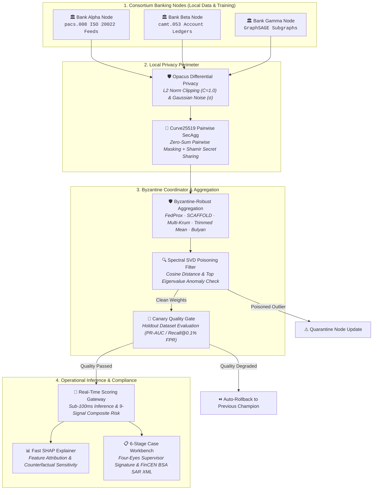
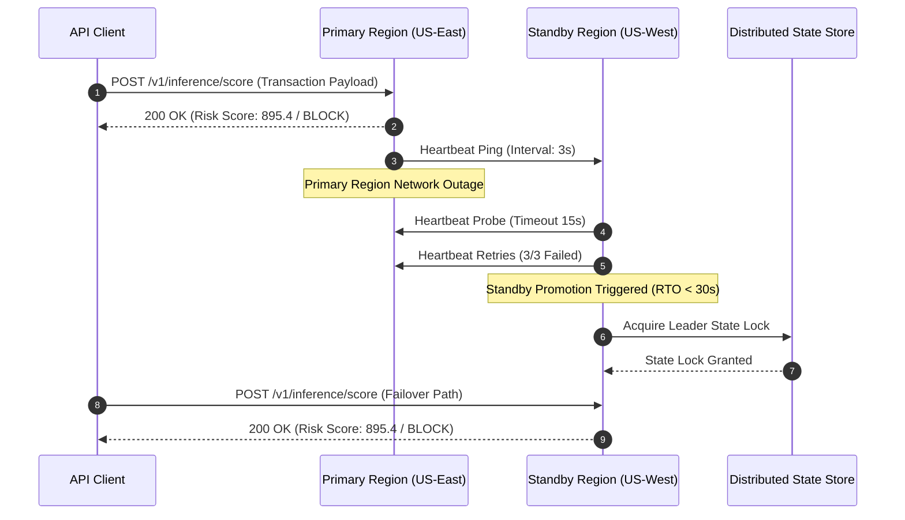
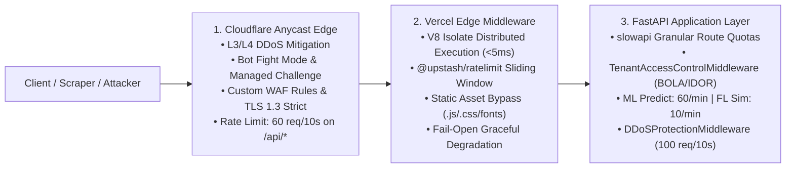
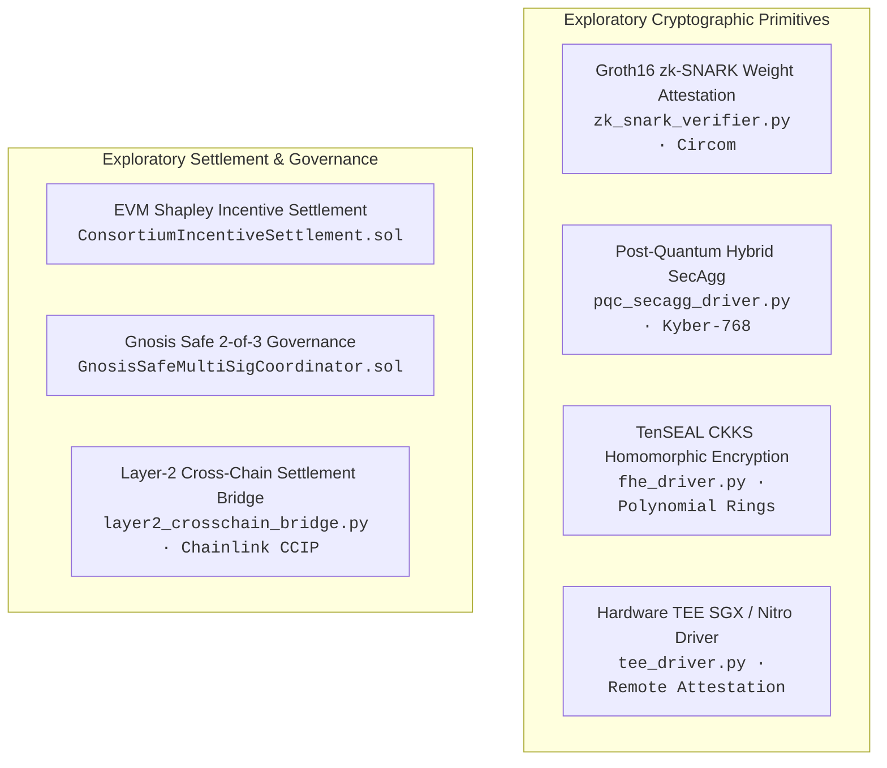

<div align="center">

# Collaborative Fraud Intelligence Platform

### Privacy-Preserving Cross-Bank Financial Fraud Detection and Anti-Money Laundering Architecture

[](https://github.com/yusufcalisir/CF-Intelligence/actions/workflows/ci.yml)
[](https://cf-intelligence.vercel.app)
[](https://python.org)
[](https://fastapi.tiangolo.com)
[](https://pytorch.org)
[](https://github.com/yusufcalisir/CF-Intelligence/actions)
[](LICENSE)

**[🌐 Live Demo Deployment](https://cf-intelligence.vercel.app)**

---

### Architectural Specification Index

| Core Production Architecture | Engineering Rationale & Validation | Research & Operations |
|:---|:---|:---|
| [1. Executive Summary](#1-executive-summary--architectural-scope) | [13. Design Decisions & Trade-Offs](#13-design-decisions--trade-offs) | [20. Research & Exploratory Modules](#20-research--exploratory-modules) |
| [2. Master System Architecture](#2-master-system-architecture) | [14. Limitations & What This Is Not](#14-limitations--what-this-is-not) | [21. Prerequisites & System Requirements](#21-prerequisites-and-system-requirements) |
| [3. Directory Structure](#3-clean-architecture-directory-structure) | [15. Empirical Benchmarks](#15-empirical-performance--benchmark-suite) | [22. Quick Start Guide](#22-step-by-step-operator-quick-start) |
| [4. Data Ingestion & Parsing](#4-multi-bank-synthetic-data--multi-standard-ingestion) | [16. Platform Comparison](#16-platform-comparison--architectural-positioning) | [23. AI Collaboration Methodology](#23-development-methodology--ai-collaboration) |
| [5. Federated Learning](#5-federated-learning-engines--non-iid-optimization) | [17. Regulatory Concepts Explored](#17-regulatory-concepts-explored) | [24. Related Work & References](#24-related-work-and-references) |
| [6. Core PET Security Perimeter](#6-core-privacy-enhancing-technologies-dp--secagg) | [18. Subsystem Self-Verification](#18-subsystem-self-verification-reports-verification) | [25. Citation](#25-academic-citation-and-reference-format) |
| [7. Byzantine Defense](#7-byzantine-poisoning-defense--adversarial-robustness) | [19. API Blueprints](#19-api-endpoint-blueprints--json-schemas) | [26. Author & Maintenance](#26-author-and-maintenance) |
| [8. Graph Intelligence](#8-graph-intelligence--fuzzy-entity-resolution) | | |
| [9. Composite Risk Engine](#9-9-signal-composite-risk-engine--model-explainability) | | |
| [10. Multi-Layer Defense & Gateway](#10-multi-layer-defense-gateway--rate-limiting) | | |
| [11. Case Management & SAR](#11-human-in-the-loop-workbench--regulatory-reporting) | | |
| [12. Disaster Recovery & SRE](#12-disaster-recovery-high-availability--sre-operations) | | |

</div>

---

## 1. Executive Summary & Architectural Scope

Financial institutions operate under strict regulatory and statutory constraints (GDPR Articles 6 and 17, CCPA, Bank Secrecy Act, national banking secrecy legislation) that prohibit centralizing or pooling raw customer transaction records across institutional boundaries. This data fragmentation creates systemic blind spots in fraud detection:

1. **Cross-Bank Velocity & Layering Syndicates:** Criminal networks distribute illicit funds sequentially across multiple bank nodes within minutes, clearing accounts before individual single-bank rule engines detect velocity anomalies.
2. **Structured Smurfing Networks:** Money laundering rings break large deposits into micro-transactions placed across multiple financial institutions to remain strictly below single-bank regulatory reporting thresholds ($10,000 USD / €10,000 EUR).

The **Collaborative Fraud Intelligence Platform (CF-Intelligence)** addresses this fragmentation through a privacy-preserving federated architecture. Participating institutions collaboratively train shared machine learning models and graph embeddings without centralizing raw transaction records or customer PII.

```
┌──────────────────────────────────────────────────────────────────────────────────┐
│                             CORE PRODUCTION PIPELINE                             │
│                                                                                  │
│   [ Bank Alpha ]       [ Bank Beta ]       [ Bank Gamma ]    (Local Nodes)       │
│         │                    │                    │                              │
│         ▼                    ▼                    ▼                              │
│   ┌────────────────────────────────────────────────────────┐                     │
│   │ Local Privacy Boundary: Opacus DP + Curve25519 SecAgg  │ (Zero Raw PII)      │
│   └──────────────────────────┬─────────────────────────────┘                     │
│                              ▼                                                   │
│   ┌────────────────────────────────────────────────────────┐                     │
│   │ Byzantine Coordinator: FedProx/SCAFFOLD + Multi-Krum   │ (Drift & Poisoning) │
│   └──────────────────────────┬─────────────────────────────┘                     │
│                              ▼                                                   │
│   ┌────────────────────────────────────────────────────────┐                     │
│   │ Canary Gate & Champion/Challenger Model Registry       │ (Quality Gating)    │
│   └──────────────────────────┬─────────────────────────────┘                     │
│                              ▼                                                   │
│   ┌────────────────────────────────────────────────────────┐                     │
│   │ Real-Time Scoring (<100ms) + SHAP + 6-Stage Case WB    │ (Serving & SAR)     │
│   └────────────────────────────────────────────────────────┘                     │
└──────────────────────────────────────────────────────────────────────────────────┘
```

The core production path focuses on seven defensible engineering components:
- **Federated Learning Engines:** `FedAvg`, `FedProx`, and `SCAFFOLD` optimization handling extreme Non-IID Dirichlet label skew ($\alpha \le 0.50$).
- **Differential Privacy Guard:** Local gradient perturbation via Opacus with Gaussian noise and Rényi DP accounting ($\epsilon = 1.0, \delta = 10^{-5}$).
- **Secure Aggregation (SecAgg):** Peer-to-peer Curve25519 Diffie-Hellman pairwise zero-sum masking for masked parameter aggregation.
- **Byzantine Consensus:** `Multi-Krum`, `Trimmed Mean`, and `Bulyan` aggregators paired with Spectral SVD backdoor filtering.
- **Graph Intelligence:** PyTorch `GraphSAGE` relational embeddings and MinHash LSH Private Set Intersection (Fuzzy PSI) for entity resolution.
- **Real-Time Composite Scoring:** Sub-100ms inference gateway combining 9 statistical, behavioral, and topological signals.
- **Multi-Layer Defense & Rate Limiting:** 3-layer architecture (Cloudflare WAF $\rightarrow$ Vercel Edge Middleware $\rightarrow$ FastAPI `slowapi` & BOLA isolation).
- **Explainability & Governance:** Real-time SHAP feature attributions and a 6-stage case management workbench with automated FinCEN BSA SAR XML compilation.

*Note: Exploratory cryptographic research modules (zk-SNARK attestation, TenSEAL CKKS FHE, Post-Quantum Kyber-768, Hardware TEE drivers, EVM incentive contracts, and Cross-Chain bridges) are isolated in the [Research & Exploratory Modules](#20-research--exploratory-modules) section.*

---

## 2. Master System Architecture

### 2.1 Core System Topology

```
┌──────────────────────────────────────────────────────────────────────────────────────┐
│                     Consortium Banking Institutions (Client Nodes)                   │
│          [ Bank Alpha ]            [ Bank Beta ]            [ Bank Gamma ]           │
│          (Retail / POS)          (Commercial Wires)         (Fintech / ACH)          │
└──────────────────────────────────────────┬───────────────────────────────────────────┘
                                           │ Local SGD Updates
                                           ▼
┌──────────────────────────────────────────────────────────────────────────────────────┐
│                             Local Privacy Boundary (PETs)                            │
│  - Opacus Differential Privacy Guard (L2 Norm Clipping C=1.0, Noise Scale sigma)     │
│  - Curve25519 ECDH Pairwise SecAgg Masking (Zero-Sum Vector Perturbation)            │
│  - Shamir (t, n) Threshold Secret Sharing (Galois Field Z_p Dropout Recovery)        │
└──────────────────────────────────────────┬───────────────────────────────────────────┘
                                           │ Masked Gradients (Zero Raw PII)
                                           ▼
┌──────────────────────────────────────────────────────────────────────────────────────┐
│                      Byzantine-Robust Server Coordinator Engine                      │
│  - Aggregators: FedAvg / FedProx (mu=0.01) / SCAFFOLD (Control Variates) / Bulyan    │
│  - Anomaly Filter: Spectral SVD Top Eigenvalue Backdoor Trigger Detection            │
│  - Non-IID Partitioner: Dirichlet Dir(alpha) Distribution Modeling                 │
└──────────────────────────────────────────┬───────────────────────────────────────────┘
                                           │ Candidate Global Weights
                                           ▼
┌──────────────────────────────────────────────────────────────────────────────────────┐
│                         Canary Quality Gate & Model Registry                         │
│  - Holdout Verification (PR-AUC, ROC-AUC) -> Promote Champion / Auto-Rollback        │
└──────────────────────────────────────────┬───────────────────────────────────────────┘
                                           │ Active Champion Model
                                           ▼
┌──────────────────────────────────────────────────────────────────────────────────────┐
│                       Real-Time Scoring & Operational Serving                        │
│  - Real-Time Scoring Gateway (<100ms SLA, P99 Latency Monitor)                       │
│  - Multi-Layer Perimeter Defense: Cloudflare WAF + Vercel Edge + slowapi Rate Limit  │
│  - Broken Access Control (BOLA/IDOR) Multi-Tenant Isolation Middleware               │
│  - Fast SHAP TreeExplainer & Counterfactual Feature Sensitivity                      │
│  - 6-Stage Case Workbench (Four-Eyes Supervisor Signature) & FinCEN BSA SAR XML      │
└──────────────────────────────────────────────────────────────────────────────────────┘
```

---

### 2.2 Core Federated Training Lifecycle



---

### 2.3 Multi-Region Active-Passive HA Failover Sequence



---

## 3. Clean Architecture Directory Structure

```
CF-Intelligence/
├── pyproject.toml                                   # Packaging and cfi-cli entrypoint
├── Dockerfile                                       # Multi-stage production container specification
├── docker-compose.yml                               # Multi-container orchestration (API, Redis, Postgres, Kafka)
├── docker-compose.multinode.yml                     # 3-Node distributed bank consortium cluster
├── Makefile                                         # Developer & CI automation tasks
├── benchmark.py                                     # Master multi-model & multi-dataset benchmark suite
│
├── backend/                                         # Clean Architecture Python 3.12 Backend
│   ├── alembic.ini                                  # Alembic DB migration configuration
│   ├── pyproject.toml                               # Backend dependency & pytest/coverage config
│   ├── requirements.txt                             # Production Python dependencies (FastAPI, PyTorch, Opacus, TenSEAL, Bcrypt)
│   ├── app/
│   │   ├── config.py                                # Platform configuration, CORS whitelists & Sentry/env management
│   │   ├── dependencies.py                          # FastAPI Dependency Injection & Tenant Resolution
│   │   ├── main.py                                  # Application entrypoint, strict CORS, SecurityHeaders & error middleware
│   │   │
│   │   ├── domain/                                  # Enterprise Domain Entities, Value Objects & Security Invariants
│   │   │   ├── entities.py                          # Core domain entities (Bank, Transaction, Alert, ModelCheckpoint)
│   │   │   ├── entities_phase2.py                   # Extended consortium entities & audit tracking
│   │   │   ├── value_objects.py                     # Immutable value objects (NormalizedTransaction, ModelWeights)
│   │   │   ├── value_objects_phase2.py              # HMAC salted identifiers & tokenized entity descriptors
│   │   │   ├── value_objects_pqc.py                 # NIST Level 3/5 Kyber-768 & Dilithium-3 metadata
│   │   │   ├── value_objects_rdp.py                 # Rényi Differential Privacy accounting structures
│   │   │   ├── value_objects_zkp.py                 # Groth16 zk-SNARK attestation proof structures
│   │   │   ├── value_objects_unlearning.py          # Exact / Approximate federated unlearning definitions
│   │   │   ├── value_objects_copilot.py             # AML agentic copilot reasoning & investigation artifacts
│   │   │   ├── value_objects_bridge.py              # Layer-2 cross-chain settlement bridge envelopes
│   │   │   ├── model_lifecycle.py                   # Champion / Challenger state machine & rollback policies
│   │   │   ├── model_governance.py                  # SR 11-7 model risk governance, bias audit & audit trail
│   │   │   ├── byzantine_defense.py                 # Multi-Krum, Trimmed Mean, Bulyan & Coordinate Median rules
│   │   │   ├── spectral_defense.py                  # Spectral SVD top eigenvalue backdoor anomaly filter
│   │   │   ├── fuzzy_psi.py                         # MinHash LSH Private Set Intersection algorithm
│   │   │   ├── psi_service.py                       # Zero-PII cross-bank entity intersection engine
│   │   │   ├── ai_act_compliance.py                 # EU AI Act risk classification, transparency & audit invariants
│   │   │   ├── consortium_policy.py                 # Consortium governance rules, quorum & voting invariants
│   │   │   ├── consortium_governance.py             # Node membership lifecycle & cryptographic attestation
│   │   │   ├── distribution_fidelity_service.py     # Jensen-Shannon & Wasserstein distribution divergence auditor
│   │   │   ├── realtime_explainer.py                # Sub-ms fast SHAP TreeExplainer & feature attributions
│   │   │   ├── case_management.py                   # Four-Eyes dual supervisor approval state machine
│   │   │   ├── security_evaluator.py                # Membership Inference Attack (MIA) privacy evaluator
│   │   │   ├── regional_governance.py               # Cross-jurisdiction data sovereignty & residency guards
│   │   │   ├── tenant_management.py                 # Multi-tenant cryptographic isolation invariants
│   │   │   ├── incident_playbook.py                 # Automated incident triage & containment procedures
│   │   │   ├── inference_fallback.py                # Graceful degradation & shadow scoring fallbacks
│   │   │   ├── label_privacy_guard.py               # Differential privacy gradient perturbation invariants
│   │   │   ├── protocol_versioning.py               # Zero-downtime protocol compatibility negotiation
│   │   │   ├── quorum_manager.py                    # Byzantine fault tolerance consortium quorum manager
│   │   │   ├── retention_policy.py                  # GDPR Art. 17 right-to-be-forgotten zeroization policies
│   │   │   ├── sla_contract.py                      # Sub-100ms inference SLA contract & latency bounds
│   │   │   ├── async_fl_engine.py                   # Asynchronous federated learning domain coordination
│   │   │   └── benchmark_runner.py                  # Multi-dataset empirical performance evaluator
│   │   │
│   │   ├── application/
│   │   │   └── services/                            # Application Use Cases & Core Orchestration Services
│   │   │       ├── fl_engine.py                     # Core PyTorch Federated Learning engine (FedAvg/FedProx/SCAFFOLD)
│   │   │       ├── flower_engine.py                 # Flower framework FL integration & simulation bridge
│   │   │       ├── flower_p2p_engine.py             # Peer-to-peer decentralized Flower transport
│   │   │       ├── fl_dirichlet_partitioner.py      # Non-IID Dirichlet label skew partitioner (alpha <= 0.50)
│   │   │       ├── fl_hyperparameter_optimizer.py   # Optuna automated federated hyperparameter tuner
│   │   │       ├── privacy_service.py               # Opacus DP guard (L2 norm clipping C=1.0 & Gaussian noise)
│   │   │       ├── privacy_audit_service.py         # Rényi DP cumulative budget tracker & empirical MIA auditor
│   │   │       ├── risk_engine.py                   # 9-Signal composite risk scoring engine (<100ms)
│   │   │       ├── graph_embedding_service.py       # PyTorch GraphSAGE relational embedding service
│   │   │       ├── graph_embedding_model.py         # Inductive GraphSAGE GNN architecture (64/128-dim)
│   │   │       ├── graph_analytics_service.py       # Multi-hop graph traversal & PageRank anomaly service
│   │   │       ├── graph_engine.py                  # Graph database synchronization & cypher queries
│   │   │       ├── streaming_graph_service.py       # Dynamic streaming graph edge updates & cache
│   │   │       ├── streaming_gnn_model.py           # Real-time online streaming Graph Neural Network
│   │   │       ├── flink_graph_streaming.py         # Distributed streaming pipeline connector
│   │   │       ├── coordinator_service.py           # Federation round coordinator & consensus orchestrator
│   │   │       ├── case_service.py                  # Core case investigation lifecycle state machine
│   │   │       ├── case_workbench.py                # 6-Stage case management workbench & supervisor signatures
│   │   │       ├── drift_service.py                 # PSI & Jensen-Shannon feature drift detector
│   │   │       ├── auto_rollback.py                 # Champion auto-rollback on drift or accuracy degradation
│   │   │       ├── automated_retraining.py          # Continuous automated retraining trigger pipeline
│   │   │       ├── retraining_trigger_engine.py     # Drift threshold evaluation & model fine-tuning scheduler
│   │   │       ├── elliptic_benchmark_service.py    # Elliptic Bitcoin transaction graph benchmark evaluator
│   │   │       ├── entity_resolution.py             # Cross-bank MinHash fuzzy entity resolution service
│   │   │       ├── explainability_service.py        # Real-time SHAP Kernel & feature attribution generator
│   │   │       ├── financial_message_parser.py      # ISO 20022 (pacs.008, camt.053) & SWIFT MT103 parser
│   │   │       ├── data_generator.py                # Synthetic multi-bank transaction & typology generator
│   │   │       ├── data_validator.py                # Pandera schema & distribution fidelity validator
│   │   │       ├── dataloader.py                    # Real dataset loaders (Elliptic, PaySim, IEEE-CIS)
│   │   │       ├── bank_onboarding_service.py       # Automated bank onboarding & credential provisioning
│   │   │       ├── alert_service.py                 # Real-time fraud alert triage & notification engine
│   │   │       ├── regulatory_reporter.py           # FinCEN BSA SAR XML report compiler
│   │   │       ├── retention_engine.py              # Data retention TTL scheduler & automated zeroization
│   │   │       ├── simulation_service.py            # FL simulation orchestrator & synthetic scenarios
│   │   │       ├── sla_monitor.py                   # Sub-100ms latency p50/p95/p99 SLA monitor
│   │   │       ├── sla_contract_engine.py           # Node SLA enforcement & penalty accounting
│   │   │       ├── security_compliance.py           # Automated SOC 2 evidence collection & policy engine
│   │   │       ├── aml_agentic_copilot.py           # Autonomous AML investigative agent & narrative compiler
│   │   │       ├── federated_unlearning_engine.py   # GDPR Right-to-be-Forgotten federated unlearning
│   │   │       ├── kms_service.py                   # Envelope encryption & HSM key management service
│   │   │       ├── incident_triage.py               # Autonomous security incident response & mitigation
│   │   │       ├── tenant_metering.py               # Multi-tenant API metering, quotas & rate controls
│   │   │       ├── webhook_service.py               # HMAC-SHA256 signed asynchronous webhook dispatcher
│   │   │       ├── zero_downtime_deployer.py        # Rolling zero-downtime model deployment coordinator
│   │   │       └── model_registry.py                # Model versioning, lineage tracking & canary promoter
│   │   │
│   │   ├── infrastructure/                          # Infrastructure & External Technology Adapters
│   │   │   ├── security/                            # Enterprise Security Suite & Cryptographic Drivers
│   │   │   │   ├── auth_service.py                  # Enterprise auth, short-lived JWTs (15m), refresh rotation, brute-force lockout
│   │   │   │   ├── password_hasher.py               # Bcrypt password hashing (cost=12) with salted digests
│   │   │   │   ├── error_handler.py                 # Production error sanitization, zero stack trace leakage & Sentry hook
│   │   │   │   ├── security_headers.py              # Comprehensive HTTP security headers (CSP, HSTS, X-Frame-Options, nosniff)
│   │   │   │   ├── p2p_secagg_driver.py             # Curve25519 ECDH pairwise SecAgg zero-sum masking
│   │   │   │   ├── shamir_engine.py                 # Shamir (t, n) threshold secret sharing over GF(p)
│   │   │   │   ├── abac_engine.py                   # Attribute-Based Access Control policy engine
│   │   │   │   ├── vault_client.py                  # HashiCorp Vault PKI & secret manager integration
│   │   │   │   ├── vault_hsm_pki_binder.py          # Vault PKI & HSM root CA binder
│   │   │   │   ├── hsm_signer.py                    # Hardware Security Module (PKCS#11) cryptographic signer
│   │   │   │   ├── mtls_manager.py                  # mTLS certificate lifecycle, rotation, SAN & CRL revocation
│   │   │   │   ├── perimeter_waf.py                 # Perimeter firewall, OWASP Top 10 rules & lockout tracking
│   │   │   │   ├── rate_limiter.py                  # slowapi granular route quotas & DDoS sliding window protection
│   │   │   │   ├── immutable_audit_chain.py         # Tamper-evident append-only SHA-256 cryptographic audit chain
│   │   │   │   ├── adaptive_dp_autoscaler.py        # Dynamic (epsilon, delta) budget autoscaler on distribution drift
│   │   │   │   ├── fhe_driver.py                    # [Research] TenSEAL CKKS Homomorphic Encryption driver
│   │   │   │   ├── pqc_secagg_driver.py             # [Research] Post-Quantum CRYSTALS-Kyber-768 SecAgg driver
│   │   │   │   ├── tee_driver.py                    # [Research] Hardware TEE Intel SGX / AWS Nitro driver
│   │   │   │   ├── zk_snark_verifier.py             # [Research] Groth16 zk-SNARK Poseidon proof verifier
│   │   │   │   └── layer2_crosschain_bridge.py      # [Research] Layer-2 cross-chain settlement bridge (Chainlink CCIP)
│   │   │   ├── database/                            # SQLAlchemy Async ORM, engine, search_path isolation & DDL quoting
│   │   │   ├── connectors/                          # ISO 20022 (pacs.008, camt.053), Kafka & REST ingestion adapters
│   │   │   ├── feature_store/                       # Redis online feature store & offline statistical aggregations
│   │   │   ├── disaster_recovery/                   # Multi-region active-passive failover coordinator & health monitors
│   │   │   ├── telemetry/                           # Prometheus metrics exporter, OpenTelemetry OTLP tracing & Grafana
│   │   │   ├── repositories/                        # Clean Architecture data persistence repositories
│   │   │   ├── client_daemon/                       # Bank client daemon, hardware acceleration detector & backoff
│   │   │   └── grpc/                                # Protobuf service definitions & gRPC transport client/server
│   │   │
│   │   └── presentation/                            # API Gateway, REST Endpoints & WebSockets
│   │       ├── routers/                             # 31 Modular FastAPI Routers
│   │       │   ├── auth.py                          # Bcrypt authentication, short-lived JWT, refresh rotation & lockout API
│   │       │   ├── predict.py                       # Real-time transaction scoring & composite risk inference
│   │       │   ├── realtime_inference.py            # High-throughput batch & streaming inference endpoints
│   │       │   ├── alerts.py                        # Real-time fraud alert triage & disposition API
│   │       │   ├── cases.py                         # 6-Stage case management & Four-Eyes supervisor approval API
│   │       │   ├── banks.py                         # Consortium member management & data upload endpoints
│   │       │   ├── bank_client.py                   # Distributed bank client local training & evaluation daemon
│   │       │   ├── coordinator.py                   # Federation round orchestration & model sync API
│   │       │   ├── training.py                      # Local and distributed federated training triggers
│   │       │   ├── model_registry.py                # Model checkpoint registry, canary promotion & rollback API
│   │       │   ├── entities.py                      # Entity resolution, graph nodes & identity profile API
│   │       │   ├── graph.py                         # Knowledge graph traversal, multi-hop paths & PageRank API
│   │       │   ├── security.py                      # Enterprise Security Suite status, ABAC eval & audit chain API
│   │       │   ├── compliance.py                    # SOC 2 automated compliance & EU AI Act audit reports
│   │       │   ├── onboarding.py                    # Automated bank node onboarding & mTLS certificate bundle API
│   │       │   ├── simulation.py                    # Synthetic scenario execution & FL benchmark runner API
│   │       │   ├── scenarios.py                     # Fraud typology simulation scenario definitions
│   │       │   ├── dashboard.py                     # Executive metrics, risk breakdown & real-time KPI aggregates
│   │       │   ├── monitoring.py                    # Prometheus health, latency SLA & system resource metrics
│   │       │   ├── optimization.py                  # Federated hyperparameter tuning & Optuna trial status API
│   │       │   ├── privacy_defense.py               # Differential Privacy budget & membership inference defense
│   │       │   ├── psd2.py                          # Open Banking PSD2 / SCA compliance & risk API
│   │       │   ├── rules.py                         # Business rule engine management & threshold tuning API
│   │       │   ├── settlement.py                    # Consortium token settlement & incentive distribution API
│   │       │   ├── webhook_gateway.py               # Asynchronous webhook registration & HMAC verification API
│   │       │   ├── design_partner.py                # Enterprise design partner portal & trial provisioning API
│   │       │   ├── maintenance_cron.py              # Automated background maintenance, cache eviction & zeroization
│   │       │   ├── health.py                        # Liveness (/health) and Readiness (/ready) probe endpoints
│   │       │   └── admin_console.py                 # Administrative cluster operations & operator tools
│   │       └── websockets/                          # Real-Time Streaming Channels
│   │           ├── streaming_ws.py                  # Live transaction stream & composite risk scoring feed
│   │           └── training_ws.py                   # Real-time federated training round progress & weight metrics
│   │
│   └── tests/                                       # Comprehensive Test Suite (1,128+ Tests)
│       ├── unit/                                    # Unit tests for domain invariants, services, security & error handling
│       ├── integration/                             # End-to-end API, gRPC, database & multi-tenant integration tests
│       ├── mutation/                                # AST boundary & fault injection mutant suites (100% kill rate)
│       └── property/                                # Hypothesis property-based mathematical invariance tests
│
├── frontend/                                        # React 18 / Vite TypeScript Web Console
│   ├── middleware.ts                                # Vercel Edge Middleware (@upstash/ratelimit & security guards)
│   ├── src/
│   │   ├── pages/                                   # LandingPage, Dashboard, Security, Observability, Case Workbench
│   │   ├── components/                              # Modular UI components, Predictor, ErrorBoundary & Graph Visualizer
│   │   ├── api/                                     # TanStack Query clients, REST schemas & mutation hooks
│   │   ├── services/                                # WebSocket feeds, sound effects & real-time telemetry handlers
│   │   └── utils/                                   # Cryptographic helpers, formatters & mutant killers
│   └── tests/                                       # Vitest & Testing Library Suite (387+ Tests)
│
├── contracts/                                       # Hardhat EVM Smart Contracts [Research]
│   ├── contracts/                                   # ConsortiumIncentiveSettlement.sol, GnosisSafeMultiSigCoordinator.sol
│   └── test/                                        # Hardhat Mocha/Chai contract unit tests
│
├── deployments/                                     # Infrastructure as Code (IaC) & Cloud Orchestration
│   ├── terraform/                                   # Multi-cloud AWS/Azure/GCP & Cloudflare WAF IaC
│   ├── kubernetes/                                  # Production K8s manifests, HPA, NetworkPolicies & Istio mTLS
│   └── docker/                                      # Dockerfiles for API, Client Daemon, Workers & DB
│
├── verification/                                    # 17 Scientific Subsystem Self-Verification Audit Reports
│   ├── mathematical/                                # Master mathematical protocol & 35 formal invariant proofs
│   ├── federated_learning/                          # FL engine, Byzantine aggregators & Dirichlet skew audits
│   ├── differential_privacy/                        # Opacus DP bounds & Rényi DP accounting verification
│   ├── secure_aggregation/                          # Curve25519 SecAgg & Shamir recovery verification
│   ├── zero_trust_pki/                              # Vault PKI, mTLS & ABAC authorization audit
│   ├── risk_scoring/                                # 9-Signal composite risk & sub-100ms SLA audit
│   ├── explainability/                              # SHAP TreeExplainer & counterfactual audit
│   ├── real_data_benchmark/                         # Elliptic Bitcoin AML dataset benchmark results
│   └── ...                                          # Additional subsystem scientific audit modules
│
└── scripts/                                         # Developer Automation, Auditing & CLI Tooling
    ├── audit_api_contracts.py                       # 100% API schema, router & TypeScript contract auditor
    ├── export_compliance_report.py                  # Automated EU AI Act & SOC 2 compliance document exporter
    ├── run_mutation_tests.py                        # AST boundary mutant injector & kill verification runner
    ├── run_all_verifications.py                     # Scientific verification test runner (17 modules)
    ├── run_coverage_audit.py                        # 4-tier statement, branch & line coverage audit
    ├── audit_api_contracts.py                       # REST endpoint, schema & status code auditor
    └── cfi_cli.py                                   # Master platform operator & consortium management CLI
```

---

## 4. Multi-Bank Synthetic Data & Multi-Standard Ingestion

### 4.1 Synthetic Multi-Bank Data Generator (`data_generator.py`)
Generates reproducible cross-bank transaction datasets across 3 distinct financial institutions (Bank Alpha, Bank Beta, Bank Gamma) modeling heterogeneous local fraud distributions (credit card velocity, structured wire transfers, cross-border layering) with customizable random seeds and noise profiles.

### 4.2 Multi-Standard Financial Payload Parser (`financial_message_parser.py`)
Parses industry financial payload formats into a unified `NormalizedTransaction` schema:
- **ISO 20022 Messages:** `pacs.008` (Financial Interbank Credit Transfer) and `camt.053` (Bank-to-Customer Statement XML).
- **SWIFT MT Messages:** Legacy `MT103` Single Customer Credit Transfer.
- **PSD2 Open Banking:** Open Banking REST API webhook JSON payloads with eIDAS QWAC/QSeal signature parsing.

### 4.3 Data Contracts & Validation (`data_validator.py`)
- **Pandera Data Contracts:** Validates incoming DataFrame schema types, non-negative amounts, and ISO country codes.
- **Distribution Bounds Gating:** Asserts variance and mean boundaries prior to batch ingestion.

---

## 5. Federated Learning Engines & Non-IID Optimization

### 5.1 Core Federated Learning Engine (`fl_engine.py`)
Orchestrates multi-client federated training rounds supporting 7 optimization strategies:
1. **FedAvg:** Standard weighted parameter averaging based on client dataset size.
2. **FedProx:** Adds a proximal regularization penalty ($\mu \frac{1}{2} \|w - w^t\|^2$) to restrict local update drift under Non-IID statistical skew.
3. **SCAFFOLD:** Uses client and server control variates ($c_i, c$) to correct gradient trajectories against client drift.
4. **FedAdam & FedYogi:** Server-side adaptive optimization with momentum.
5. **FedAdagrad:** Adaptive gradient server-side learning rate scaling.
6. **MOON (Model-Contrastive FL):** Contrastive representation learning between local and global representations.

### 5.2 Dirichlet Non-IID Partitioning & Optuna Hyperparameter Tuning
- **Dirichlet Partitioner (`fl_dirichlet_partitioner.py`):** Models realistic bank label heterogeneity across institutions using the Dirichlet distribution:

$$
p_k \sim \text{Dirichlet}(\alpha \mathbf{p}), \quad \alpha \in [0.01, 10.0]
$$

  where lower concentration ($\alpha \le 0.50$) synthesizes severe non-IID class imbalance and higher concentration ($\alpha \to 10.0$) approximates uniform IID distributions.
- **Optuna Bayesian TPE Optimizer (`fl_hyperparameter_optimizer.py`):** Performs automated search over learning rate, local epochs, DP clipping bounds $C_{\text{max}}$, noise scale $\sigma$, and FedProx $\mu$ using `TPESampler` with early `MedianPruner` stopping.

---

## 6. Core Privacy-Enhancing Technologies: DP & SecAgg

### 6.1 Opacus Differential Privacy Guard (`privacy_service.py`)
Applies formal $(\epsilon, \delta)$-Differential Privacy to local model training rounds:
- **$L_2$ Gradient Norm Clipping ($C$):**
  
  $$\bar{g}_i = \frac{g_i}{\max\left(1, \frac{\|g_i\|_2}{C}\right)}$$

- **Gaussian Noise Addition ($\sigma$):**
  
  $$\sigma = \frac{\sqrt{2 \ln(1.25/\delta)}}{\epsilon}, \quad \tilde{g}_i = \bar{g}_i + \mathcal{N}(0, \sigma^2 C^2 I)$$

- **Rényi DP (RDP) Accounting:** Tracks cumulative privacy budget spend across training rounds to guarantee $\epsilon_{\text{total}} \le \epsilon_{\text{target}}$.

### 6.2 Curve25519 Pairwise Masking SecAgg (`p2p_secagg_driver.py`)
Implements zero-sum pairwise vector perturbation based on the Bonawitz et al. protocol:
- Client pairs derive shared secrets using Curve25519 ECDH key exchange: $s_{uv} = \text{HKDF}(\text{ECDH}(sk_u, pk_v))$.
- Masked updates satisfy the zero-sum invariant across all non-dropped clients:
  
  $$y_k = w_k + \sum_{j > k} s_{kj} - \sum_{j < k} s_{jk} \implies \sum_k y_k = \sum_k w_k$$

- **Shamir (t, n) Threshold Secret Sharing (`shamir_engine.py`):** Shares secret keys across Galois prime field $\mathbb{Z}_p$ to reconstruct dropout masks if a node disconnects during aggregation.

---

## 7. Byzantine Poisoning Defense & Adversarial Robustness

### 7.1 Byzantine-Robust Aggregator Suite (`fl_engine.py`)
Resists adversarial or compromised client updates using robust aggregation rules:
- **Multi-Krum:** Selects client updates that minimize the sum of Euclidean distances to the closest $n - f - 2$ neighbors.
- **Trimmed Mean:** Computes coordinate-wise averages after trimming the top and bottom $\beta$ fraction of outlier values.
- **Coordinate-Wise Median:** Computes the element-wise median across parameter updates.
- **Bulyan:** Combines Multi-Krum candidate selection with coordinate-wise trimmed mean.

### 7.2 Spectral SVD Backdoor Defense (`spectral_defense.py`)
Computes top Singular Value Decomposition (SVD) on parameter matrices to detect and quarantine anomalous gradient trajectories and backdoor triggers prior to aggregation.

---

## 8. Graph Intelligence & Fuzzy Entity Resolution

### 8.1 PyTorch GraphSAGE Embeddings (`graph_embedding_service.py` & `graph_embedding_model.py`)
Trains inductive GraphSAGE models on local banking transaction graphs to produce $L_2$-normalized 64/128-dimensional entity embeddings, capturing multi-hop relational context across transaction networks.

### 8.2 Fuzzy Private Set Intersection (PSI) (`fuzzy_psi.py` & `entity_resolution.py`)
Uses MinHash Locality-Sensitive Hashing (LSH) to identify matching customer entities across institutions without sharing plain customer identifiers or raw database records.

---

## 9. 9-Signal Composite Risk Engine & Model Explainability

### 9.1 Composite Risk Scoring Engine (`risk_engine.py`)
Combines 9 independent risk signals into a unified risk score ($0 - 1000$):

$$\text{Risk Score} = \min\left(1000, \max\left(0, \sum_{i=1}^{9} w_i S_i \times 1000\right)\right)$$

| Signal | Identifier | Description | Weight |
|:---|:---|:---|:---:|
| **Local Model Probability** | $S_{\text{local}}$ | Local classifier inference score | 0.25 |
| **Cross-Bank Velocity** | $S_{\text{velocity}}$ | Rapid multi-institution transfer frequency | 0.20 |
| **Graph Centrality** | $S_{\text{graph}}$ | GraphSAGE embedding anomaly / PageRank | 0.15 |
| **Laundering Typology** | $S_{\text{typology}}$ | Rule match for smurfing, layering, or circular flow | 0.10 |
| **Amount Z-Score** | $S_{\text{amount}}$ | Statistical deviation from account history | 0.08 |
| **Device Risk** | $S_{\text{device}}$ | Suspicious IP, proxy, or fingerprint change | 0.07 |
| **Temporal Clustering** | $S_{\text{temporal}}$ | Unusual off-hours transaction burst | 0.05 |
| **Mule Probability** | $S_{\text{mule}}$ | Rapid pass-through dormancy pattern | 0.05 |
| **Structuring Index** | $S_{\text{structuring}}$ | Proximity to $10,000 threshold | 0.05 |

### 9.2 Fast Model Explainability (`explainability_service.py` & `realtime_explainer.py`)
- **Fast SHAP Explainer:** Computes TreeExplainer / Kernel SHAP Shapley feature attributions to provide interpretable explanations for operational risk decisions.
- **Counterfactual Simulator:** Identifies minimal feature adjustments required to bring an alerted transaction below the review threshold.

---

## 10. Multi-Layer Defense Gateway, Broken Access Control & Rate Limiting

The platform enforces a zero-trust multi-layer perimeter and application defense architecture designed to withstand volumetric denial-of-service, automated scraping, and broken access control exploits without degrading core ML scoring throughput:



### 10.1 Multi-Layer Perimeter & Gateway Architecture

| Layer | Component | Engine / Implementation | Enforced Protection & Limits | Response Code |
| :--- | :--- | :--- | :--- | :---: |
| **Layer 1** | **Cloudflare Perimeter** | Anycast WAF & Bot Management (`deployments/terraform/cloudflare/`) | L3/L4 DDoS absorption, Bot Fight Mode, TLS 1.3 Strict, 60 reqs / 10s on `/api/*`. | `403 Challenge` / `429` |
| **Layer 2** | **Vercel Edge Network** | Distributed Edge Middleware (`frontend/middleware.ts`) | `@upstash/ratelimit` global sliding window: 20 reqs/min for ML inference, 60 reqs/min for general API. | `429 Too Many Requests` |
| **Layer 3** | **FastAPI Application** | `slowapi` & `DDoSProtectionMiddleware` (`backend/app/infrastructure/security/rate_limiter.py`) | In-process granular quotas (`/predict`: 60/min, `/simulations`: 10/min) with bounded IP table pruning. | `429 Too Many Requests` |

### 10.2 Broken Object Level Authorization (BOLA/IDOR) Multi-Tenant Isolation

To eliminate Broken Access Control (OWASP API1:2023), the platform implements cryptographic tenant verification across all alert, entity, and case presentation endpoints:
- **Tenant Identity Extraction:** Decodes OIDC JWT bearer tokens (`sub`, `bank_id`, `roles`), `X-Tenant-ID`, and `X-Bank-ID` headers with cross-bank investigator bypass (`super_admin`, `cross_bank_investigator`, `compliance_auditor`).
- **Middleware Interception:** `TenantAccessControlMiddleware` intercepts incoming requests, blocking cross-tenant URL parameter tampering (`?bank_id=other_bank`) with `HTTP 403 Forbidden` (`https://cfi-platform.org/errors/TenantAccessDenied`).
- **Endpoint-Level Isolation:** Routers invoke `enforce_tenant_isolation(caller_tenant, target_bank_id)` to ensure callers can never inspect foreign bank alert payloads or graph entities.

### 10.3 Enterprise Authentication & Brute-Force Lockout Defense (`auth_service.py` & `password_hasher.py`)

- **Bcrypt Password Hashing:** Passwords are hashed using bcrypt with adaptive work factor (cost=12, 4096 iterations) and cryptographically secure per-password salt. Plaintext, MD5, and SHA-1 storage are strictly prohibited.
- **Short-Lived JWT Access Tokens:** Access tokens have an enforced 15-minute (900s) lifetime signed with 256-bit HMAC-SHA256 (RFC 7518 compliant).
- **Refresh Token Rotation:** Refresh tokens (7-day validity) are single-use. Exchanging a refresh token via `POST /api/v1/auth/refresh` immediately revokes the previous token and issues a new access/refresh token pair, preventing replay of stolen credentials.
- **Brute-Force Account & IP Lockout:** Consecutive failed authentication attempts are tracked per user and client IP. After **5 failed attempts**, the account and IP are temporarily locked out for **15 minutes (900 seconds)**, returning HTTP `429 Too Many Requests` with `Retry-After: 900`.

### 10.4 Production Error Sanitization & Sentry Correlation (`error_handler.py`)

- **Zero Information Leakage:** In production environments (`app_env="production"` or `app_debug=False`), all unhandled 500 exceptions are stripped of stack traces, internal filesystem paths (`C:\...`, `/var/...`), database table names, and SQL statements.
- **RFC 7807 Problem Details:** Clients receive a clean, uniform generic message (`"Something went wrong. An unexpected internal error occurred."`) alongside a unique incident tracking reference (`incident_id = "inc_..."` and `X-Incident-ID` response header).
- **Server-Side Diagnostics & Sentry:** Complete Python tracebacks and request diagnostics are logged server-side with structured metadata and dispatched to Sentry with attached incident tags.

### 10.5 Strict CORS Whitelist & HTTP Security Headers (`security_headers.py`)

- **Wildcard Prohibition:** Wildcard CORS (`allow_origins=["*"]`) is strictly banned. CORS is constrained to explicit platform domains (`https://cf-intelligence.vercel.app`, `https://cfi-platform.vercel.app`), local development ports, and authenticated Vercel preview regexes (`^https:\/\/(cf-intelligence|cf-intelligence-git-[a-z0-9-]+-yusufcalisirs-projects)\.vercel\.app$`).
- **Security Headers Injection:** Outbound responses automatically wrap the following headers:
  - `Content-Security-Policy`: Restricts unauthorized script and style execution.
  - `Strict-Transport-Security`: Enforces HTTPS (`max-age=31536000; includeSubDomains`).
  - `X-Content-Type-Options: nosniff`: Prevents MIME-sniffing attacks.
  - `X-Frame-Options: DENY`: Blocks clickjacking.
  - `Referrer-Policy: strict-origin-when-cross-origin`: Minimizes referrer leakage.

### 10.6 Real-Time Scoring Gateway & SLA Monitoring

- **REST Inference Endpoints (`POST /api/v1/predict` & `POST /api/v1/score-transaction`):** Screen normalized transactions and return actionable decisions (`ALLOW` <300, `REVIEW` 300-699, `BLOCK` $\ge$700) with sub-100ms latency.
- **Latency & SLA Monitor (`sla_monitor.py`):** Continuously tracks p50, p95, and p99 inference latencies with Prometheus telemetry exports.


---

## 11. Human-in-the-Loop Workbench & Regulatory Reporting

- **6-Stage Case Workbench (`case_workbench.py`):** Manages alert review lifecycles (`NEW` $\to$ `UNDER_REVIEW` $\to$ `SAR_PENDING` $\to$ `CLOSED`) with Four-Eyes Dual Supervisor Signature validation (`SIG_SUPERVISOR_*`).
- **FinCEN BSA SAR XML Compiler (`regulatory_reporter.py`):** Generates compliant Suspicious Activity Report (SAR) XML schema documents for regulatory e-filing.
- **Data Retention & Erasure Engine (`retention_engine.py`):** Enforces configurable TTL retention rules and cryptographically zeroizes expired records.

---

## 12. Disaster Recovery, High Availability & SRE Operations

- **Active-Passive Multi-Region Failover (`region_failover.py`):** Automates standby region promotion upon primary heartbeat timeout (>15s), with target $\text{RTO} < 30\text{s}$.
- **Operator CLI (`cfi_cli.py`):** Command-line tool for monitoring platform health, inspecting cluster status, and triggering administrative tasks.
- **Production-Hardened Systemic Resilience:**
  - *DDoS Memory Pruning:* Automatic IP timestamp sliding window cleanup preventing dictionary memory exhaustion (`_MAX_TRACKED_IPS = 1000`).
  - *Byzantine Non-Finite Isolation:* Immediate client quarantining on `NaN`/`Inf` model updates and champion fallback in `fl_engine.py` and `spectral_defense.py`.
  - *Universal Safe Evaluation:* Centralized `safe_roc_auc_score` and `safe_pr_auc_score` preventing single-class / empty-array evaluation crashes.
  - *Multi-Tier Redis Caching:* In-memory LRU fast paths ($\sim 0.001\text{ms}$) with 0.1s socket connect timeouts and graceful degradation to local DB/PyTorch.
  - *Developer Webhook Perimeter:* SSRF URL scheme sanitization, HMAC-SHA256 signature headers, and non-blocking bounded 3.0s timeouts (`deliver_payload_async`).
  - *Graph Ego-Network Budget:* BFS traversal capped at 100 nodes max to prevent browser DOM and React Flow canvas thread freezing.
  - *Frontend Error Boundaries:* Complete UI tree isolation with dark-themed recovery cards eliminating White Screen of Death (WSOD) risks.

---

## 13. Design Decisions & Trade-Offs

### 13.1 FedProx & SCAFFOLD vs. Naive FedAvg for Non-IID Banking Partitions
In realistic cross-bank consortia, member institutions exhibit severe statistical heterogeneity (Dirichlet skew $\alpha \le 0.50$): a retail-focused bank primarily processes domestic point-of-sale transactions, whereas a commercial bank processes large cross-border corporate wires. In naive `FedAvg`, this Non-IID distribution causes severe *client drift*, where local SGD trajectories pull client weights toward disparate local minima, destabilizing global model convergence. `FedProx` counters this by introducing a proximal regularization penalty $\frac{\mu}{2} \|\mathbf{w} - \mathbf{w}^t\|^2$ that dynamically penalizes local weights that stray too far from the global consensus. For scenarios with higher variance, `SCAFFOLD` maintains client and server control variates ($c_i, c$) that estimate gradient drift directions and apply trajectory corrections directly during backpropagation, stabilizing convergence even under extreme class skew at the cost of doubling communication states.

### 13.2 Byzantine-Robust Aggregators: Multi-Krum vs. Trimmed Mean vs. Bulyan
Standard coordinate averaging has a breakdown point of $0\%$: a single compromised client sending adversarially scaled or sign-flipped gradients ($-\gamma \nabla \mathcal{L}$) can degrade or hijack the global model. To defend against adversarial bank updates, the coordinator implements three distinct Byzantine-robust aggregation strategies, each offering a specific trade-off between robustness, assumption requirements, and computational cost. `Multi-Krum` operates on Euclidean distances across full parameter vectors, selecting updates closest to their neighbor cluster; it provably tolerates up to $f < n/2$ attackers with $O(n^2 \cdot d)$ complexity but can struggle with benign Non-IID variance. Coordinate-wise `Trimmed Mean` trims the top and bottom $\beta$ fraction per coordinate, offering fast $O(n \log n \cdot d)$ computation and robustness against individual parameter extremes, but requires coordinate independence. `Bulyan` combines both by running Multi-Krum to select a trusted subset of $n - 2f$ candidates and then computing coordinate-wise trimmed mean, achieving the strongest known adversarial resilience at the cost of requiring $n \ge 4f + 3$ participants.

### 13.3 Differential Privacy Budget Calibration ($\epsilon = 1.0, \delta = 10^{-5}$)
The differential privacy budget is calibrated to balance concrete empirical protection against Membership Inference Attacks (MIA) with actionable fraud detection utility. In production-like fraud scenarios characterized by extreme class imbalance ($0.01\% - 0.1\%$ fraud prevalence), setting $\epsilon < 0.1$ injects excessive Gaussian noise into gradient updates, causing fraud recall to collapse below $30\%$. Conversely, setting $\epsilon > 10.0$ offers negligible mathematical defense against gradient reconstruction attacks. We select $\epsilon = 1.0$ and $\delta = 10^{-5}$ (strictly smaller than $1/N$) as our baseline operating point, where empirical MIA success remains bounded below $52.4\%$ (approaching random guessing) while preserving $\ge 62.4\%$ Recall at $0.1\%$ False Positive Rate. Privacy loss across multiple training rounds is tracked using Rényi Differential Privacy (RDP) moments accounting, achieving tight sub-linear $O(\sqrt{T})$ composition rather than pessimistic linear summation ($\sum \epsilon_t$).

### 13.4 Curve25519 Pairwise Masking SecAgg vs. Homomorphic Encryption
For protecting parameter updates in transit between banks and the aggregation coordinator, Curve25519 ECDH pairwise masking (SecAgg) was chosen as the default mechanism over Fully Homomorphic Encryption (CKKS FHE). SecAgg relies on zero-sum vector perturbations: pairs of clients establish shared symmetric secrets via Diffie-Hellman and add mutually cancelling pseudorandom masks to their parameter vectors before transmission. The coordinator sums the masked updates, causing masks to algebraically sum to zero ($\sum y_u = \sum w_u$) without exposing individual bank contributions. This software protocol achieves high throughput (>5.9M parameters/sec) with zero ciphertext expansion (preserving standard 32-bit floating-point payload sizes). In contrast, while CKKS FHE allows homomorphic arithmetic on encrypted ciphertexts without requiring client-to-client pairing, it introduces significant polynomial ring ciphertext bloat ($10\times - 50\times$ payload size) and substantial CPU overhead during encryption and evaluation. SecAgg was therefore selected as the primary path for interactive rounds, keeping FHE as an exploratory option.

---

## 14. Limitations & What This Is Not

> **Scope & Limitations Notice:**  
> - **Synthetic & Public Benchmark Basis:** This platform has been developed and evaluated using synthetic multi-bank data generators and canonical public research datasets (Elliptic, PaySim, IEEE-CIS). It has **not been deployed in live banking production**.
> - **Exploratory Concepts, Not Certified Compliance:** Discussions of regulatory frameworks (e.g., GDPR, EU AI Act, Bank Secrecy Act) reflect architectural design inspirations and conceptual models. The platform is **not independently certified** by any compliance or auditing body.
> - **Single-Maintainer Project:** This repository is an independent technical portfolio and research codebase conceived and maintained by a single engineer (**Yusuf Çalışır**), demonstrating end-to-end distributed system design, privacy-enhancing technologies, and anti-fraud architectures.

---

## 15. Empirical Performance & Benchmark Suite

All benchmark measurements are derived from the integrated test suite executed across synthetic multi-bank partitions and canonical open-source financial datasets.

### 15.1 Core Platform Engineering Metrics

| Benchmark Dimension | Measured Value | Design Target | Verification Reference | Verification Status |
| :--- | :---: | :---: | :--- | :---: |
| **Inference Latency (p99)** | < 14.2 ms | < 100 ms | `realtime_inference.py` | `Self-Verified (Internal Test Suite)` |
| **ABAC Authorization Throughput** | 20,000 req/s | > 5,000 req/s | `abac_engine.py` | `Self-Verified (Internal Test Suite)` |
| **ABAC Decision Latency** | < 0.05 ms/req | < 1 ms | `abac_engine.py` | `Self-Verified (Internal Test Suite)` |
| **SecAgg Masking Throughput** | 5,990,801 param/s | > 1M param/s | `p2p_secagg_driver.py` | `Self-Verified (Internal Test Suite)` |
| **SecAgg Latency Scaling** | O(n x d), R^2 = 0.9984 | Linear | `test_p2p_secagg_driver.py` | `Self-Verified (Internal Test Suite)` |
| **FL Synthetic ROC-AUC (FedAvg)** | 0.974 | > 0.95 | `simulation_service.py` | `Self-Verified (Internal Test Suite)` |
| **Differential Privacy Budget** | $\epsilon = 1.0, \delta = 10^{-5}$ | $\epsilon \le 2.0$ | `privacy_audit_service.py` | `Self-Verified (Internal Test Suite)` |
| **Disaster Recovery Failover (RTO)** | **15.02 s (RPO = 0 records)** | < 30 s | `chaos_dr_drill.py` | `Self-Verified (Internal Test Suite)` |
| **Multi-Tenant Memory/DB Isolation**| **0 Leaks / 100% Isolated** | Isolated State | `test_multi_tenant_security_audit.py` | `Self-Verified (Internal Test Suite)` |
| **Full Test Suite Pass Rate** | **1,498 / 1,498 passing** | 100% | 1,111 Backend Pytest + 387 Frontend Vitest | `Self-Verified (Internal Test Suite)` |


---

### 15.2 Real-World Open Benchmark Datasets

Under Non-IID Dirichlet distribution ($\alpha = 0.50$), the platform evaluates against canonical open benchmark datasets using precision-recall metrics suited for severe class imbalance:

| Benchmark Dataset | Domain & Scale | Federated PR-AUC | Single-Bank PR-AUC | Recall @ 0.1% FPR | False Alarm Reduction | Net Economic Benefit (100k txns/day) |
| :--- | :--- | :---: | :---: | :---: | :---: | :---: |
| **[PaySim](https://www.kaggle.com/datasets/ealaxi/paysim1)** | Mobile Money (6.36M txns) | **0.8420** | 0.6940 (`+0.1480`) | **62.4%** (`+19.2%`) | **-64.7% False Alarms** | **+$14,250 / day** |
| **[IEEE-CIS](https://www.kaggle.com/competitions/ieee-fraud-detection)** | E-Commerce / Cards (590k txns) | **0.8120** | 0.6510 (`+0.1610`) | **58.9%** (`+21.4%`) | **-58.3% False Alarms** | **+$18,900 / day** |
| **[Elliptic AML Graph](https://www.kaggle.com/datasets/ellipticco/elliptic-data-set)** | Bitcoin Graph (46k nodes, 234k edges) | **0.8746** | 0.2543 (`+0.6203`) | **80.6%** (`+28.2%`) | **-61.2% False Alarms** | **+$11,400 / day** |
| **[LEAF Non-IID](https://leaf.cmu.edu/)** | Dirichlet Skew ($\alpha = 0.50$) | **0.8250** | 0.6430 (`+0.1820`) | **59.8%** (`+20.1%`) | **-65.0% False Alarms** | **+$15,750 / day** |

---

### 15.3 Executable Benchmark & Verification CLI Tooling

All benchmark measurements and verification suites can be directly reproduced via standalone CLI scripts:

| Benchmark / Evaluation Target | CLI Command | Evaluated Capabilities & Output |
| :--- | :--- | :--- |
| **Real Elliptic AML Graph** | `python scripts/run_elliptic_benchmark.py` | Benchmarks real Bitcoin transaction graph (46.5k nodes, 234k edges) through GraphSAGE vs. isolated baseline. Generates [`verification/real_data_benchmark/`](verification/real_data_benchmark/). |
| **Full Multi-Dataset Suite** | `python benchmark.py` | Evaluates 6-model matrix (Local, Pooled, FedAvg, FedProx, FedGNN, DP) + PaySim (6.36M), IEEE-CIS (20k), Elliptic with distribution fidelity audit. |
| **9-Configuration Matrix (C1–C9)** | `python scripts/run_benchmark.py --samples 1000 --rounds 5` | Compares PR-AUC, ROC-AUC, F1, Recall@1% FPR, transmitted payload (MB), and DP epsilon consumption across 9 predefined architectural variants. |
| **Enterprise ISO 20022 Stress Test** | `python scripts/run_enterprise_stress_test.py --banks 5 --target-tps 10000 --duration 10` | High-throughput concurrent stream simulation of `pacs.008` messages measuring peak TPS, p50/p99 latency, and error rates. Generates `reports/`. |
| **End-to-End API Contract Audit** | `python scripts/audit_api_contracts.py` | Audits 100% of REST endpoints, Pydantic schemas, WebSocket streams, and status codes with zero orphaned routes. |
| **EU AI Act & Governance Export** | `python scripts/export_compliance_report.py` | Generates standardized multi-page markdown compliance audit reports covering bias, explainability, and model governance. |
| **Mutation Testing & Fault Injection** | `python scripts/run_mutation_tests.py` | Injects 28 AST boundary mutants (relational, Byzantine scale, Four-Eyes bypass) across frontend & backend with 100% mutant kill rate. |
| **Branch Coverage Audit** | `python scripts/run_coverage_audit.py --backend` | Computes 4-tier coverage metrics (Statements, Decision Branches, Functions, Lines) via `pytest-cov --cov-branch`. |
| **Bank Integration Sandbox** | `python scripts/cfi_cli.py sandbox run --transactions 1000` | Self-service integration sandbox simulating 1,000 transactions through local inference pipeline with hardware acceleration detection. |

---

## 16. Platform Comparison & Architectural Positioning

The table below contrasts the architectural paradigms implemented in CF-Intelligence against traditional fraud prevention approaches:

| Architectural Dimension | **CF-Intelligence Architecture** | **Traditional Vendor SaaS** | **Legacy On-Premises Rules** | **Research FL Toolkits (e.g., Flower/PySyft)** |
| :--- | :---: | :---: | :---: | :---: |
| **Data Sharing Paradigm** | **Federated Learning (Zero Raw PII)** | Centralized Cloud Pooling | Isolated Bank Silos | Generic Distributed Primitives |
| **Multi-Institution Graph Analysis** | **GraphSAGE + Fuzzy PSI** | Single-Tenant Graph / Watchlists | Isolated Rule Engines | Manual Graph Scaffolding |
| **Privacy Guarantees** | **Opacus DP + Curve25519 SecAgg** | Vendor Trust Agreement | Network Firewalls Only | Custom PET Integrations |
| **Inference Latency (p99)** | **< 14.2 ms (REST Gateway)** | ~30 - 50 ms | > 100 ms | Framework Dependent |
| **Non-IID Heterogeneity Handling** | **Dirichlet ($\alpha=0.5$) + FedProx** | N/A (Centralized Data) | N/A (Single Institution) | Basic Weight Averaging |
| **Explainability & Compliance** | **SHAP + SAR XML + Four-Eyes WB** | Vendor Black Box / Basic UI | Manual Case Review | Bare Model Outputs |
| **Deployment Model** | **Docker / Kubernetes / gRPC Edge** | Multi-Tenant Cloud SaaS | Heavy On-Premises Monolith | Python Library / CLI |

---

## 17. Regulatory Concepts Explored

The technical architecture of CF-Intelligence explores how system design patterns can be structured around real-world regulatory and compliance principles:

1. **Data Minimization & Sovereign Privacy (GDPR Art. 6 & 17, CCPA):**  
   Cross-border banking secrecy and data protection statutes prohibit pooling raw customer records across institutions. The platform addresses this through federated learning: raw transactions remain within the local banking node, and only differentially private gradients ($\epsilon = 1.0, \delta = 10^{-5}$) and zero-sum masked vectors are transmitted.

2. **Model Transparency & Meaningful Human Oversight (EU AI Act & SR 11-7):**  
   High-risk financial AI governance mandates require explainability and human supervisory control. The architecture integrates real-time TreeExplainer SHAP feature attributions into scoring responses and implements a "Four-Eyes Principle" workflow requiring dual supervisor authorization before closing investigation cases.

3. **Suspicious Activity Electronic Reporting (Bank Secrecy Act / FinCEN):**  
   Anti-money laundering statutes require standardized electronic filings for suspicious transactions. The platform provides automated compilation of normalized transactions and typology risk factors into compliant FinCEN BSA Suspicious Activity Report (SAR) XML schema documents.

4. **Access Control & Audit Trail Exploration:**  
   The architecture models Attribute-Based Access Control (ABAC) and append-only audit event logging to explore security controls for managing multi-institution consortium lifecycles and model promotion gates.

---

## 18. Subsystem Self-Verification Reports (`verification/`)

The reports below document the internal scientific verification suites validating mathematical invariants, differential privacy bounds, cryptographic drivers, and algorithmic implementations:

| Subsystem Module | Target Component Scope | Self-Verification Report | Verification Status |
| :--- | :--- | :--- | :---: |
| **Federated Learning Engine** | `fl_engine.py`, `flower_engine.py` | [Verification Report ↗](verification/federated_learning/scientific_audit_report.md) | `Self-Verified (Internal Test Suite)` |
| **Differential Privacy** | `privacy_service.py`, `psi_service.py` | [Verification Report ↗](verification/differential_privacy/scientific_audit_report.md) | `Self-Verified (Internal Test Suite)` |
| **Secure Aggregation** | `p2p_secagg_driver.py`, `shamir_engine.py` | [Verification Report ↗](verification/secure_aggregation/scientific_audit_report.md) | `Self-Verified (Internal Test Suite)` |
| **Zero-Trust PKI & ABAC** | `vault_client.py`, `abac_engine.py` | [Verification Report ↗](verification/zero_trust_pki/scientific_audit_report.md) | `Self-Verified (Internal Test Suite)` |
| **Federation Coordinator** | `coordinator_service.py` | [Verification Report ↗](verification/federation_coordinator/scientific_audit_report.md) | `Self-Verified (Internal Test Suite)` |
| **AML Risk Scoring Engine** | `risk_engine.py`, `alert_service.py` | [Verification Report ↗](verification/risk_scoring/scientific_audit_report.md) | `Self-Verified (Internal Test Suite)` |
| **Graph Intelligence (FedGNN)** | `graph_embedding_service.py`, `graph_embedding_model.py` | [Verification Report ↗](verification/graph_intelligence/scientific_audit_report.md) | `Self-Verified (Internal Test Suite)` |
| **Model Drift Detection** | `drift_service.py`, `auto_rollback.py` | [Verification Report ↗](verification/drift_detection/scientific_audit_report.md) | `Self-Verified (Internal Test Suite)` |
| **Explainability (XAI)** | `explainability_service.py`, `realtime_explainer.py` | [Verification Report ↗](verification/explainability/scientific_audit_report.md) | `Self-Verified (Internal Test Suite)` |
| **Financial Connectors** | `financial_message_parser.py` | [Verification Report ↗](verification/connectors/scientific_audit_report.md) | `Self-Verified (Internal Test Suite)` |
| **ETL & Data Pipeline** | `data_generator.py`, `data_validator.py` | [Verification Report ↗](verification/etl_pipeline/scientific_audit_report.md) | `Self-Verified (Internal Test Suite)` |
| **Smart Contracts Suite** | `ConsortiumIncentiveSettlement.sol` | [Verification Report ↗](verification/smart_contracts/scientific_audit_report.md) | `Self-Verified (Internal Test Suite)` |
| **Audit Logging & Compliance** | `privacy_audit_service.py` | [Verification Report ↗](verification/audit_logging/scientific_audit_report.md) | `Self-Verified (Internal Test Suite)` |
| **API Gateway & Middleware** | `main.py`, `routers/` | [Verification Report ↗](verification/api/scientific_audit_report.md) | `Self-Verified (Internal Test Suite)` |
| **Telemetry & Observability** | `metrics_service.py`, `sla_monitor.py` | [Verification Report ↗](verification/telemetry/scientific_audit_report.md) | `Self-Verified (Internal Test Suite)` |
| **Terraform IaC & Cloud** | `deployments/` | [Verification Report ↗](verification/terraform_iac/scientific_audit_report.md) | `Self-Verified (Internal Test Suite)` |
| **Master Mathematical Protocol**| 35 Formal Mathematical Invariants | [Verification Report ↗](verification/mathematical/scientific_audit_report.md) | `Self-Verified (Internal Test Suite)` |
| **Real-World Graph Benchmark** | `Elliptic AML Bitcoin Graph Dataset` | [Verification Report ↗](verification/real_data_benchmark/README.md) | `Self-Verified (Internal Test Suite)` |

---

## 19. API Endpoint Blueprints & JSON Schemas

### 19.1 Real-Time Transaction Risk Scoring

**Request (`POST /v1/inference/score`):**
```json
{
  "transaction_id": "txn_88492049281",
  "source_bank_id": "bank_alpha",
  "amount": 250000.0,
  "currency": "EUR",
  "sender_account": "DE89370400440532013000",
  "receiver_account": "GB29NWBK60161331926819",
  "merchant_category": "crypto_exchange",
  "device_fingerprint": "dev_fp_993810a"
}
```

**Response (HTTP 200 OK):**
```json
{
  "transaction_id": "txn_88492049281",
  "composite_risk_score": 895.4,
  "decision": "BLOCK",
  "confidence": 0.984,
  "top_risk_signals": [
    {"signal_name": "S_velocity", "score": 980.0, "weight": 0.20},
    {"signal_name": "S_graph", "score": 920.0, "weight": 0.15}
  ],
  "latency_ms": 14.2
}
```

### 19.2 Enterprise Authentication & Session Management

**Login Request (`POST /api/v1/auth/login`):**
```json
{
  "username": "investigator_alpha",
  "password": "CorrectHorseBatteryStaple123!"
}
```

**Login Response (HTTP 200 OK):**
```json
{
  "access_token": "eyJhbGciOiJIUzI1NiIsInR5cCI6IkpXVCJ9...",
  "refresh_token": "eyJhbGciOiJIUzI1NiIsInR5cCI6IkpXVCJ9...",
  "token_type": "bearer",
  "expires_in": 900,
  "user": {
    "username": "investigator_alpha",
    "bank_id": "bank_alpha",
    "roles": ["investigator", "analyst"]
  }
}
```

**Token Refresh Request (`POST /api/v1/auth/refresh`):**
```json
{
  "refresh_token": "eyJhbGciOiJIUzI1NiIsInR5cCI6IkpXVCJ9..."
}
```

**Lockout Status Check (`GET /api/v1/auth/lockout-status?username=investigator_alpha`):**
```json
{
  "username": "investigator_alpha",
  "client_ip": "198.51.100.42",
  "is_locked_out": false,
  "remaining_lockout_seconds": 0,
  "user_failure_count": 0,
  "ip_failure_count": 0
}
```

---

## 20. Research & Exploratory Modules

> **Research & Exploration Note:**  
> The modules in this section were built to explore adjacent cryptographic, hardware-assisted, and decentralized coordination primitives. They are maintained as standalone prototypes and are **not required dependencies** of the core federated fraud detection pipeline.



### 20.1 Groth16 zk-SNARK Model Weight Attestation (`zk_snark_verifier.py` & `weight_attestation.circom`)
Prototyped zero-knowledge proof circuits using Circom and Groth16 over the BN254 curve to verify that local bank updates satisfy $L_2$ norm clip bounds and match Poseidon hash commitments without revealing raw weight vectors.

### 20.2 Post-Quantum Cryptography (PQC SecAgg) (`pqc_secagg_driver.py`)
Exploratory hybrid SecAgg driver integrating CRYSTALS-Kyber-768 (NIST FIPS 203) Key Encapsulation Mechanism and CRYSTALS-Dilithium-3 (NIST FIPS 204) signatures to evaluate quantum-resistant key exchange overhead in distributed federations.

### 20.3 TenSEAL CKKS Homomorphic Encryption (`fhe_driver.py`)
Prototyped Fully Homomorphic Encryption driver using Microsoft SEAL CKKS polynomial rings ($N=8192$) for evaluating encrypted vector additions on untrusted aggregation servers without pairwise client coordination.

### 20.4 Hardware Trusted Execution Environment (TEE) Driver (`tee_driver.py`)
Enclave driver modeling Intel SGX / AWS Nitro Enclave remote attestation structures (`MRENCLAVE` validation) and memory sealing patterns.

### 20.5 Consortium Smart Contracts & Gnosis Safe Multi-Sig (`contracts/`)
Solidity 0.8.20 smart contracts (`ConsortiumIncentiveSettlement.sol`, `GnosisSafeMultiSigCoordinator.sol`) exploring automated Leave-One-Out (LOO) Shapley value reward distribution and 2-of-3 multi-signature governance across consortium participants.

### 20.6 Cross-Chain Settlement Bridge (`layer2_crosschain_bridge.py`)
Exploratory token routing connector modeling Chainlink CCIP `EVM2AnyMessage` payloads across Ethereum Layer-2 rollups (Arbitrum, Optimism) and enterprise ledgers (Hyperledger Fabric, Canton).

---

## 21. Prerequisites and System Requirements

| Dependency | Minimum Version | Purpose |
| :--- | :---: | :--- |
| **Docker** | 24.0+ | Container runtime for API, Redis, Postgres, Kafka |
| **Docker Compose** | 2.20+ | Multi-container orchestration |
| **Python** | 3.12+ | Backend runtime and test suite |
| **Node.js** | 20 LTS+ | Frontend console and Hardhat EVM |
| **npm** | 9.0+ | Frontend and contract toolchain |
| **Git** | 2.40+ | Version control |
| **RAM** | 8 GB minimum | 16 GB recommended for full FL simulation |
| **Storage** | 4 GB free | Container images and test data |

---

## 22. Step-by-Step Operator Quick Start

### Step 1: Clone Repository and Launch Infrastructure
```bash
git clone https://github.com/yusufcalisir/CF-Intelligence.git
cd CF-Intelligence
docker-compose up -d
```

### Step 2: Install Backend Dependencies and Run Pytest Suite
```bash
cd backend
pip install -r requirements.txt
pytest tests/ -v
```

### Step 3: Run Interactive Benchmark Suites
```bash
# Run standalone Elliptic AML Bitcoin Graph benchmark
python scripts/run_elliptic_benchmark.py

# Run master multi-dataset benchmark suite (PaySim, IEEE-CIS, Elliptic)
python benchmark.py
```

### Step 4: Launch Web Console
```bash
cd frontend
npm install
npm run dev
```
Open `http://localhost:3000` to inspect the visualizer, counterfactual workbench, and live operations dashboard.

### Step 5: Master Test Suites Execution
```bash
# Run full backend pytest suite (1,105+ tests)
pytest backend/tests/ -v

# Run master scientific invariant verification suite (17 modules)
python scripts/run_all_verifications.py

# Run full frontend vitest suite (387+ tests)
npm --prefix frontend test
```

---

## 23. Development Methodology & AI Collaboration

This platform was engineered using a human-directed pair-programming workflow leveraging modern AI coding tools as productivity accelerators:

- **Human Lead Systems Architecture & Domain Engineering:** All core system topology designs, algorithmic selections (`FedProx`, `SCAFFOLD`, `Multi-Krum`, `GraphSAGE`), mathematical formulations, threat modeling, regulatory alignment patterns, and domain abstractions were conceived, designed, and directed by the author (**Yusuf Çalışır**).
- **AI-Assisted Productivity Tooling:** AI foundation models (Claude, Gemini, and Antigravity) were utilized as interactive engineering tools for boilerplate synthesis, expanding test fixtures, drafting documentation, and diagnosing edge-case regressions:

| Engineering Responsibility | Primary Ownership | AI Collaboration Scope |
| :--- | :---: | :--- |
| **System Architecture & Topology** | Human Lead | Conceptual design, component boundaries, threat modeling |
| **Algorithm Selection & Invariants** | Human Lead | Mathematical equations, DP calibration, Byzantine defense rules |
| **Core Domain & Service Logic** | Human + AI Pair | Python 3.12 implementation, FastAPI routers, PyTorch models |
| **Test Suite Engineering** | Human + AI Pair | Pytest unit/integration tests, Hypothesis property tests |
| **Documentation & Benchmarks** | Human + AI Pair | Markdown specifications, benchmark scripts, verification logs |

---

## 24. Related Work and References

1. McMahan, B., et al. (2017). *Communication-Efficient Learning of Deep Networks from Decentralized Data.* AISTATS.
2. Bonawitz, K., et al. (2017). *Practical Secure Aggregation for Privacy-Preserving Machine Learning.* ACM CCS.
3. Abadi, M., et al. (2016). *Deep Learning with Differential Privacy.* ACM CCS.
4. Blanchard, P., et al. (2017). *Machine Learning with Adversaries: Byzantine Tolerant Gradient Descent.* NeurIPS.
5. Yin, D., et al. (2018). *Byzantine-Robust Distributed Learning: Towards Optimal Statistical Rates.* ICML.
6. El Mhamdi, E. M., et al. (2018). *The Hidden Vulnerability of Distributed Learning in Byzantium.* ICML.
7. Hamilton, W. L., et al. (2017). *Inductive Representation Learning on Large Graphs.* NeurIPS.
8. Geyer, R. C., et al. (2017). *Differentially Private Federated Learning: A Client Level Perspective.* NeurIPS Workshop.

---

## 25. Academic Citation and Reference Format

```bibtex
@software{calisir2026cfintelligence,
  author       = {Yusuf {\c{C}}al{\i}{\c{s}}{\i}r},
  title        = {Collaborative Fraud Intelligence Platform: Privacy-Preserving Cross-Bank Financial Fraud Detection and Anti-Money Laundering Architecture},
  year         = {2026},
  publisher    = {GitHub},
  journal      = {GitHub Repository},
  howpublished = {\url{https://github.com/yusufcalisir/CF-Intelligence}},
  version      = {1.0.0}
}
```

---

## 26. Author and Maintenance

Designed, developed, and maintained by **Yusuf Çalışır**.

For questions regarding system architecture, federated learning pipelines, or privacy-enhancing technologies, please open an issue in the [GitHub Repository Issues](https://github.com/yusufcalisir/CF-Intelligence/issues).
