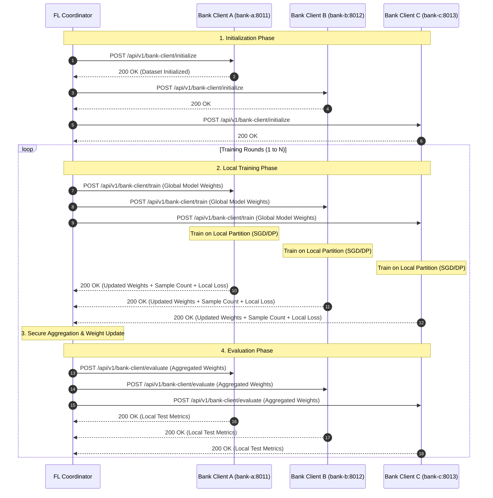
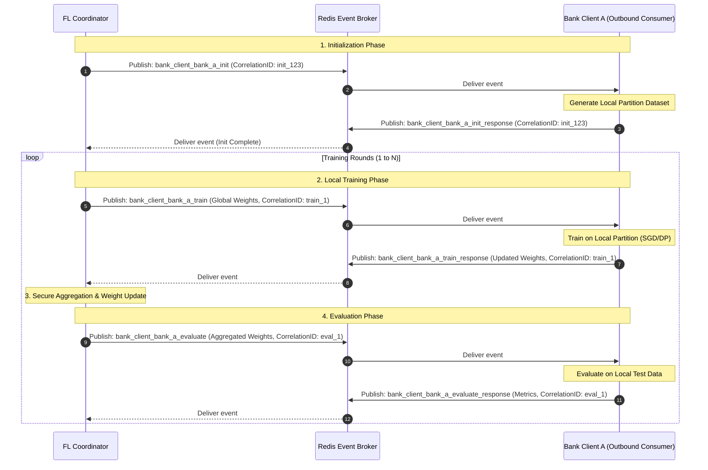
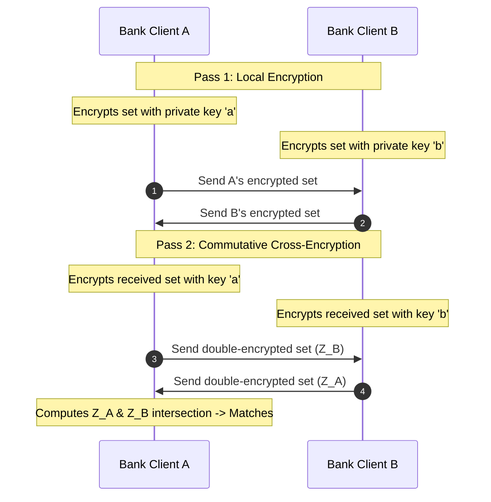
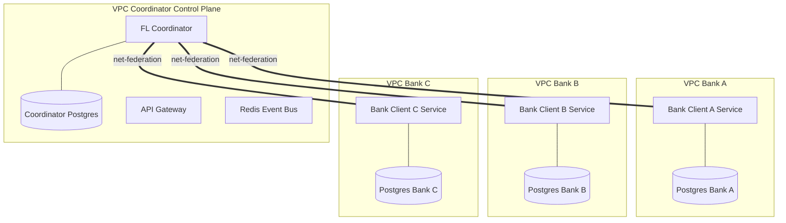
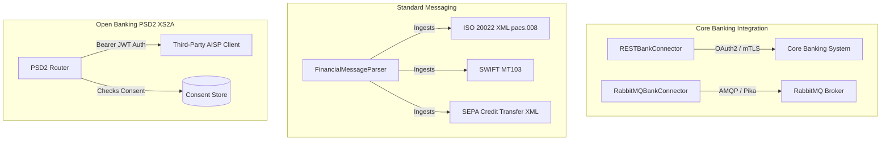
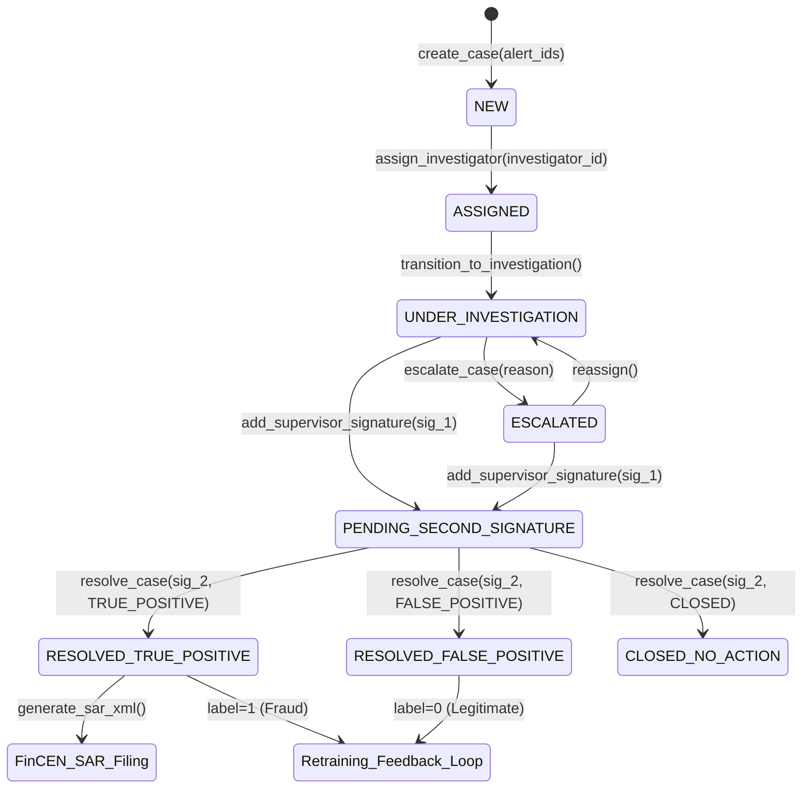
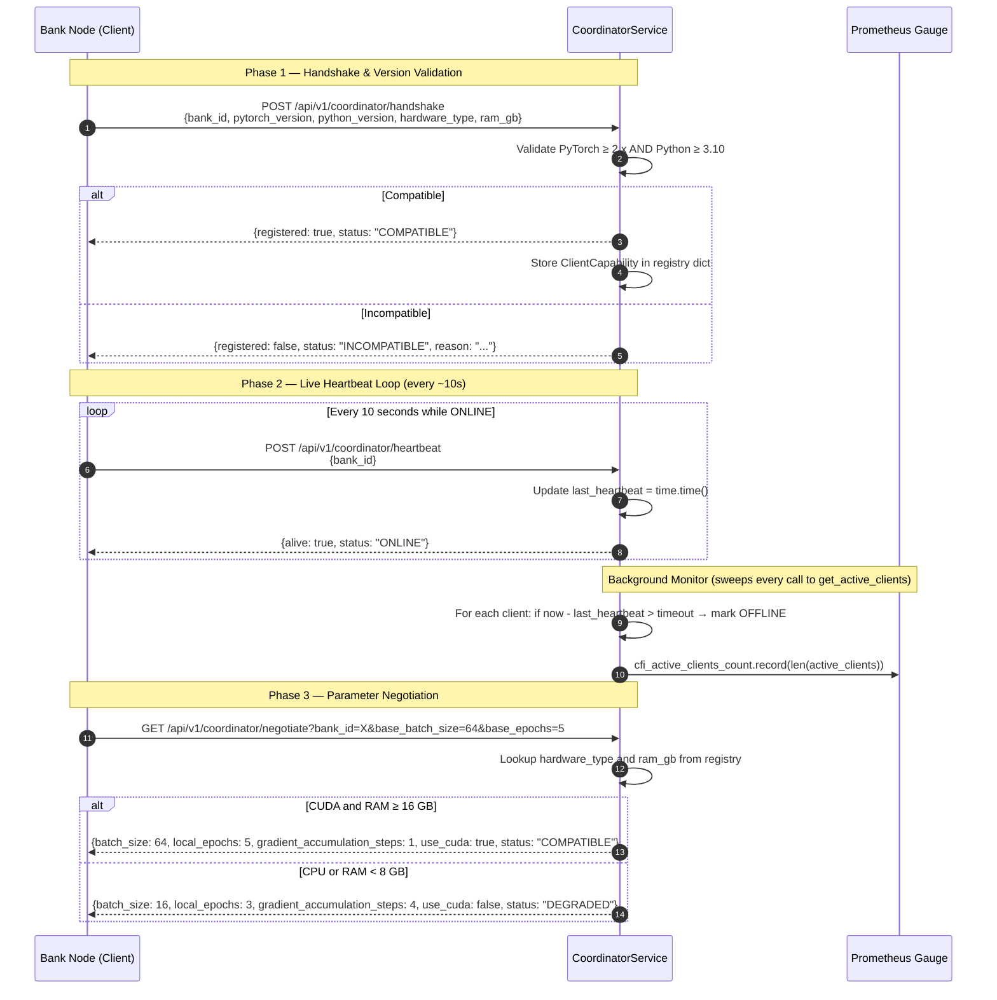

# Architecture & System Design: Phase 2 Collaborative AML Platform

This document describes the architectural additions, system components, protocols, and end-to-end data flows of the collaborative cross-bank Anti-Money Laundering (AML) platform.

---

## Component Overview

Phase 2 builds upon the foundational Federated Learning architecture, adding real-time alert processing, case management with four-eyes dual-control governance, privacy-preserving entity resolution (DH-PSI and Fuzzy MinHash LSH), relationship graph analysis (Neo4j / Memgraph), federated graph embeddings (GraphSAGE), and regulatory e-filing (FinCEN SAR 2.0).

```mermaid
graph TD
    subgraph PresentationLayer ["Presentation Layer"]
        UI["React Web Console / React Flow<br/>[InvestigationDashboard, CaseDetailPage, PsiPage]"]
        WS["WebSocket Gateway (/ws/alerts, /ws/scenarios)"]
        CLI["CFI Operator CLI (cfi)"]
    end

    subgraph ApiLayer ["API & Orchestration Layer (Presentation Routers)"]
        FastAPI["FastAPI Control Plane (Gateway)"]
        AlertsR["Alerts Router (/api/v1/alerts)"]
        CasesR["Cases Router (/api/v1/cases)"]
        EntitiesR["Entities Router (/api/v1/entities)"]
        GraphR["Graph Router (/api/v1/graph)"]
        ScenariosR["Scenarios Router (/api/v1/scenarios)"]
        DashboardR["Dashboard Router (/api/v1/dashboard)"]
        PredictR["Prediction Router (/api/v1/predict)"]
        CoordR["Coordinator Router (/api/v1/coordinator)"]
        PrivacyR["Privacy Defense Router (/api/v1/privacy-defense)"]
        ComplianceR["Compliance Router (/api/v1/compliance)"]
        OnboardR["Onboarding Router (/api/v1/onboarding)"]
        SecurityR["Security Router (/api/v1/security)"]
        MonitoringR["Monitoring Router (/api/v1/monitoring)"]
        Psd2R["PSD2 Router (/api/v1/psd2)"]
    end

    subgraph AppLayer ["Application & Business Logic Services"]
        RiskEng["Risk Scoring Engine (9 Composite Signals)"]
        AlertSvc["Alert Intelligence Service"]
        CaseWorkbench["Investigator Case Workbench Service"]
        RegReporter["Regulatory Reporter Service (FinCEN SAR XML)"]
        EntitySvc["Entity Resolution Service (MinHash LSH)"]
        PsiSvc["PSI Service (Diffie-Hellman Commutative PSI)"]
        GraphEng["Graph Engine (Neo4j Bolt / In-Memory Adjacency)"]
        GraphAnalytics["Graph Analytics Service (PageRank Decay, Velocity)"]
        GraphEmbed["Graph Embedding Service (FedGNN / GraphSAGE)"]
        StreamEng["Streaming Engine & Flink Graph Streaming"]
        CoordSvc["Federated Coordinator Service (Registry & Heartbeats)"]
        PrivacyAudit["Privacy Defense & Audit Service (MIA, Inversion, DLG)"]
        FeedbackLoop["Label Feedback Loop Pipeline"]
    end

    subgraph DataLayer ["Data & Persistence Layer"]
        DB[("PostgreSQL Multi-Tenant Database")]
        Cache[("Redis Event Broker & Pub/Sub Cache")]
        GraphDB[("Neo4j / Memgraph Distributed Graph DB")]
        Vault[("HashiCorp Vault PKI & KMS Secrets Engine")]
    end

    UI --> FastAPI
    CLI --> FastAPI
    WS --> StreamEng
    FastAPI --> AlertsR & CasesR & EntitiesR & GraphR & ScenariosR & DashboardR & PredictR & CoordR & PrivacyR & ComplianceR & OnboardR & SecurityR & MonitoringR & Psd2R

    AlertsR --> AlertSvc
    PredictR --> AlertSvc
    CasesR --> CaseWorkbench
    EntitiesR --> EntitySvc & PsiSvc
    GraphR --> GraphEng & GraphAnalytics & GraphEmbed
    ScenariosR --> StreamEng
    DashboardR --> RiskEng
    CoordR --> CoordSvc
    PrivacyR --> PrivacyAudit
    ComplianceR --> RegReporter

    AlertSvc --> RiskEng
    AlertSvc --> EntitySvc
    EntitySvc --> PsiSvc
    EntitySvc --> GraphEng
    CaseWorkbench --> FeedbackLoop
    CaseWorkbench --> RegReporter
    StreamEng --> Cache
    Cache --> WS

    AlertSvc & CaseWorkbench & EntitySvc & GraphEng & CoordSvc --> DB
    GraphEng --> GraphDB
    FastAPI --> Vault
```



### Layer Responsibilities

| Layer | Primary Components | Key Files | Responsibility |
|:---|:---|:---|:---|
| **Presentation** | Web UI, React Flow, WebSockets, CLI | [InvestigationDashboard.tsx](../frontend/src/pages/InvestigationDashboard.tsx), [CaseDetailPage.tsx](../frontend/src/pages/CaseDetailPage.tsx), [PsiPage.tsx](../frontend/src/pages/PsiPage.tsx), [CoordinatorPage.tsx](../frontend/src/pages/CoordinatorPage.tsx) | Live interactive dashboards, graph visualizer, case detail workbench, PSI sandbox, operator CLI. |
| **API & Routers** | FastAPI REST endpoints & WebSockets | [cases.py](../backend/app/presentation/routers/cases.py), [coordinator.py](../backend/app/presentation/routers/coordinator.py), [privacy_defense.py](../backend/app/presentation/routers/privacy_defense.py), [compliance.py](../backend/app/presentation/routers/compliance.py) | Inbound payload validation, JWT / mTLS authentication, ABAC policy enforcement, HTTP/WebSocket serialization. |
| **Application Services** | Domain services & business logic | [case_workbench.py](../backend/app/application/services/case_workbench.py), [regulatory_reporter.py](../backend/app/application/services/regulatory_reporter.py), [psi_service.py](../backend/app/application/services/psi_service.py), [graph_analytics_service.py](../backend/app/application/services/graph_analytics_service.py) | Risk scoring (9 signals), entity resolution (LSH MinHash), PSI execution, GraphSAGE embeddings, case lifecycle state machines, SAR e-filing. |
| **Domain Layer** | Dataclasses & pure value objects | [case_management.py](../backend/app/domain/case_management.py), [entities_phase2.py](../backend/app/domain/entities_phase2.py), [value_objects_phase2.py](../backend/app/domain/value_objects_phase2.py) | Framework-independent domain models, immutable value objects, type-safe status enums, deterministic hashing formulas. |
| **Infrastructure & Storage** | Persistence & cryptography | [otel_tracer.py](../backend/app/infrastructure/telemetry/otel_tracer.py), [kms_service.py](../backend/app/application/services/kms_service.py), [FinCEN_SAR_2.0.xsd](../backend/schemas/FinCEN_SAR_2.0.xsd) | PostgreSQL schemas, Redis pub/sub broker, Neo4j Bolt driver, HashiCorp Vault PKI engine, OpenTelemetry / Prometheus telemetry. |

---

## Data Flow: End-to-End Real-Time Detection, Resolution, Investigation & Retraining

The complete data lifecycle coordinates streaming transactions, collaborative privacy-preserving intelligence, four-eyes case investigation, and model feedback loops:

```
[Core Banking Systems / CBS Adapters]
  (ISO 20022 pacs.008, SWIFT MT103, REST CBS, PSD2 XS2A)
        │
        ▼ (Streaming Event Ingestion)
[Streaming Engine & Flink Graph Streaming] ──(Pub/Sub)──► [Redis Channels] ──► [WebSockets] ──► [Frontend UI]
        │
        ▼ (Real-Time Scoring)
[Risk Scoring Engine]
   ├── Evaluates 9 signals (Federated ML Model, Graph Risk, Velocity, Geolocation, Amount, etc.)
   └── Outputs Composite Risk Score (0 - 1000)
        │
        ▼ (If Risk Score > Threshold [e.g. ≥ 700])
[Alert Intelligence Service]
   ├── Generates Alert Entity with audit metadata
   ├── Converts PII to PrivacyPreservingIdentifiers (Type-Salted HMAC-SHA256)
   └── Broadcasts SharedIntelligence indicator across consortium banks
        │
        ▼ (Trigger Cross-Bank Matching)
[Entity Resolution Service & PSIService]
   ├── Executes Diffie-Hellman Commutative PSI (DH-PSI) over attribute sets
   ├── Computes Locality-Sensitive Hashing (MinHash LSH) over character 3-grams
   └── Identifies cross-institution overlaps without exposing non-matching records
        │
        ▼ (Update Graph Topology)
[Graph Engine & Graph Analytics Service]
   ├── Registers resolved nodes & cross-bank edges in Neo4j / Redis
   ├── Propagates risk scores across neighbors using decay factor (γ = 0.85)
   ├── Detects high-risk communities and fraud syndicates
   └── Computes 12-dimensional node embeddings via Federated GraphSAGE (FedGNN)
        │
        ▼ (Case Assembly & Workbench)
[Investigator Case Workbench Service]
   ├── Groups related alerts and graph nodes into FraudCaseRecord
   ├── Manages CaseLifecycleStateMachine (NEW ➔ ASSIGNED ➔ UNDER_INVESTIGATION ➔ ESCALATED)
   └── Enforces Four-Eyes Dual Control (Requires 2 distinct supervisor signatures: SIG_SUPERVISOR_<ID>)
        │
        ├──► (If Confirmed True Positive) ──► [Regulatory Reporter Service]
        │                                         ├── Serializes FinCEN SAR XML 2.0 filing
        │                                         └── Validates against FinCEN_SAR_2.0.xsd schema
        │
        └──► (Verified Label Ingestion) ──► [Label Feedback Loop Pipeline]
                                                  ├── Updates local bank training partitions
                                                  ├── Applies Dirichlet non-IID class weighting
                                                  └── Triggers next Federated Learning Round
```

---

## Privacy-Preserving Mechanics

To satisfy strict data protection regulations (GDPR Art. 9/22, CCPA, Bank Secrecy Act 31 U.S.C. 5318(g), Turkish KVKK), the architecture enforces four foundational security invariants:

### 1. Zero Raw PII Transmission
* No plaintext customer names, emails, telephone numbers, bank account numbers (IBAN), or device fingerprints are ever transmitted across bank boundaries or to the central coordinator.
* All PII is normalized and converted to deterministic cryptographic hashes locally within the bank's secure perimeter prior to any collaborative protocol execution.

### 2. Type-Salted HMAC-SHA256 Deterministic Hashing
* Hashes are computed using keyed-hash message authentication codes:
  $$\text{Privacy Hash} = \text{HMAC-SHA256}(\text{Shared Salt}, \text{Entity Type} \mathbin{\Vert} \text{Standardized Value})$$
* Prefixing each value with its entity type (`customer:`, `phone:`, `email:`, `device:`, `iban:`) eliminates cross-attribute collision and prevents rainbow table matching across different identifier categories.
* Output hashes are formatted as compact 16-character hexadecimal strings for simulation tracking and audit chaining.

### 3. Commutative Diffie-Hellman Private Set Intersection (DH-PSI)
* Enables two banks ($A$ and $B$) to discover overlapping fraud identifiers ($x \in X_A \cap X_B$) without disclosing non-matching elements ($x \in X_A \setminus X_B$ or $x \in X_B \setminus X_A$):
  $$\text{Bank A computes: } c_{A,i} = H(x_i)^{a} \pmod p$$
  $$\text{Bank B computes: } c_{B,j} = H(y_j)^{b} \pmod p$$
  $$\text{Bank A double-encrypts: } c_{BA,j} = (c_{B,j})^{a} = H(y_j)^{a \cdot b} \pmod p$$
  $$\text{Bank B double-encrypts: } c_{AB,i} = (c_{A,i})^{b} = H(x_i)^{a \cdot b} \pmod p$$
* By modular exponentiation commutativity $(H(x)^a)^b \equiv (H(x)^b)^a \pmod p$, equality $c_{AB,i} = c_{BA,j}$ indicates an exact match while leaking zero information about unmatched values.

### 4. MinHash LSH Fuzzy Private Set Intersection
* Extracts overlapping character 3-grams over standardized entity strings.
* Applies $H = 16$ independent polynomial rolling hash seeds modulo a large prime $M$ to compute deterministic 16-dimensional MinHash signature vectors:
  $$\text{sig}[i] = \min_{s \in S} \left( (a_i \cdot h(s) + b_i) \bmod M \right)$$
* Enables near-duplicate detection and typo-resilient entity matching under strict zero raw PII policies.

### 5. Federated Learning Alignment
* Local models train on partitioned bank data using Local SGD with Differential Privacy (Opacus DP-SGD: $\epsilon, \delta$ guarantees).
* Model updates (gradients / weights) are aggregated securely using Byzantine-robust optimizers (FedAvg, FedProx, FedYogi, SCAFFOLD, Trimmed Mean, Bulyan) without sharing training samples.

---

## Design Patterns & Architectural Choices

* **Signal-Combiner Pattern**: The [RiskScoringEngine](../backend/app/application/services/risk_engine.py) decouples 9 independent risk scoring strategies (federated ML inference, transaction velocity, high-risk destination geolocation, time-of-day anomaly, transaction amount deviation, device sharing risk, graph risk score, and historical fraud incidence). This enables dynamic weight rebalancing without altering the core pipeline.
* **Separation of Concerns (Clean Architecture)**:
  * **Domain Layer** ([case_management.py](../backend/app/domain/case_management.py), [entities_phase2.py](../backend/app/domain/entities_phase2.py), [value_objects_phase2.py](../backend/app/domain/value_objects_phase2.py)) maintains framework-independent business entities, status enums, and mathematical algorithms.
  * **Application Layer** ([case_workbench.py](../backend/app/application/services/case_workbench.py), [regulatory_reporter.py](../backend/app/application/services/regulatory_reporter.py), [psi_service.py](../backend/app/application/services/psi_service.py), [coordinator_service.py](../backend/app/application/services/coordinator_service.py)) orchestrates business operations and AML algorithms.
  * **Presentation Layer** ([cases.py](../backend/app/presentation/routers/cases.py), [coordinator.py](../backend/app/presentation/routers/coordinator.py), [privacy_defense.py](../backend/app/presentation/routers/privacy_defense.py)) handles network endpoints, OpenAPI contracts, and serializations.
* **Finite State Machine (FSM) Pattern**: The [CaseLifecycleStateMachine](../backend/app/domain/case_management.py) governs case progression across immutable transition paths, enforcing actor identity logging and four-eyes dual authorization.
* **Pub/Sub Scenario Replay**: Redis Pub/Sub decouples high-throughput simulation engines from FastAPI WebSocket connections, eliminating latency jitter on browser dashboards during real-time load tests.

---

## Distributed Federated Learning Engine (HTTP Engine)

When configured for distributed operation (`fl_engine_type = "distributed"`), the system transitions from an in-memory simulation to an enterprise multi-node distributed topology:

### Node Layout and Networking
* **Coordinator Node**: The central `fl-coordinator` orchestrates federated rounds, checks client capabilities, distributes global model parameters, and executes aggregation.
* **Bank Client Nodes**: Bank clients (`bank-a`, `bank-b`, `bank-c`) execute within isolated container environments listening on dedicated HTTP ports (`8011`, `8012`, `8013`).



---

## Event-Driven Federated Learning Engine (Redis Pub/Sub Engine)

When configured as `event_driven` (`fl_engine_type = "event_driven"`), communication shifts from synchronous HTTP requests to asynchronous event exchanges using Redis Pub/Sub:

### Security & Networking Advantages
* **Zero Inbound Port Exposure**: Bank clients connect strictly as outbound consumers. No external listening ports are opened, adhering to strict corporate banking network perimeter policies.
* **Decoupled Topologies**: Neither the coordinator nor bank nodes require fixed IP routing tables or DNS host records.
* **Robust Correlation Tracking**: All transactions, task events, and replies maintain unique message `correlation_id` headers.



---

## Privacy-Preserving Graph Intelligence

Phase 2 introduces **Privacy-Preserving Entity Resolution (PSI)** and **Graph-Based Fraud Detection (Graph Analytics)**. These components operate jointly to match entities securely across banks and propagate threat risks over the transaction graph.

### 1. Diffie-Hellman Private Set Intersection (DH-PSI)

To match customers, cards, or device IDs without disclosing raw identifiers of non-overlapping records, we implement a commutative modular exponentiation protocol (DH-PSI):

1. **Parameters**: A shared 512-bit modular prime $p$ and a generator $g$.
2. **Local Keys**: Bank A generates private scalar key $a$; Bank B generates private scalar key $b$.
3. **Pass 1**:
   - Bank A encrypts its set of hashes $X_A$: $Y_A = \{ x^a \pmod p \mid x \in X_A \}$.
   - Bank B encrypts its set of hashes $X_B$: $Y_B = \{ x^b \pmod p \mid x \in X_B \}$.
   - They exchange their encrypted sets.
4. **Pass 2**:
   - Bank A encrypts Bank B's set: $Z_B = \{ y^a \pmod p \mid y \in Y_B \} = \{ x^{ab} \pmod p \}$.
   - Bank B encrypts Bank A's set: $Z_A = \{ y^b \pmod p \mid y \in Y_A \} = \{ x^{ba} \pmod p \}$.
5. **Intersection**: Since modular exponentiation is commutative ($x^{ab} \equiv x^{ba} \pmod p$), matching elements in $Z_A$ and $Z_B$ reveal the shared entities without exposing any other values.



### 1.1 Fuzzy & Probabilistic Private Entity Resolution (LSH / Fuzzy PSI)

Deterministic exact-string matching fails when bank records differ slightly in spelling, accents, or formatting (e.g., "Yusuf Çalışır" vs "Yusuf Calisir"). Phase 2 implements a four-stage privacy-preserving fuzzy entity matching pipeline:

#### Stage 1 — Standardization Pipeline (`standardize_input()`)

[value_objects_phase2.py](../backend/app/domain/value_objects_phase2.py) :: `standardize_input(raw_value, entity_type)` applies a pre-hashing normalization pipeline to all entity identifiers before any matching is attempted:

| Entity Type | Transformation Applied |
| :--- | :--- |
| `customer` / `merchant` | Unicode NFC → Turkish character transliteration (`ı→i`, `ş→s`, `ç→c`, `ğ→g`, `ö→o`, `ü→u`, `ß→ss`) → NFD accent stripping → lowercase → strip non-alphanumeric → collapse whitespace |
| `phone` | Extract all digit characters; if original input starts with `+`, preserve `+` prefix (E.164 format) |
| `email` | Strip surrounding whitespace → lowercase |
| `device` / others | Strip → lowercase |

This ensures that `"Yusuf Çalışır"` and `"Yusuf Calisir"` both standardize to `"yusuf calisir"` before any hash is computed.

#### Stage 2 — Locality-Sensitive Hashing (LSH) on Character n-grams (`compute_minhash_signature()`)

[value_objects_phase2.py](../backend/app/domain/value_objects_phase2.py) :: `compute_minhash_signature(text, num_hashes=16)` generates a compact probabilistic fingerprint:

1. **3-gram Extraction**: The standardized name is decomposed into a set of overlapping character 3-grams:
   $$S = \{ \text{text}[i:i+3] \mid 0 \le i \le \text{len(text)} - 3 \}$$
   e.g., `"yusuf calisir"` → `{"yus", "usu", "suf", "uf ", ...}`

2. **MinHash Signature**: $H=16$ independent hash seeds $i$ are applied to each shingle $s$ using a deterministic polynomial rolling hash modulo a large prime $M$:
   $$\text{sig}[i] = \min_{s \in S} \left( \left( (a_i \cdot h(s) + b_i) \bmod M \right) \right)$$

3. **Jaccard Approximation**: Similarity between two signatures is estimated as the fraction of matching positions:
   $$\widehat{J}(S_1, S_2) = \frac{|\{ i \mid \text{sig}_1[i] = \text{sig}_2[i] \}|}{H}$$

The 16-dimensional MinHash vector is stored directly in the entity's `attributes["minhash_signature"]` field, eliminating the need for a separate LSH index store.

#### Stage 3 — Multi-Attribute Fuzzy PSI (`PSIService.run_psi(enable_fuzzy=True)`)

[psi_service.py](../backend/app/application/services/psi_service.py) :: `run_psi(bank_a_id, bank_b_id, entity_type, enable_fuzzy=True, fuzzy_threshold=3)` executes a threshold-based multi-attribute matching protocol:

1. **Attribute Set**: 5 key PII attributes are evaluated per entity pair: `phone`, `email`, `device_id`, `birthdate`, `surname`.
2. **Independent DH-PSI per Attribute**: Standard Diffie-Hellman commutative exponentiation is executed independently over each attribute's `PrivacyPreservingIdentifier` hash:
   $$Z_a^{(\text{attr})} = \left( H(\text{attr}_a) \right)^{k_b \cdot k_a} \pmod p$$
3. **k-of-n Threshold Gate**: A cross-bank pair is declared a match if:
   $$\left| \text{matched attrs} \right| \ge k \quad (\text{default: } k = 3 \text{ of } n = 5)$$
4. **Similarity Score**: The output match record includes a continuous overlap score $= |\text{matched attrs}| / n$.

#### Stage 4 — Central LSH Registry (`EntityResolutionService.resolve_fuzzy_entities()`)

[entity_resolution.py](../backend/app/application/services/entity_resolution.py) :: `resolve_fuzzy_entities(query_name, entity_type, threshold=0.70)` provides a direct name-to-entity fuzzy lookup:
- Standardizes and computes the MinHash signature of the query string.
- Iterates all stored entities, reads their `minhash_signature` attribute, and computes Jaccard similarity.
- Returns all entities above the configurable similarity threshold, sorted by descending similarity.
- Exposed to the frontend via `POST /api/v1/entities/fuzzy-resolve`.

#### Frontend Integration (`PsiPage.tsx`)

The [PsiPage.tsx](../frontend/src/pages/PsiPage.tsx) React component provides an interactive three-panel UI:
- **PSI Protocol Control Center**: Configures bank pair, entity type, Intel SGX TEE toggle, fuzzy enable/disable, and threshold slider ($k = 1–5$).
- **MinHash Spelling Playground**: Local JavaScript implementation of `standardize_input()` and `compute_minhash_signature()` that shows real-time 16-dimensional signature comparison and Jaccard score for any two name inputs without making API calls.
- **Central LSH Registry Query Panel**: Calls `/api/v1/entities/fuzzy-resolve` and displays matched entities with similarity scores, bank, risk level, standardized form, and privacy hash.

---

### 2. Graph Analytics & Risk Propagation

Once matches are resolved, a multi-bank transaction graph is constructed. The engine executes three structural graph algorithms:

* **PageRank-Like Risk Propagation**: Starting with known high-risk/critical alerts, risk scores are propagated to neighboring nodes using a decay factor ($\gamma = 0.85$) and weight adjustments based on relationship type (e.g. `SHARES_DEVICE` has higher weight than `SHARES_IP`).
* **Community Analytics**: Connected components are grouped, and community-level statistics (size, average risk, and fraud density) are computed to isolate potential fraud rings.
* **Temporal Velocity Anomalies**: Edges are grouped in sliding time windows (e.g., 5 minutes) to detect high-velocity relationship creation bursts that signal structuring or automated laundering networks.

### 2.5 Dedicated Distributed Graph Database Integration (Neo4j / Memgraph)

To handle massive scales of customer relationships, transactions, and alert linkages at sub-second latency, the Graph Engine supports a dedicated, distributed graph database backend (Neo4j or Memgraph) via the Bolt protocol.

* **Cypher Queries**: Replaces CPU-bound custom Python traversal loops (BFS/DFS) with highly optimized Cypher queries executed directly in the database:
  - *Neighbor Search query*:
    ```cypher
    MATCH (s:Entity {id: $entity_id})-[r]-(n:Entity)
    WHERE ($relationship_types IS NULL OR r.relationship_type IN $relationship_types)
    RETURN DISTINCT n
    ```
  - *Subgraph Extraction query*:
    ```cypher
    MATCH (s:Entity {id: $center_id})
    OPTIONAL MATCH p = (s)-[*1..$radius]-(n:Entity)
    RETURN s, collect(p) as paths
    ```
* **Real-time GNN Serving**: Enables compatibility with real-time Graph Neural Network inference runtimes (e.g. Memgraph GNN modules / DGL) to update node embeddings dynamically as new transaction edges are written.
* **Dual-Storage & Fallback**: Configured via `graph_db_type` in settings (supporting `"redis"`, `"neo4j"`, `"memgraph"`). If the graph database is not reachable or not installed, the engine gracefully falls back to the Redis / in-memory adjacency list to maintain complete backward compatibility in development.
* **Topological Ring Analytics & Mule Loop Detection**:
  - Detects closed transaction cycles of length $L \in [3, 7]$ using directed DFS traversal in memory or native Cypher variable-length path matching `MATCH path = (start:Entity)-[r*3..7]->(start)`.
  - Implements canonical rotation deduplication: rotates each cycle to begin with its lexicographically minimum entity ID, preventing identical cycle duplicates under cyclic permutations. Assigns deterministic SHA-256 ring digests.
  - Multi-bank risk scoring: evaluates cross-bank boundaries ($\text{banks\_involved} \ge 2$), entity risk baselines, and cycle compactness.
* **Multi-Hop Financial Smurfing Detection**:
  - *Fan-In (Aggregation Mules)*: Identifies hubs receiving convergent micro-deposits from $\ge 3$ distinct sources.
  - *Fan-Out (Dispersion Mules)*: Identifies hubs dispersing funds to $\ge 3$ target accounts to circumvent reporting thresholds.
  - *Multi-Hop Layering*: Identifies transit hubs exhibiting concurrent high fan-in and fan-out across multiple hops (depth $\ge 2$).
* **Safe Parameterized Cypher Execution**:
  - Rejects mutation keywords (`CREATE`, `MERGE`, `DELETE`, `SET`, `REMOVE`, `DROP`, `DETACH`) when `read_only=True` via strict regex parsing.
  - Thread safety enforced across all graph state mutations and queries via `threading.RLock()`.

### 2.6 Advanced AI Explainability Portal (Counterfactuals, Decision Replay, GNNExplainer)

To satisfy strict regulatory requirements ("Right to Explanation" under GDPR Art. 22) and provide compliance officers with audit-grade transparency:

1. **Counterfactual Remediation Engine**:
   - Computes actionable feature modifications ($x \to x'$) that lower an alert's risk score below the remediation threshold (e.g. $<350.0$).
   - Formulates human-understandable remediation statements (e.g., *"Reduce amount by $45.00 AND originate transaction from US instead of RU"*).
2. **Deterministic Decision Replay (Inference Audit)**:
   - Reproduces historical risk scoring decisions deterministically ($| \text{score}_{\text{replay}} - \text{score}_{\text{orig}} | < 0.01$).
   - Retrieves model version metadata (`v1.4.2-champion`), feature vector snapshots, 9-signal policy rule outcomes, and graph snapshots at transaction timestamp.
3. **GNNExplainer Subgraph Attribution**:
   - Calculates edge contribution percentages over entity 2-hop neighborhoods via message-passing masking.
   - Highlights specific relationship types (e.g., `SHARES_DEVICE` with known mule account) driving the GraphSAGE risk embedding.
4. **LIME Local Linear Surrogate (Interpretable Model-Agnostic Explanations)**:
   - Evaluates local decision surfaces via continuous Gaussian feature perturbations $z \sim \mathcal{N}(x, \sigma^2)$ weighted by an exponential distance kernel $w(z) = \exp(-D(x, z)^2 / \sigma^2)$.
   - Solves closed-form L2 regularized Ridge regression $\beta = (X_{\mathrm{surr}}^T W X_{\mathrm{surr}} + \lambda I)^{-1} X_{\mathrm{surr}}^T W y$ to extract signed feature attributions and compute surrogate fidelity $R^2$.
5. **Mathematical Shapley Efficiency & Process-Safe Caching**:
   - Enforces the efficiency axiom $\sum_{i=1}^M \phi_i = f(x) - \mathbb{E}[f(x)]$ with exact normalization.
   - Preserves process-wide RNG integrity during KernelSHAP evaluation and protects real-time fast-path caching with `threading.RLock()`.


### 2.7 Production Enterprise Security Suite (mTLS, OIDC, Vault, ABAC, Immutable Audit Chain)

To satisfy enterprise banking security standards (ISO 27001, SOC2, PCI-DSS):

1. **Mutual TLS 1.3 (mTLS)**: Enforces TLS 1.3 with client certificate requirement (`CERT_REQUIRED`), HashiCorp Vault PKI Root CA integration, automated zero-downtime certificate rotation (`cert rotation`), Subject Alternative Name (SAN) validation, and CRL revocation checks for all inter-microservice communication.
2. **OIDC / OAuth2 JWT Authentication**: Authenticates users with signed JWT bearer tokens, parsing standard (`sub`, `iss`, `exp`) and custom claims (`bank_id`, `roles`, `clearance_level`, `shift_hours`, `approval_tier`).
3. **Dynamic Attribute-Based Access Control (ABAC)**: Evaluates dynamic policy rules matching user attributes against resource properties:
   - *Tenant Isolation*: Restricts data access strictly to the user's home bank ID unless holding `cross_bank_investigator` or `super_admin` roles.
   - *Shift Hours Restriction*: Enforces access windows (e.g. `08:00-18:00`).
   - *Approval Tier Limit*: Limits high-value operations ($>\$50,000$) to qualified authorization tiers.
   - *Security Clearance*: Restricts classified intelligence by clearance level.
4. **HashiCorp Vault & Live PKI Integration**: Centralizes secrets management via Vault KV v2 secret engine and provisions dynamic X.509 certificates via HashiCorp Vault PKI Secrets Engine (`/v1/pki/issue/cfi-bank-role`), backed by automated bootstrap script (`scripts/init_vault_pki.py`) and environment fallbacks.
5. **Tamper-Proof Cryptographic Audit Chain**: Chains every system event using SHA-256 hash chaining ($H_i = \text{SHA-256}(L_i \mathbin{\Vert} H_{i-1})$) with a 1-click `verify_chain_integrity()` tool to detect retrospective log tampering.

### 2.8 Enterprise Observability, Log Aggregation & Model Drift Engine

To maintain continuous MLOps model quality and infrastructure health:

1. **PLG Log Aggregation Stack**: **Grafana Loki** + **Promtail** scrape container log streams. Backend uses structured `JSONLogFormatter` tagging log entries with `tenant_id`, `bank_id`, and OpenTelemetry `trace_id`.
2. **Prometheus Alertmanager**: Evaluates real-time metric thresholds (`monitoring/prometheus/alert_rules.yml`):
   - *High Gateway Latency*: $p95 \text{ latency} > 100\text{ms}$ for 5m.
   - *High Client Dropout*: $>50\%$ bank client dropout during FL rounds.
   - *Significant Concept Drift*: Concept drift $PSI > 0.20$ for 1m.
   - *Poor Model Calibration*: Brier score $> 0.15$ for 1m.
3. **Statistical Model Drift Engine (`ModelDriftService`)**:
   - *Feature Drift*: Kolmogorov-Smirnov 2-sample test ($p$-value threshold $<0.05$) and Wasserstein distance across incoming features against reference baselines.
   - *Concept Drift*: Population Stability Index (PSI) over transaction risk scores:
     $$PSI = \sum_{i=1}^k (A_i - E_i) \times \ln\left(\frac{A_i}{E_i}\right)$$
4. **Model Calibration Monitoring**: Evaluates probability calibration via Brier score ($\frac{1}{N}\sum (p_i - y_i)^2$), Expected Calibration Error (ECE), and 10-bin reliability curve generation.
5. **Automated Re-training Triggers**: When concept drift $PSI \ge 0.20$, the platform automatically alerts MLOps engineers and triggers a new federated training round (`trigger_auto_retraining()`).

### 2.9 GitOps & Container Orchestration Pipeline (Kubernetes, Helm & ArgoCD)

To ensure high availability, zero-downtime rolling updates, and declarative environment alignment:

1. **Kubernetes Orchestration**: The containerized microservices leverage Horizontal Pod Autoscaling (HPA) to scale between 2 and 10 replicas based on CPU demand.
2. **Helm Charts Packaging**: Standardizes packaging across services (`gateway`, `fl-coordinator`, `identity-graph`, `fraud-alert`, `frontend`) under a unified chart (`helm/cfi-platform/`). Parameters for resources, storage classes, ingress hosts, database connectivity, and secrets are dynamically injected via `values.yaml`.
3. **Declarative GitOps (ArgoCD)**: An ArgoCD Application manifest (`argocd/application.yaml`) tracks target repositories and syncs Kubernetes resources automatically whenever changes are pushed to git, maintaining a strict source of truth.
4. **CI Pipeline Linting**: The GitHub Actions pipeline (`ci.yml`) executes `helm lint` validation on all pull requests to verify manifest syntax correctness before build promotion.

### 3. Federated Graph Embedding (FedGNN)

To move beyond heuristic relationship weights, the platform introduces a **Federated GraphSAGE** (Sample and Aggregate) pipeline to learn structural graph embeddings collaboratively:

1. **Local Graph Representation**: Each bank constructs a graph mapping its entities to a 12-dimensional numerical feature representation (entity types, risk levels, alert logs, local degrees, and activity recency).
2. **GraphSAGE Model**: A 2-layer GraphSAGE architecture performs message-passing:
   $$\mathbf{h}_{\mathcal{N}(v)}^{(k)} = \text{AGGREGATE}\left(\{\mathbf{h}_u^{(k-1)}, \forall u \in \mathcal{N}(v)\}\right)$$
   $$\mathbf{h}_v^{(k)} = \sigma\left(\mathbf{W}^{(k)} \cdot \left[\mathbf{h}_v^{(k-1)} \,\|\, \mathbf{h}_{\mathcal{N}(v)}^{(k)}\right]\right)$$
3. **Federated Aggregation**: Only GNN parameters ($\mathbf{W}^{(k)}$ projection weights) are sent to the coordinator. The coordinator aggregates GNN parameters using Krum or FedAvg, then redistributes the global GNN.
4. **Downstream Analytics**:
   - **Embedding-Enhanced Propagation**: Connected node risk transfer weights are calculated dynamically using cosine similarity of GNN embeddings rather than hardcoded heuristics.
   - **Unconnected Clustering**: Nodes are clustered across banks by embedding similarity, isolating coordinated syndicate networks that share a modus operandi without having a direct edge connection in the graph.

---

## Decentralized Infrastructure & Network Isolation (Production Design)

To move away from monolithic or shared environments, the production-grade simulator models a multi-VPC decentralized cloud architecture using distinct networks and database containers.

### 1. Security Boundaries & Network-Level VPC Simulation
The system is divided into four private, isolated security zones and one shared federation channel:
- **Bank Client Private Zones (`net-bank-a`, `net-bank-b`, `net-bank-c`)**: Contains the respective Bank Client microservice and its **isolated database container** (e.g. `postgres-bank-a`). No database port is exposed to other networks or the host, preventing cross-bank data leakage.
- **Coordinator Private Zone (`net-coordinator`)**: Hosts the central control plane, including the Gateway, Federated Learning Coordinator, Identity & Graph Service, Fraud & Alert Engine, Celery Workers, Flower, Redis Event Broker, Jaeger, Prometheus, Grafana, and the coordinator database.
- **Federation Network Channel (`net-federation`)**: A dedicated network bridge restricted to cross-zone communications. Only the `fl-coordinator` and the bank clients (`bank-a`, `bank-b`, `bank-c`) have interfaces on this network.



### 2. Mutual Auth & Cryptographic Payload Signing
To protect the REST communication channel between the `fl-coordinator` and the `bank-client` nodes on `net-federation`, the API implements **end-to-end payload signing**:
1. **Outbound Request Signing**: The coordinator computes an HMAC-SHA256 signature using the shared `PAYLOAD_SIGNING_SECRET`, the current Unix timestamp, and the request body:
   $$\text{Signature} = \text{HMAC-SHA256}(\text{Secret}, \text{Timestamp} \mathbin{\Vert} \text{Payload Bytes})$$
2. **Transmission**: The request is sent with the custom headers `X-Payload-Signature` and `X-Payload-Timestamp`.
3. **Inbound Validation**: The bank client validates that:
   - The timestamp header is present and is within a $\pm 300\text{s}$ tolerance window (mitigating replay attacks).
   - The HMAC computed locally over the received raw request body matches the signature header.
4. **Rejection**: If signature verification fails, the request is rejected with a `401 Unauthorized` response.

---

## Real-Bank Connector Integrations (Core Banking Architecture)

To support seamless transitions from simulation to production banking architectures, the platform implements standardized, production-ready interfaces for core banking systems (CBS), standard messaging formats, open banking APIs, and message queues.



### 1. Production-Grade CBS Adapters
* **mTLS Integration**: The `RESTBankConnector` checks for configured client certificate files at runtime. If present, it establishes secure HTTPS connections using mutual TLS certificate verification.
* **OAuth2 Authentication**: For systems requiring token-based access, the adapter dynamically requests OAuth2 Client Credentials tokens from the configured authorization server (`oauth_token_url`), caches them locally, and attaches them as Bearer tokens to outbound requests.

### 2. Financial Message Parsers
The [financial_message_parser.py](../backend/app/application/services/financial_message_parser.py) normalizes real-time and bulk financial messages into transaction entities:
* **ISO 20022 (pacs.008)**: Parses structured XML schemas to extract end-to-end IDs, settlement amounts, currencies, debtor (sender) and creditor (receiver) names, IBANs, and BICs.
* **SWIFT MT103**: Parses flat legacy SWIFT messages by scanning block 4 tags (e.g., `:20:` for reference, `:32A:` for value date/amount, `:50K:`/`:59:` for customer info).
* **SEPA credit transfers**: Standardizes incoming instant and credit transfer pain.001 or pacs.008 messages into the platform's schema.

### 3. Open Banking PSD2 API
The platform exposes standardized endpoints compliant with the PSD2 XS2A (Access to Account) mandate:
* **Consent Management (`/api/v1/psd2/consents`)**: Allows third-party providers (AISPs) to register account access scopes and expiration dates.
* **Account Access (`/api/v1/psd2/accounts`)**: Retrieves details of accounts matching active consents.
* **Transaction Ingestion (`/api/v1/psd2/accounts/{account_id}/transactions`)**: Exposes historical transactions under active AISP consents.
* **Bearer JWT Security**: Endpoints require JWT validation signed with a secure secret, verifying standard claims (`sub`, `scope`, and expiration timestamp).

### 4. Enterprise Message Queues (RabbitMQ)
* **Concrete RabbitMQ Connector**: Implements `BankConnectorInterface` using the `pika` library. It publishes tasks to durable queues (`fl.queue.{bank_id}.train`, etc.) and consumes responses on dynamic, exclusive callback queues using matching correlation IDs.
* **Resilient Failover**: If the RabbitMQ broker is unreachable, the connector falls back to local in-memory nodes (`MockBankConnector`), preventing orchestration failure during local testing.

---

## Enterprise Case Management Workbench & Regulatory SAR Architecture

The [case_workbench.py](../backend/app/application/services/case_workbench.py) and [case_management.py](../backend/app/domain/case_management.py) services implement full-lifecycle case handling with strict Four-Eyes governance and automated FinCEN Suspicious Activity Report (SAR) XML generation.



### 1. Four-Eyes Dual-Control Governance
* **Dual Supervisor Requirement**: High-risk cases cannot be closed or submitted to regulatory authorities without two independent supervisor cryptographic signatures (`SIG_SUPERVISOR_<ID>`).
* **State Machine Invariants**:
  - A single supervisor cannot supply both signatures (anti-collusion invariant).
  - Attempting to bypass `PENDING_SECOND_SIGNATURE` raises a domain state transition exception.
  - Every transition records the `actor_id`, timestamp, and reason notes into an append-only audit trail.

### 2. FinCEN BSA SAR 2.0 XML Generation & Validation
* The [regulatory_reporter.py](../backend/app/application/services/regulatory_reporter.py) service generates e-filing compliant XML documents for confirmed money laundering cases.
* Documents are validated against the official XML Schema Definition at [FinCEN_SAR_2.0.xsd](../backend/schemas/FinCEN_SAR_2.0.xsd), asserting:
  - `<EFilingSubmission>` root element.
  - Standard `<SubmissionHeader>` with `ActivityType`, `SubmissionType`, and timestamps.
  - `<Activity>` body containing institution identifiers, suspect subjects, detailed narratives, and financial transaction amounts.

### 3. Verified Retraining Label Feedback Loop
* Confirmed case outcomes are ingested by the [label_feedback_pipeline.py](../backend/app/application/services/label_feedback_pipeline.py).
* Validated labels (`label = 1` for `RESOLVED_TRUE_POSITIVE`, `label = 0` for `RESOLVED_FALSE_POSITIVE`) are merged into local bank training partitions using Dirichlet non-IID class weighting, continuously improving model detection accuracy in successive FL rounds.

---

## Enterprise Federated Coordinator Suite

The [coordinator_service.py](../backend/app/application/services/coordinator_service.py) transforms static node topologies into a production-grade, self-healing FL network where bank nodes register dynamically, send heartbeats, and negotiate hardware-aware training parameters.

### Architecture



### Components

| Component | File | Responsibility |
|:---|:---|:---|
| `CoordinatorService` | [coordinator_service.py](../backend/app/application/services/coordinator_service.py) | Client registry, heartbeat tracking, runtime version validator, hardware-aware parameter negotiation. |
| `coordinator` Router | [coordinator.py](../backend/app/presentation/routers/coordinator.py) | REST endpoints: `/handshake`, `/heartbeat`, `/clients`, `/negotiate`. |
| `cfi_active_clients_count` | [otel_tracer.py](../backend/app/infrastructure/telemetry/otel_tracer.py) | Prometheus gauge tracking live online client count. |
| `CoordinatorPage` | [CoordinatorPage.tsx](../frontend/src/pages/CoordinatorPage.tsx) | Live registry UI, heartbeat health indicators, and API reference. |

### Heartbeat Timeout Logic
The coordinator uses a passive sweep model: `get_active_clients()` iterates the registry on each call and marks clients `OFFLINE` when `last_heartbeat` age exceeds `heartbeat_timeout_seconds` (default: 15s). This avoids background thread contention and works transparently with FastAPI async request handlers.

### Parameter Negotiation Strategy

| Hardware Profile | Batch Size | Local Epochs | Gradient Accumulation | CUDA | Status |
|:---|:---|:---|:---|:---|:---|
| CUDA + RAM ≥ 16 GB | Base (e.g. 64) | Base (e.g. 5) | 1 | ✅ | COMPATIBLE |
| CUDA + RAM 8–16 GB | Base × 0.75 | Base − 1 | 2 | ✅ | COMPATIBLE |
| CPU + RAM ≥ 8 GB | 32 | min(base, 3) | 2 | ❌ | DEGRADED |
| CPU + RAM < 8 GB | 16 | min(base, 3) | 4 | ❌ | DEGRADED |
| Unregistered | 16 | min(base, 3) | 4 | ❌ | DEGRADED |

### REST API Endpoints

| Method | Path | Description |
|:---|:---|:---|
| `POST` | `/api/v1/coordinator/handshake` | Register a new bank node with runtime version validation |
| `POST` | `/api/v1/coordinator/heartbeat` | Record a heartbeat ping for a registered bank |
| `GET` | `/api/v1/coordinator/clients` | List all registered clients with status and heartbeat age |
| `GET` | `/api/v1/coordinator/negotiate` | Return negotiated training parameters for a bank's hardware profile |

---

## Advanced Privacy Defense & Adversarial Attack Benchmarking

To audit and protect aggregated model weights against adversarial attacks, the system integrates Byzantine-robust optimizers and the [privacy_audit_service.py](../backend/app/application/services/privacy_audit_service.py).

```
                  ┌──────────────────────────────┐
                  │      FL Server (Server)      │
                  └──────────────┬───────────────┘
                                 │
               Runs aggregate_parameters() (fl_engine.py)
                                 │
         ┌───────────────────────┴───────────────────────┐
         ▼                                               ▼
[Trimmed Mean (coordinate)]                      [Bulyan (nested)]
  - Removes largest/smallest f updates             - Selects closest candidate (Krum)
  - Averages remaining updates                     - Trims coordinate-wise extremes
                                                   - Averages remaining parameters
```

### Components

| Component | File | Responsibility |
|:---|:---|:---|
| `Bulyan` & `Trimmed Mean` | [fl_engine.py](../backend/app/application/services/fl_engine.py) | Byzantine-robust aggregation algorithms defending against colluding malicious banks. |
| `PrivacyAuditService` | [privacy_audit_service.py](../backend/app/application/services/privacy_audit_service.py) | Evaluates Membership Inference Attacks (MIA), Model Inversion (gradient variance), and DLG (Pearson correlation). |
| `PrivacyService` | [privacy_service.py](../backend/app/application/services/privacy_service.py) | Multi-simulation $\epsilon$ privacy budget consumption tracking with exhaustion flags. |
| `privacy_defense` Router | [privacy_defense.py](../backend/app/presentation/routers/privacy_defense.py) | REST API routes: `/aggregation-methods`, `/audit/mia`, `/audit/model-inversion`, `/audit/dlg`, and `/budget-log`. |
| `PrivacyDefensePage` | [PrivacyDefensePage.tsx](../frontend/src/pages/PrivacyDefensePage.tsx) | Dashboard displaying Byzantine defense methods, active attack simulations, and budget gauges. |

### Robust Aggregation Algorithms

#### 1. Coordinate-wise Trimmed Mean
For each parameter coordinate, sorts received weights from $N$ clients. Removes the $f$ lowest and $f$ highest updates, where $f$ represents the estimated number of Byzantine/malicious workers ($2f < N$). Computes the mean of the remaining $N - 2f$ values:
$$\text{TrimmedMean}_i = \frac{1}{N - 2f} \sum_{k=f+1}^{N-f} w_{(k), i}$$

#### 2. Bulyan
Defends against colluding attackers that Krum or Median alone cannot mitigate:
1. Selects $\theta = N - 2f$ candidate weight vectors using Krum (minimizing multi-client Euclidean distance).
2. For each coordinate $i$, sorts the parameters of the $\theta$ selected updates.
3. Applies Trimmed Mean on the sorted parameters by discarding $f'$ largest and $f'$ smallest values ($f' = \theta - 2f$), averaging the remainder.

### REST API Endpoints

| Method | Path | Description |
|:---|:---|:---|
| `GET` | `/api/v1/privacy-defense/aggregation-methods` | List Byzantine robust aggregation methods (Krum, Median, Trimmed Mean, Bulyan) |
| `POST` | `/api/v1/privacy-defense/audit/mia` | Run Membership Inference Attack (MIA) audit based on loss distributions |
| `POST` | `/api/v1/privacy-defense/audit/model-inversion` | Run Model Inversion Audit based on variance of gradient norms |
| `POST` | `/api/v1/privacy-defense/audit/dlg` | Evaluate Deep Leakage from Gradients (DLG) via Pearson correlation |
| `GET` | `/api/v1/privacy-defense/budget-log` | Get sorted multi-simulation privacy budget consumption logs |

---

## Public Dataset Benchmarks & Advanced FL Optimization

### Public Dataset Loaders (`dataloader.py`)

[dataloader.py](../backend/app/application/services/dataloader.py) loads standard benchmarks with automatic synthetic mock fallback for offline CI/CD testing:

| Dataset | Source | Feature Dim | Fraud Ratio | Graph Structure? |
|:---|:---|---:|---:|:---:|
| **Elliptic Bitcoin** | Kaggle / EllipticDataset | 166 | ~2 % | ✅ node-edge CSV |
| **AMLSim** | IBM Research | 6 (tabular) | ~1.5 % | — |
| **PaySim / Kaggle CC** | Kaggle Credit Card Fraud | 29 (V1-V28 + Amount) | ~0.17 % | — |

Each loader conforms to the contract:
```python
data = load_dataset("elliptic", n_mock_nodes=2000)
# Returns: {"X": np.ndarray, "y": np.ndarray, "edges": list, "source": "real"|"mock"}
```

Real CSV files are looked up under `storage/datasets/<name>/`. When absent, synthetic mocks matching exact feature dimensions and label distributions are generated automatically.

### FedYogi — Adaptive Server Optimizer

**Reference**: Reddi et al., *"Adaptive Federated Optimization"* (ICLR 2021)

FedYogi introduces a server-side adaptive second-moment update that prevents effective learning rates from collapsing in sparse gradient regimes:

$$v_{t+1} = v_t - (1 - \beta_2) \cdot \text{sign}(v_t - \Delta_t^2) \cdot \Delta_t^2$$
$$m_{t+1} = \beta_1 m_t + (1 - \beta_1) \Delta_t$$
$$w_{t+1} = w_t + \eta \cdot \frac{m_{t+1}}{\sqrt{v_{t+1}} + \tau}$$

Compared to FedAdam, FedYogi slows variance growth and maintains larger effective updates on parameters where $v$ already exceeds $\Delta^2$, which is critical for highly skewed fraud distributions.

### SCAFFOLD — Control-Variate Client-Drift Correction

**Reference**: Karimireddy et al., *"SCAFFOLD: Stochastic Controlled Averaging for Federated Learning"* (ICML 2020)

SCAFFOLD mitigates client drift induced by non-IID distributions by maintaining control variates $c$ (global) and $c_i$ (client-local):

```
g_i ← ∇L_i(w) - c_i + c        # corrected gradient
w_i ← w_i - lr · g_i
c_i+ ← c_i - c + (1/K·lr)·(w_old - w_new)
```

Server updates compute weighted FedAvg on parameter updates, correcting directional bias across heterogeneous bank partitions.

### Offline Benchmark Runner (`benchmark_real_data.py`)

Evaluates cross-products over Datasets (Elliptic, AMLSim, PaySim), Optimizers (FedAvg, FedProx, SCAFFOLD, MOON, FedYogi), and Byzantine Defenses (None, Krum, Bulyan):

```bash
# Full benchmark run:
python benchmark_real_data.py

# Offline CI/CD smoke test:
python benchmark_real_data.py --mock-only --n-samples 300 --rounds 2 --epochs 1
```

Results are saved to `storage/benchmark_results.md` with ROC-AUC, PR-AUC, and F1 metrics.

---

## Automated Verification & Test Coverage Matrix

All Phase 2 components are continuously verified through unit and integration suites under [backend/tests/unit/](../backend/tests/unit):

| Test Suite | Targeted Module / Service | Verified Features | Test Count | Status |
|:---|:---|:---|:---:|:---:|
| [test_fuzzy_psi.py](../backend/tests/unit/test_fuzzy_psi.py) | `value_objects_phase2`, `psi_service` | Turkish transliteration, MinHash LSH, 3-of-5 attribute threshold gate | 3 | ✅ 100% Pass |
| [test_psi_service.py](../backend/tests/unit/test_psi_service.py) | `psi_service` | Commutative DH-PSI exponentiation, match identification, cross-encryption | 3 | ✅ 100% Pass |
| [test_psi_fuzzy_domain.py](../backend/tests/unit/test_psi_fuzzy_domain.py) | `value_objects_phase2` | Normalization edge cases, punctuation stripping, phone E.164 standardization | 4 | ✅ 100% Pass |
| [test_coordinator_service.py](../backend/tests/unit/test_coordinator_service.py) | `coordinator_service` | Dynamic handshake, heartbeat sweep, CUDA/RAM parameter negotiation | 19 | ✅ 100% Pass |
| [test_privacy_defense_router.py](../backend/tests/unit/test_privacy_defense_router.py) | `privacy_defense.py` | Aggregation method listing, MIA / Inversion / DLG audit endpoints | 7 | ✅ 100% Pass |
| [test_privacy_audit.py](../backend/tests/unit/test_privacy_audit.py) | `privacy_audit_service` | Loss distribution MIA, reconstruction score, Pearson leakage metric | 15 | ✅ 100% Pass |
| [test_privacy_service.py](../backend/tests/unit/test_privacy_service.py) | `privacy_service` | Multi-simulation $\epsilon$ log tracking, threshold exhaustion alerts | 15 | ✅ 100% Pass |
| [test_graph_analytics.py](../backend/tests/unit/test_graph_analytics.py) | `graph_analytics_service` | PageRank risk propagation with decay ($\gamma = 0.85$), community density, velocity | 3 | ✅ 100% Pass |
| [test_graph_embedding.py](../backend/tests/unit/test_graph_embedding.py) | `graph_embedding_service` | 12-dim node feature extraction, GraphSAGE forward pass, FedAvg GNN aggregation | 21 | ✅ 100% Pass |
| [test_graph_embedding_hardening.py](../backend/tests/unit/test_graph_embedding_hardening.py) | `graph_embedding_service` | Inductive inference on unseen nodes, DP noise injection, weight shape validation, similarity query budget & thread safety | 10 | ✅ 100% Pass |
| [test_neo4j_graph.py](../backend/tests/unit/test_neo4j_graph.py) | `graph_engine` | Neo4j Bolt driver init, Cypher entity/relationship merges, Redis fallback | 8 | ✅ 100% Pass |
| [test_graph_analytics_hardening.py](../backend/tests/unit/test_graph_analytics_hardening.py) | `graph_engine` | Cyclic mule rings ($L \in [3, 7]$), canonical deduplication, smurfing, safe Cypher, thread locks | 10 | ✅ 100% Pass |
| [test_flink_graph_streaming.py](../backend/tests/unit/test_flink_graph_streaming.py) | `flink_graph_streaming` | High-velocity streaming edge sliding windows, anomaly triggers | 3 | ✅ 100% Pass |
| [test_streaming_gnn_hardening.py](../backend/tests/unit/test_streaming_gnn_hardening.py) | `streaming_gnn_model`, `flink_graph_streaming`, `streaming_graph_service` | Multi-neighbor index_add_, exponential time decay w(t), Flink burst rate/volume, thread safety, streaming API | 10 | ✅ 100% Pass |
| [test_elliptic_benchmark_hardening.py](../backend/tests/unit/test_elliptic_benchmark_hardening.py) | `elliptic_benchmark_service` | Real Bitcoin graph parsing, row alignment, genuine PyTorch GraphSAGE training, metrics, concurrency & REST API | 10 | ✅ 100% Pass |
| [test_advanced_explainability.py](../backend/tests/unit/test_advanced_explainability.py) | `explainability_service` | Counterfactual explanations, deterministic decision replay, GNNExplainer | 6 | ✅ 100% Pass |
| [test_explainability_hardening.py](../backend/tests/unit/test_explainability_hardening.py) | `explainability_service`, `realtime_explainer` | Shapley efficiency, LIME Ridge surrogate, R^2 fidelity, RNG non-pollution, thread caching & purged mock edges | 10 | ✅ 100% Pass |
| [test_case_management_workbench.py](../backend/tests/unit/test_case_management_workbench.py) | `case_workbench` | Case FSM transitions, four-eyes supervisor signatures (`SIG_SUPERVISOR_<ID>`) | 4 | ✅ 100% Pass |
| [test_regulatory_reporter.py](../backend/tests/unit/test_regulatory_reporter.py) | `regulatory_reporter` | FinCEN SAR XML 2.0 serialization, XML structure & XSD schema validation | 5 | ✅ 100% Pass |
| **Total Verified** | **19 Dedicated Suites** | **Collaborative AML Platform Architecture** | **166 Tests** | **100% Pass** |


