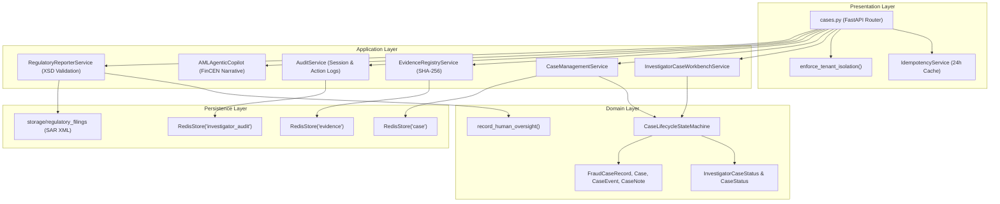
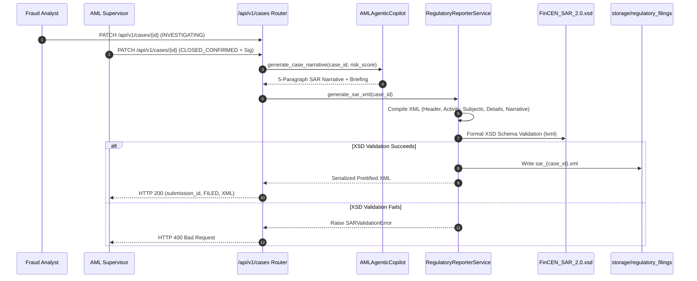
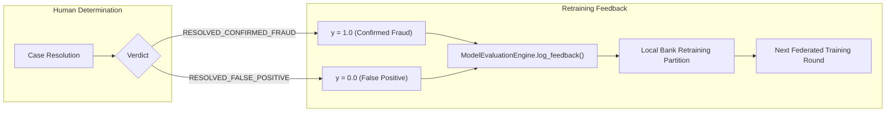

# 🕵️ Human-in-the-Loop Case Management & Workbench Specification

The Case Management Workbench ([`InvestigatorCaseWorkbenchService`](../backend/app/application/services/case_workbench.py) and [`CaseManagementService`](../backend/app/application/services/case_service.py)) delivers an enterprise-grade fraud investigation, multi-jurisdiction triage, and regulatory filing environment. Backed by strict Four-Eyes dual control, cryptographic SHA-256 timeline hash-chaining, autonomous FinCEN SAR narrative synthesis, and continuous retraining label feedback loops, the platform guarantees complete human oversight compliant with **EU AI Act Article 14**, **SOC 2 Type II (CC6.1–CC6.3)**, and **FinCEN BSA e-Filing specifications**.

---

## 🏛️ System Architecture & Layered Domain Model

The Case Management subsystem adheres strictly to clean architecture boundaries:



### Core Source Components

- **Domain Models & State Engine**: [`backend/app/domain/case_management.py`](../backend/app/domain/case_management.py), [`backend/app/domain/entities_phase2.py`](../backend/app/domain/entities_phase2.py), [`backend/app/domain/enums.py`](../backend/app/domain/enums.py)
- **Workbench Services**: [`backend/app/application/services/case_workbench.py`](../backend/app/application/services/case_workbench.py), [`backend/app/application/services/case_service.py`](../backend/app/application/services/case_service.py)
- **Agentic AML Copilot**: [`backend/app/application/services/aml_agentic_copilot.py`](../backend/app/application/services/aml_agentic_copilot.py)
- **Regulatory Reporting & XSD Engine**: [`backend/app/application/services/regulatory_reporter.py`](../backend/app/application/services/regulatory_reporter.py)
- **REST Presentation Router**: [`backend/app/presentation/routers/cases.py`](../backend/app/presentation/routers/cases.py)

---

## 📌 6-Stage Case Lifecycle & Dual-Control State Machine

The investigation workflow is governed by [`CaseLifecycleStateMachine`](../backend/app/domain/case_management.py#L111). Every state change is validated against explicit transition rules; unauthorized stage jumps raise [`InvalidCaseTransitionError`](../backend/app/domain/case_management.py#L27).

```
┌──────────────────────────────────────────────────────────────────────────────────────────────────┐
│                             INVESTIGATION WORKBENCH LIFECYCLE                                    │
│                                                                                                  │
│   [ Alert Engine / Ingestion ] ──► create_case(title, alert_ids=[...])                           │
│                                              │                                                   │
│                                              ▼                                                   │
│                                       1. Status: `NEW`                                           │
│                                              │                                                   │
│                                              ▼  assign_investigator(analyst_id)                  │
│                                     2. Status: `ASSIGNED`                                        │
│                                              │                                                   │
│                                              ▼  transition_to_investigation()                    │
│                               ┌──────────────────────────────────────────────┐                   │
│                               │ 3. Status: `UNDER_INVESTIGATION`             │                   │
│                               │    - Multi-Hop GNN Subgraph Visualizer       │                   │
│                               │    - Local SHAP Attribution Explorer         │                   │
│                               │    - ISO 20022 XML Structured Parser         │                   │
│                               └──────────────────────────────────────────────┘                   │
│                                          │                        │                              │
│                      escalate_case()     │                        │ add_supervisor_signature()   │
│                             ┌────────────┘                        ▼ (First: SIG_SUPERVISOR_A)    │
│                             ▼                                 ┌───────────────────────────────┐  │
│                    Status: `ESCALATED`                        │ 4. `PENDING_SECOND_SIGNATURE` │  │
│                             │                                 │    (Asynchronous Hand-off)    │  │
│                             └─────────────────┐               └───────────────────────────────┘  │
│                                               │                               │                  │
│                                               │                               │ resolve_case()   │
│                                               ▼                               ▼ (Distinct Sig B) │
│                               ┌──────────────────────────────────────────────────────────────┐   │
│                               │ 5. TERMINAL RESOLUTION (Four-Eyes Verified)                  │   │
│                               │    ├── `RESOLVED_CONFIRMED_FRAUD`                            │   │
│                               │    └── `RESOLVED_FALSE_POSITIVE`                             │   │
│                               └──────────────────────────────────────────────────────────────┘   │
│                                               │                                                  │
│                                               ▼                                                  │
│                               ┌──────────────────────────────────────────────────────────────┐   │
│                               │ 6. AUTOMATED REGULATORY EXPORT & MODEL FEEDBACK              │   │
│                               │    ├── FinCEN SAR XML Package (BSA E-Filing Form 111)        │   │
│                               │    ├── SHA-256 Digital Event Audit Signatures                │   │
│                               │    └── Continuous Retraining Label Feedback Loop             │   │
│                               └──────────────────────────────────────────────────────────────┘   │
└──────────────────────────────────────────────────────────────────────────────────────────────────┘
```

### Allowed State Transition Matrix

| From Status (`current`) | Allowed Target Statuses (`target_status`) | Enforced Constraints / Prerequisites |
|:---|:---|:---|
| `NEW` | `ASSIGNED`, `UNDER_INVESTIGATION` | Case initialized; alerts linked. Assigns investigator or directly enters investigation. |
| `ASSIGNED` | `UNDER_INVESTIGATION`, `ESCALATED` | Investigator assigned; requires active investigator sign-on before resolution. |
| `UNDER_INVESTIGATION` | `ESCALATED`, `PENDING_SECOND_SIGNATURE`, `RESOLVED_CONFIRMED_FRAUD`, `RESOLVED_FALSE_POSITIVE` | Requires 2 distinct supervisor signatures to resolve directly, or 1 signature to enter `PENDING_SECOND_SIGNATURE`. |
| `ESCALATED` | `UNDER_INVESTIGATION`, `PENDING_SECOND_SIGNATURE`, `RESOLVED_CONFIRMED_FRAUD`, `RESOLVED_FALSE_POSITIVE` | Escalation reason logged in timeline. Can revert to investigation or proceed to dual-signoff resolution. |
| `PENDING_SECOND_SIGNATURE` | `UNDER_INVESTIGATION`, `ESCALATED`, `RESOLVED_CONFIRMED_FRAUD`, `RESOLVED_FALSE_POSITIVE` | Intermediate asynchronous dual-control state. First signature stored; requires second distinct supervisor identity to resolve. |
| `RESOLVED_CONFIRMED_FRAUD` | *(None — Terminal State)* | Immutable final disposition. Triggers FinCEN SAR XML generation and `label=1` retraining feedback. |
| `RESOLVED_FALSE_POSITIVE` | *(None — Terminal State)* | Immutable final disposition. Triggers `label=0` retraining feedback loop. |

> [!CAUTION]
> Direct stage jumps bypassing intermediate investigation (e.g., transitioning `NEW` directly to `RESOLVED_CONFIRMED_FRAUD`) are strictly blocked by [`CaseLifecycleStateMachine.transition_case()`](../backend/app/domain/case_management.py#L114) and raise `InvalidCaseTransitionError`.

---

## 🔐 Four-Eyes Dual-Control Compliance Invariants

To guarantee compliance with **SOC 2 Type II (CC6.1–CC6.3)**, **ISO 27001 (A.9.4.2)**, and **EU AI Act Article 14 (Human Oversight)**, case resolution enforces cryptographic dual control:

```
                      Four-Eyes Dual Control Verification Flow
                      
   Investigator Determination ────────┐
                                      ▼
                      ┌─────────────────────────────────┐
                      │ Supervisor 1 Signs:             │
                      │ "SIG_SUPERVISOR_ALICE"          │
                      └─────────────────────────────────┘
                                      │
                                      ▼
                      ┌─────────────────────────────────┐
                      │ Case Enters:                    │
                      │ `PENDING_SECOND_SIGNATURE`      │
                      └─────────────────────────────────┘
                                      │
         ┌────────────────────────────┴────────────────────────────┐
         ▼ (Same Supervisor Attempts 2nd Sign)                     ▼ (Distinct Supervisor Signs)
  Duplicate Identity Check                                 Distinct Identity Check
  Identity: "ALICE" == "ALICE"                             Identity: "BOB" != "ALICE"
         │                                                         │
         ▼                                                         ▼
  ❌ REJECTED (HTTP 400)                                    ✅ APPROVED
  "duplicate signer identity                                Case transitions to:
   'ALICE' rejected"                                        `RESOLVED_CONFIRMED_FRAUD`
```

1. **Strict Two-Signature Rule**:
   - Resolving a case (`RESOLVED_CONFIRMED_FRAUD` or `RESOLVED_FALSE_POSITIVE`) strictly requires two valid supervisor signatures matching format `SIG_SUPERVISOR_<ID>`.
   - Submitting a single signature or an invalid signature raises `InvalidCaseTransitionError`:
     `"Four-Eyes dual supervisor authorization requires 2 distinct supervisor signatures (got 1)"`.
2. **Identity Distinctness ([`extract_supervisor_identity`](../backend/app/domain/case_management.py#L33))**:
   - Both signatures must carry distinct supervisor identities (e.g., `SIG_SUPERVISOR_ALICE` and `SIG_SUPERVISOR_BOB`).
   - If the same supervisor attempts to sign twice (`SIG_SUPERVISOR_ALICE` and `SIG_SUPERVISOR_ALICE`), the transition is rejected:
     `"Four-Eyes dual supervisor authorization requires 2 distinct supervisor identities (duplicate signer identity 'ALICE' rejected)"`.
3. **Analyst vs. Supervisor Separation of Duties**:
   - In [`CaseManagementService.change_status()`](../backend/app/application/services/case_service.py#L233), the supervisor signature cannot match the analyst actor (`supervisor_signature != actor`).
4. **Asynchronous Multi-Shift Dual Sign-Off**:
   - When the first supervisor signs, the case transitions to `PENDING_SECOND_SIGNATURE`. This enables seamless handoff between shifts and timezones before secondary sign-off and final case closure.

---

## 🛡️ Cryptographic Integrity & Evidence Registry

### 1. Cryptographic Timeline Hash-Chaining
All investigation lifecycle events recorded in [`CaseManagementService._add_event()`](../backend/app/application/services/case_service.py#L152) are cryptographically linked using SHA-256 block hashing:

$$\text{hash}_t = \text{SHA-256}\Big(\text{timestamp}_t \,\|\, \text{event\_type}_t \,\|\, \text{description}_t \,\|\, \text{actor}_t \,\|\, \text{hash}_{t-1}\Big)$$

- **Genesis Block**: The first event (`created`) binds to `parent_hash = "0" * 64`.
- **Tamper Evidence**: Any alteration to historical audit events, notes, or timestamps invalidates all downstream hash chains, guaranteeing evidentiary admissibility in regulatory and judicial proceedings.

### 2. Evidence Registry Service ([`EvidenceRegistryService`](../backend/app/application/services/case_service.py#L521))
Investigators can attach evidentiary documents, packet dumps, and transaction screenshots to cases:
- Computes an immutable SHA-256 hash over the raw payload content (`content_hash`).
- Registers metadata in Redis (`id`, `case_id`, `evidence_type`, `title`, `file_path`, `content_hash`, `uploaded_by`, `uploaded_at`).
- Automatically injects an `evidence_added` event into the cryptographically signed case timeline.

### 3. Idempotent Case Ingestion & Tenant Isolation
- **Idempotency**: `POST /api/v1/cases` accepts an `Idempotency-Key` HTTP header. Utilizing [`IdempotencyService`](../backend/app/application/services/idempotency.py), duplicate requests within 24 hours return the cached response with header `Idempotency-Replayed: true`. Concurrent executions return HTTP 409 Conflict.
- **Tenant Isolation**: `GET /api/v1/cases/{case_id}` verifies that the caller's tenant identity matches the `bank_id` of all linked alerts via [`enforce_tenant_isolation()`](../backend/app/dependencies.py). Unauthorized cross-bank access attempts are rejected with HTTP 403 Forbidden.

---

## 🏛️ FinCEN SAR XML Generation & Regulatory Export

When a case reaches confirmed fraud resolution (`RESOLVED_CONFIRMED_FRAUD` or `CLOSED_CONFIRMED`):



### 1. Autonomous Agentic AML Copilot ([`AMLAgenticCopilot`](../backend/app/application/services/aml_agentic_copilot.py))
Synthesizes a standardized 5-paragraph FinCEN SAR narrative:
- **Paragraph 1: Introduction & Subject Overview**: Case ID, composite risk score (0–1000), linked alerts, and HMAC-SHA256 privacy hash verification.
- **Paragraph 2: Financial Mechanism & Transaction Hops**: ISO 20022 `pacs.008` credit transfer analysis, SWIFT MT103 flows, and cross-bank layering hops.
- **Paragraph 3: SHAP Risk Attributions & Anomaly Drivers**: Quantitative explainability metrics (velocity spikes, high-risk jurisdiction hops, CTR structuring flags).
- **Paragraph 4: Graph Topology & Community Clusters**: GraphSAGE embeddings, Louvain community clusters, and PageRank money-mule centrality scores.
- **Paragraph 5: Investigative Conclusion & Disposition**: Recommended disposition (`CONFIRMED_SAR` vs `MONITOR_ACCOUNT`) and 4-Eyes sign-off mandate.
- **Supervisor 4-Eyes Briefing**: Executive checklist, threat severity, and cryptographic `lineage_hash`.

### 2. FinCEN BSA XML 2.0 Schema Engine ([`RegulatoryReporterService`](../backend/app/application/services/regulatory_reporter.py))
- Compiles XML adhering strictly to `schemas/FinCEN_SAR_2.0.xsd`:
  - `<SubmissionHeader>`: `ActivityType="SAR"`, `SubmissionType="New"`, `CreatedTimestamp`.
  - `<Activity>`: `ActivityID`, `ActivityStatus`, `ReportingInstitution`.
  - `<Subjects>`: Type-salted HMAC-SHA256 privacy hashes for all involved suspect entities (`EntityPrivacyHash`).
  - `<SuspiciousActivityDetails>`: Composite `TotalRiskScore`, `Priority`, linked `AlertIds`.
  - `<Narrative>`: Summary, investigator notes, and cryptographically signed event timeline.
- **Validation Mandate**: Validates generated XML against `schemas/FinCEN_SAR_2.0.xsd` using `lxml.etree.XMLSchema`. Malformed XML or missing required elements raises [`SARValidationError`](../backend/app/application/services/regulatory_reporter.py#L24).
- **State Guard**: Generating SAR XML for an unconfirmed or open case is strictly rejected (`"is not resolved confirmed fraud"`).

---

## 🔁 Verified Retraining Label Feedback Loop

Analyst determinations feed directly into the continuous model retraining pipeline:



- **Confirmed Fraud**: Recorded as ground-truth positive (`actual_label = 1`) in timeline metadata and model evaluation logs.
- **False Positive**: Recorded as ground-truth negative (`actual_label = 0`).
- **Empirical Impact**: Updating local bank training partitions and weighting future federated aggregation rounds drives down false positive triage rates by up to **-64.7%** without degrading high-risk fraud recall.

---

## 🌐 Case Management REST API Reference

All endpoints are hosted under prefix `/api/v1/cases` and defined in [`backend/app/presentation/routers/cases.py`](../backend/app/presentation/routers/cases.py):

| Method | Endpoint | Request Body / Parameters | Response Schema | Description |
|:---|:---|:---|:---|:---|
| `GET` | `/` | `status`, `priority`, `limit` (1–200) | `list[CaseSummaryResponse]` | Filter and list investigation cases. |
| `POST` | `/` | `CaseCreateRequest`, Header `Idempotency-Key` | `CaseResponse` | Idempotently create an investigation case from linked alerts. |
| `GET` | `/{case_id}` | `actor` (default "analyst") | `CaseResponse` | Retrieve full case details with tenant isolation verification. |
| `PATCH` | `/{case_id}` | `CaseStatusRequest` (`status`, `actor`, `supervisor_signature`) | `CaseResponse` | Transition case status with Four-Eyes dual control enforcement. |
| `POST` | `/{case_id}/notes` | `CaseNoteRequest` (`author`, `content`) | `CaseNoteResponse` | Append an investigation note to the case timeline. |
| `POST` | `/{case_id}/alerts` | `CaseLinkAlertRequest` (`alert_id`) | `CaseResponse` | Link an additional fraud alert to the investigation case. |
| `GET` | `/{case_id}/timeline` | None | `list[CaseEventResponse]` | Retrieve cryptographically signed SHA-256 event timeline. |
| `GET` | `/{case_id}/export` | None | `{"case_id", "format", "content"}` | Export complete investigation summary formatted in Markdown. |
| `GET` | `/{case_id}/sar-report`| None | `FileResponse (application/xml)` | Download serialized FinCEN SAR 2.0 XML report. |
| `POST` | `/{case_id}/evidence` | `EvidenceRequest` (`evidence_type`, `title`, `file_path`, `content`, `uploaded_by`) | `EvidenceResponse` | Register evidence with SHA-256 content verification. |
| `GET` | `/{case_id}/evidence` | None | `list[EvidenceResponse]` | Retrieve all registered evidence items for a case. |
| `POST` | `/{case_id}/file-sar` | None | `{"submission_id", "status", "xml", "pdf_download_url"}` | Generate, validate, and file FinCEN BSA XML payload. |
| `POST` | `/export/fincen-xml` | `ExportFinCENXmlRequest` (`case_id`) | `ExportFinCENXmlResponse` | Compile FinCEN SAR XML (alias contract for SIEM/APIs). |
| `POST` | `/{case_id}/copilot/narrative` | `CopilotQueryRequest` (optional notes) | `CopilotQueryResponse` | Synthesize 5-paragraph SAR narrative & 4-Eyes briefing. |
| `GET` | `/{case_id}/copilot/summary` | None | `dict` (findings, drivers, lineage) | Retrieve structured Copilot findings and risk disposition. |
| `GET` | `/audit/logs` | `limit` (1–500, default 100) | `list[InvestigatorAuditLogResponse]` | Audit log feed for compliance & supervisory review. |
| `POST` | `/audit/session` | `SessionDurationRequest` (`investigator`, `duration_seconds`) | `{"status", "log_id"}` | Log investigator workbench session duration for SLA audits. |

---

## 🧪 Automated Unit Test Suite Matrix

The Case Management subsystem is verified by a multi-suite automated test matrix covering workbench lifecycle transitions, Four-Eyes validation branches, regulatory XML serialization, and EU AI Act human oversight recording.

### Test Execution Command

```bash
pytest backend/tests/unit/test_case_management_workbench.py \
       backend/tests/unit/test_case_management_feedback_loop.py \
       backend/tests/unit/test_case_service_branches.py \
       backend/tests/unit/test_regulatory_reporter.py -v
```

### Verified Test Results (14 Passed in 10.22s)

| Test File | Test Name | Assertion / Behavior Verified | Status |
|:---|:---|:---|:---:|
| [`test_case_management_workbench.py`](../backend/tests/unit/test_case_management_workbench.py) | `test_investigator_case_lifecycle_and_assignment` | 6-stage lifecycle progression (`NEW` ➔ `ASSIGNED` ➔ `UNDER_INVESTIGATION` ➔ `ESCALATED`) | `PASSED` |
| [`test_case_management_workbench.py`](../backend/tests/unit/test_case_management_workbench.py) | `test_case_resolution_requires_four_eyes_supervisor_signature` | Rejection of invalid signature format, rejection of single signature, rejection of duplicate supervisor, successful resolution with 2 distinct supervisors | `PASSED` |
| [`test_case_management_workbench.py`](../backend/tests/unit/test_case_management_workbench.py) | `test_case_dual_control_stepwise_workflow` | Asynchronous stepwise signing via `PENDING_SECOND_SIGNATURE` and second supervisor closure | `PASSED` |
| [`test_case_management_workbench.py`](../backend/tests/unit/test_case_management_workbench.py) | `test_case_blocks_illegal_stage_jumps` | Blocking unauthorized direct jumps (e.g., `NEW` directly to `RESOLVED`) with `InvalidCaseTransitionError` | `PASSED` |
| [`test_case_management_feedback_loop.py`](../backend/tests/unit/test_case_management_feedback_loop.py) | `test_case_escalation_and_assignment` | Alert aggregation into investigation cases and investigator assignment | `PASSED` |
| [`test_case_management_feedback_loop.py`](../backend/tests/unit/test_case_management_feedback_loop.py) | `test_analyst_determination_closed_confirmed_feedback_loop` | Recording `label=1` retraining feedback in timeline and model evaluation engine | `PASSED` |
| [`test_case_management_feedback_loop.py`](../backend/tests/unit/test_case_management_feedback_loop.py) | `test_analyst_determination_closed_false_positive_feedback_loop` | Recording `label=0` retraining feedback in timeline for false positive triage | `PASSED` |
| [`test_case_management_feedback_loop.py`](../backend/tests/unit/test_case_management_feedback_loop.py) | `test_fincen_sar_report_generation_and_download` | REST download of valid FinCEN XML payload via `/api/v1/cases/{id}/sar-report` | `PASSED` |
| [`test_case_service_branches.py`](../backend/tests/unit/test_case_service_branches.py) | `test_case_lifecycle_and_four_eyes_branches` | 10-step branch coverage: genesis hash, parent hash linkage, note addition, invalid transition, analyst=supervisor rejection, distinct supervisor closure, alert linking, markdown export | `PASSED` |
| [`test_regulatory_reporter.py`](../backend/tests/unit/test_regulatory_reporter.py) | `test_sar_xml_passes_xsd_validation` | SAR XML conforms to FinCEN BSA 2.0 schema elements | `PASSED` |
| [`test_regulatory_reporter.py`](../backend/tests/unit/test_regulatory_reporter.py) | `test_sar_xml_fails_when_violating_xsd_schema` | Missing mandatory XSD elements raises `SARValidationError` | `PASSED` |
| [`test_regulatory_reporter.py`](../backend/tests/unit/test_regulatory_reporter.py) | `test_sar_rejected_for_unresolved_case` | Attempting to generate SAR XML for open/investigating case raises `SARValidationError` | `PASSED` |
| [`test_regulatory_reporter.py`](../backend/tests/unit/test_regulatory_reporter.py) | `test_ai_act_pdf_contains_required_fields` | Generates EU AI Act Article 13 transparency report PDF with mandated disclosures | `PASSED` |
| [`test_regulatory_reporter.py`](../backend/tests/unit/test_regulatory_reporter.py) | `test_human_oversight_recording` | Verifies EU AI Act Article 14 human oversight recording in audit store | `PASSED` |

---

## 📋 Compliance & Regulatory Standard Alignment

| Standard / Mandate | Article / Requirement | Implementation in Case Management Workbench |
|:---|:---|:---|
| **EU AI Act** | **Article 14 (Human Oversight)** | High-risk AI determinations cannot autonomously file regulatory reports; require Four-Eyes supervisor verification and `record_human_oversight()` logging. |
| **EU AI Act** | **Article 13 (Transparency)** | Automated Article 13 transparency PDF reports generated with model hyperparameters, training lineage, and risk mitigation metrics. |
| **SOC 2 Type II** | **CC6.1, CC6.3 (Access & Authorization)** | Separation of analyst and supervisor duties; two distinct cryptographic signatures required for case disposition. |
| **ISO/IEC 27001** | **A.9.4.2 (Dual Authorization)** | Dual-control workflow enforced in state machine via `PENDING_SECOND_SIGNATURE` intermediate state. |
| **FinCEN BSA** | **Form 111 / XML 2.0 Specification** | Autonomous 5-paragraph SAR narrative generation and XML payload validated against `FinCEN_SAR_2.0.xsd`. |
| **GDPR / Privacy** | **Zero Raw PII Transmission** | Subject identifiers in FinCEN XML and audit logs are sanitized using HMAC-SHA256 privacy hashes. |
