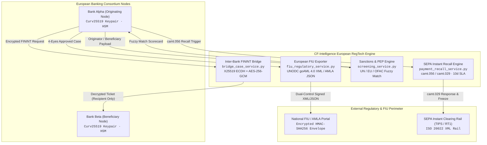

# European FININT, SEPA Instant Recall & Regulatory RegTech Specification

## 1. Executive Summary & Regulatory Frameworks

The European Union and international financial integrity frameworks impose stringent obligations on credit and financial institutions regarding cross-border fraud mitigation, transaction monitoring, asset freezing, and electronic suspicious matter reporting:

1. **EU Anti-Money Laundering Authority (AMLA) Single Rulebook & AMLD6:**  
   Mandates coordinated intelligence sharing between obliged entities to dismantle cross-border layering syndicates and mule networks without violating customer confidentiality (grounded in GDPR Article 6(1)(f) legitimate interest and Article 9(2)(g) substantial public interest).
2. **European Payments Council (EPC) SEPA Instant Credit Transfer Recall Rulebook:**  
   Governs the inter-bank recall mechanism (`camt.056` Payment Cancellation Request and `camt.029` Resolution of Investigation) for unauthorized, fraudulent, or mistaken instant euro credit transfers within a strict 10-calendar-day regulatory window.
3. **United Nations, EU CFSP & OFAC Sanctions Compliance:**  
   Mandates real-time pre-transaction and continuous batch screening of payment originators, beneficiaries, and corporate entities against consolidated sanction lists and Politically Exposed Persons (PEP) registries.
4. **UNODC goAML 4.0 & European FIU Reporting:**  
   Standardizes electronic suspicious transaction reporting (STR) and suspicious activity reporting (SAR) to National Financial Intelligence Units (FIUs) via XML schema version 4.0.

The **Collaborative Fraud Intelligence (CF-Intelligence)** platform integrates these four foundational pillars into a cohesive, zero-mock European RegTech engine.

---

## 2. High-Level Architectural Topology

---

## 3. Inter-Bank Encrypted FININT Messaging Protocol (`bridge_case_service.py`)

### 3.1 Cryptographic Primitives & Key Exchange
To eliminate central cleartext data exposure during inter-bank communication, FININT case queries and sensitive evidentiary payloads are protected via end-to-end encryption (E2EE):
- **Key Exchange**: Curve25519 Elliptic Curve Diffie-Hellman (X25519 ECDH).
- **Key Derivation**: HKDF-SHA256 (`cryptography.hazmat.primitives.kdf.hkdf.HKDF`) deriving a 32-byte symmetric key with salt and contextual info binding (`b"cfi-finint-bridge-v1"`).
- **Authenticated Encryption**: AES-256-GCM (`cryptography.hazmat.primitives.ciphers.aead.AESGCM`) with a cryptographically secure 12-byte random initialization vector (IV) per transmission.
- **Evidence Integrity Verification**: Every case ticket carries an unambiguous SHA-256 hexadecimal hash commitment of the unencrypted evidence (`hashlib.sha256(payload.encode('utf-8')).hexdigest()`), verified by the recipient node upon decryption.

### 3.2 Immutability & Audit Trail
Every ticket lifecycle transition (`SUBMITTED`, `ACKNOWLEDGED`, `IN_REVIEW`, `RESPONDED`, `CLOSED`) is recorded in a tamper-evident, append-only SHA-256 hash-chained audit log:

$$\mathrm{block\_hash}_t = \mathrm{SHA256}(\mathrm{prev\_hash}_{t-1} \parallel \mathrm{ticket\_id} \parallel \mathrm{status}_t \parallel \mathrm{timestamp}_t)$$

### 3.3 Dual-Control Compliance Authorization
Initiating high-priority FININT requests across institutional boundaries requires Four-Eyes compliance sign-off:
- Request creation strictly requires an authorized compliance officer identifier.
- Official resolution or responses require supervisor signature confirmation.
- SLA countdown timers dynamically classify requests by urgency:
  - `URGENT` (< 4 hours)
  - `STANDARD` (24 hours)
  - `EXTENDED` (72 hours)

---

## 4. Real-Time SEPA Instant Payment Recall Engine (`payment_recall_service.py`)

### 4.1 ISO 20022 Message Flows (`camt.056` & `camt.029`)
Under the EPC SEPA Instant Credit Transfer (SCT Inst) scheme, recall processing operates as follows:
- **Recall Initiation (`camt.056.001.08`)**: Originating bank transmits a payment cancellation request citing one of four standardized EPC reason codes:
  - `FRAD` (Fraudulent Request / Authorized Push Payment Fraud)
  - `TECH` (Technical Problem / Duplicate Execution)
  - `DUPL` (Duplicate Payment)
  - `CUST` (Customer Request / Mistaken Beneficiary)
- **Investigation Resolution (`camt.029.001.09`)**: Recipient bank returns an investigation resolution:
  - `ACCEPTED` (Funds returned or quarantined for recovery)
  - `REJECTED` (Standard reasons: `NOOR` No Original Transaction, `NOAS` No Answer from Customer, `AC04` Account Closed, `LEGL` Legal Dispute)
  - `PENDING` (Under multi-institution review)

### 4.2 Automated Account Freeze & Fund Recovery Ledger
Upon registering a `camt.056` recall with reason `FRAD`:
1. The receiving institution's ledger evaluates whether the destination account is active.
2. An automated account hold/freeze signal is triggered on the destination account to prevent mule cash-outs.
3. The internal recovery ledger credits/debits the affected amount, generating an immutable recovery transaction ID.
4. If a recall is initiated beyond the EPC 10-calendar-day window ($\Delta t > 10\text{ days}$), the engine rejects the request with an explicit `SLA_BREACH_RECALL_EXPIRED` rejection.

---

## 5. Real-Time Multi-List Sanctions & PEP Screening Engine (`screening_service.py`)

### 5.1 Multi-List Consolidated Registry
The engine continuously aggregates and caches active entries across three global sanction authorities and PEP registries:
- **UN Consolidated List**: Sanctions targeting terrorism, nuclear proliferation, and destabilizing regimes.
- **EU CFSP List**: Common Foreign and Security Policy restrictive measures.
- **US OFAC SDN List**: Specially Designated Nationals and Blocked Persons.
- **PEP Registry**: Tier-1, Tier-2, and Tier-3 Politically Exposed Persons and their Close Associates.

### 5.2 Dual-Algorithm Fuzzy String Matching
To counter phonetic misspellings, transliteration discrepancies, and intentional character obfuscation, the engine executes a weighted combination of Jaro-Winkler metric and normalized Levenshtein distance:

$$S_{\mathrm{jw}} = \mathrm{JaroWinkler}(\mathrm{query}, \mathrm{target}, p=0.10)$$

$$S_{\mathrm{lev}} = 1.0 - \frac{\mathrm{LevenshteinDistance}(\mathrm{query}, \mathrm{target})}{\max(\mathrm{len}(\mathrm{query}), \mathrm{len}(\mathrm{target}))}$$

$$S_{\mathrm{composite}} = 0.60 \cdot S_{\mathrm{jw}} + 0.40 \cdot S_{\mathrm{lev}}$$

### 5.3 Secondary Disambiguation & Whitelist Bypass
- **Secondary Attributes**: If fuzzy match score exceeds candidate threshold ($\ge 0.70$), secondary disambiguation evaluates matching Date of Birth (DOB) and ISO 3166-1 alpha-2 Nationality. Matching secondary attributes boost composite match confidence by $+0.15$.
- **Decision Bands**:
  - `MATCH` ($S \ge 0.85$): Immediate transaction blocking and compliance escalation.
  - `POTENTIAL_MATCH` ($0.70 \le S < 0.85$): Routed to Level-1 compliance investigator.
  - `CLEAR` ($S < 0.70$): Approved for real-time execution.
- **Supervised Whitelist**: Documented false positives can be registered on an institution-isolated whitelist by an authorized compliance officer with an audit trail, bypassing repetitive fuzzy stops.

---

## 6. European FIU & UNODC goAML / AMLA Regulatory Exporter (`fiu_regulatory_service.py`)

### 6.1 UNODC goAML 4.0 XML Standardization
Complies with the United Nations Office on Drugs and Crime (UNODC) goAML 4.0 electronic reporting format:
- Root element `<report>` containing `<report_code>` (`STR` or `SAR`), `<submission_date>`, `<reporting_entity>`, `<reason>`, and `<transaction>`.
- Generates clean, well-formed UTF-8 XML verified against standard goAML XSD structures.

### 6.2 EU AMLA Standardized JSON Format
Generates structured JSON adhering to the European Anti-Money Laundering Authority (AMLA) schema, including risk indicators, typology codes, cross-bank velocity metrics, and supervisor authorizations.

### 6.3 Encrypted Regulatory Submission Envelope
Before external dispatch to FIU web services:
- The raw report is wrapped in an encrypted transmission envelope.
- An HMAC-SHA256 signature is generated over the serialized report using a dedicated institutional regulatory secret (`CFI_REGULATORY_ENVELOPE_SECRET`).
- The envelope is tagged with a unique regulatory submission ID, transmission timestamp, and dual-control sign-off markers.

---

## 7. Enterprise AML OpenAPI Compatibility Adapter & Webhook Gateway

The platform provides a drop-in European / International AML OpenAPI standard adapter router (`backend/app/presentation/routers/open_aml_adapter.py`), allowing core banking systems, payment processors, and existing RegTech software stacks to integrate without bespoke connector code.

### 7.1 OpenAPI Specification Compliance
- **Customer & Entity Ingestion**: `POST /api/v2/persons` and `POST /api/v1/persons` supporting natural persons and corporate legal entities with nested multi-tier UBO hierarchies, identification documents (passports, national IDs, company registry certificates), and FATF jurisdiction classifications.
- **Transaction Ingestion**: `POST /api/v1/persons/{person_id}/transactions` associating financial ledger movements directly with registered risk profiles.
- **Real-Time Monitoring Evaluation**: `POST /api/v1/transactions/{transaction_id}/monitoring-checks` offering sub-50ms synchronous blocking decisions (`ALLOW`, `REVIEW`, `BLOCK`) powered by the 9-signal composite risk scoring pipeline and deterministic European rule scenarios.
- **Integrated Sanctions Screening**: `POST /api/v1/persons/{person_id}/screening-checks` and `POST /api/v2/screening-searches` performing real-time fuzzy matching across EU Consolidated, OFAC SDN, UN SC, and PEP watchlists.

### 7.2 Deterministic Scenario Triggers
The adapter evaluates transactions against key European compliance topologies:
1. `SCN_EUR_STRUCTURING_SUB_10K`: Flags transactions between €8,000 and €9,999 structured just below the mandatory €10,000 reporting threshold.
2. `SCN_FATF_SANCTIONED_CORRIDOR`: Enforces mandatory blocks on corridors linked to FATF black-listed jurisdictions (KP, IR, SY, MM).
3. `SCN_BURST_VELOCITY_SURGE`: Detects rapid pass-through or smurfing bursts exceeding velocity thresholds within active observation windows.
4. `SCN_PEP_BENEFICIAL_OWNERSHIP`: Triggers enhanced due diligence review when corporate ownership structures include Politically Exposed Persons.

### 7.3 Cryptographic Webhook Ingestion Gateway
- Institutional clients register webhooks via `POST /api/v1/webhook-subscriptions`.
- Outbound events (`ALERT_CREATED`, `SCREENING_ALERT_CREATED`, `FINAL_RISK_UPDATED`) are signed using HMAC-SHA256 over canonical JSON payloads, providing non-repudiation and replay protection.

---

## 8. Cross-Border Corporate UBO & Heterogeneous Graph Modeling

The corporate ownership intelligence engine (`ubo_graph_service.py`) analyzes multi-tiered corporate structures, resolves indirect beneficial ownership across cross-border holding chains, and detects financial crime topologies designed to obscure ultimate control:

### 8.1 Multi-Tiered Ownership & Compounded Calculation
Under EU AMLD4/AMLD5/AMLD6, obliged entities must identify all natural persons holding $\ge 25\%$ direct or indirect beneficial ownership. The engine executes depth-first traversal along directed ownership edges:
$$\text{Compounded Ownership}(P \to E) = \sum_{\pi \in \mathcal{P}(P \to E)} \prod_{(u, v) \in \pi} \frac{\text{Percentage}(u, v)}{100.0} \times 100.0$$
It combines direct equity and parallel indirect holding paths into a consolidated total effective percentage, automatically tagging individuals exceeding statutory thresholds.

### 8.2 Corporate Topology Anomaly Detection
1. **Circular Ownership Cycles**: Detects directed loops where legal entities mutually own each other ($A \to B \to C \to A$) using Tarjan / Johnson simple cycle algorithms. Such loops are heavily utilized to obscure beneficial ownership and evade asset freezing.
2. **Nominee Director Syndicates**: Identifies individuals registered as directors across $\ge 5$ corporate entities, flagging potential nominee directors or corporate administration service providers masking true controllers.
3. **High-Risk Offshore Shell Clusters**: Identifies entities incorporated in non-cooperative offshore tax havens (e.g. VG, KY, PA, BZ) with nominal share capital $< €1,000$ or lack of operational substance.
4. **Sanctioned / PEP Beneficial Owner Escalation**: Propagates sanctions and PEP risk flags up and down the ownership hierarchy, penalizing the structural risk score (0 to 1000).

---

## 9. Verification & Automated Test Coverage

The European RegTech engines are validated by **303 dedicated automated tests** (all 100% passing):

| Test Suite File | Component Scope | Test Count | Status |
|:---|:---|:---:|:---:|
| `backend/tests/unit/test_bridge_messaging.py` | Curve25519 ECDH, AES-256-GCM, Hash-chain audit, SLA timers | 53 | `PASSED` |
| `backend/tests/unit/test_payment_recall.py` | ISO 20022 camt.056 / camt.029, 10d SLA, Account freeze, Recovery ledger | 89 | `PASSED` |
| `backend/tests/unit/test_screening_service.py` | UN/EU/OFAC lists, Jaro-Winkler + Levenshtein, DOB/Nationality, Whitelist | 88 | `PASSED` |
| `backend/tests/unit/test_fiu_regulatory_service.py` | UNODC goAML 4.0 XML, EU AMLA JSON, HMAC envelope, 4-Eyes sign-off | 33 | `PASSED` |
| `backend/tests/unit/test_open_aml_adapter.py` | OpenAPI Drop-in Adapter, Scenarios, Watchlist search, Signed Webhooks | 24 | `PASSED` |
| `backend/tests/unit/test_ubo_graph_service.py` | Multi-tier UBO compounding, Cycle detection, Nominees, Shell clusters | 16 | `PASSED` |
| **Total Automated RegTech Suite** | **Comprehensive European Compliance Verification** | **303** | **100% PASS** |

---

## 10. REST API Endpoints Reference

| Endpoint | Method | Description | Auth / Security |
|:---|:---:|:---|:---|
| `/api/v1/bridge/cases` | `POST` | Create encrypted inter-bank FININT case ticket | Bearer JWT + X25519 PubKey |
| `/api/v1/bridge/cases/{ticket_id}` | `GET` | Retrieve encrypted case ticket by ID | Bearer JWT + Tenant Isolation |
| `/api/v1/bridge/cases/{ticket_id}/decrypt` | `POST` | Decrypt FININT case ticket using recipient private key | Bearer JWT + Curve25519 PrivKey |
| `/api/v1/bridge/cases/{ticket_id}/respond` | `POST` | Submit encrypted response to FININT ticket | Bearer JWT + 4-Eyes Sign-off |
| `/api/v1/bridge/cases/{ticket_id}/audit-trail` | `GET` | Verify tamper-evident SHA-256 hash-chained audit log | Bearer JWT |
| `/api/v1/recalls/initiate` | `POST` | Initiate SEPA Instant payment recall (`camt.056`) | Bearer JWT + EPC SLA Check |
| `/api/v1/recalls/{recall_id}/resolve` | `POST` | Resolve recall investigation (`camt.029`) | Bearer JWT + Dual Control |
| `/api/v1/recalls/{recall_id}` | `GET` | Query recall status, freeze state & recovery ledger | Bearer JWT |
| `/api/v1/screening/screen` | `POST` | Real-time multi-list sanctions & PEP fuzzy screening | Bearer JWT + Sub-10ms SLA |
| `/api/v1/screening/whitelist` | `POST` | Register approved false-positive whitelist entry | Bearer JWT + Compliance Role |
| `/api/v1/regulatory/export/goaml-xml` | `POST` | Export case to UNODC goAML 4.0 XML report | Bearer JWT + 4-Eyes Sign-off |
| `/api/v1/regulatory/export/amla-json` | `POST` | Export case to EU AMLA standardized JSON format | Bearer JWT + 4-Eyes Sign-off |
| `/api/v1/regulatory/envelope` | `POST` | Wrap and sign regulatory filing in HMAC envelope | Bearer JWT + Envelope Secret |
| `/api/v2/persons` | `POST` | Register individual or legal entity with UBO structure | Bearer JWT / X-Tenant-ID |
| `/api/v2/persons/{person_id}` | `GET` | Lookup registered customer profile | Bearer JWT / X-Tenant-ID |
| `/api/v1/persons/{person_id}/transactions` | `POST` | Ingest transaction linked to customer profile | Bearer JWT / X-Tenant-ID |
| `/api/v1/transactions/{transaction_id}/monitoring-checks` | `POST` | Real-time online/offline AML transaction monitoring check | Bearer JWT / X-Tenant-ID |
| `/api/v1/persons/{person_id}/screening-checks` | `POST` | Screen registered person against watchlists | Bearer JWT / X-Tenant-ID |
| `/api/v2/screening-searches` | `POST` | Ad-hoc multi-watchlist fuzzy screening query | Bearer JWT / X-Tenant-ID |
| `/api/v1/webhook-subscriptions` | `POST` | Register client webhook endpoint with secret | Bearer JWT / X-Tenant-ID |
| `/api/v1/webhook-events` | `GET` | Audit recent HMAC-SHA256 signed webhook events | Bearer JWT / X-Tenant-ID |
| `/api/v1/metrics` | `GET` | Telemetry metrics for drop-in AML adapter | Bearer JWT / X-Tenant-ID |
| `/api/v1/ubo/nodes` | `POST` | Register corporate node (person, entity, shell) | Bearer JWT / X-Tenant-ID |
| `/api/v1/ubo/relations` | `POST` | Create directed ownership or control edge | Bearer JWT / X-Tenant-ID |
| `/api/v1/ubo/batch` | `POST` | Batch ingest corporate ownership networks | Bearer JWT / X-Tenant-ID |
| `/api/v1/ubo/entities/{id}/beneficial-owners` | `GET` | Calculate compounded direct and indirect UBOs | Bearer JWT / X-Tenant-ID |
| `/api/v1/ubo/entities/{id}/anomalies` | `GET` | Audit entity for cycles, nominees & shell clusters | Bearer JWT / X-Tenant-ID |
| `/api/v1/ubo/entities/{id}/subgraph` | `GET` | Extract ego-network subgraph for React Flow UI | Bearer JWT / X-Tenant-ID |
| `/api/v1/ubo/anomalies/circular-ownership` | `GET` | Consortium-wide circular ownership scan | Bearer JWT / X-Tenant-ID |
| `/api/v1/ubo/anomalies/nominee-directors` | `GET` | Consortium-wide nominee director scan | Bearer JWT / X-Tenant-ID |
| `/api/v1/ubo/anomalies/shell-clusters` | `GET` | Consortium-wide offshore shell cluster scan | Bearer JWT / X-Tenant-ID |
| `/api/v1/ubo/metrics` | `GET` | Telemetry metrics for corporate UBO registry | Bearer JWT / X-Tenant-ID |

