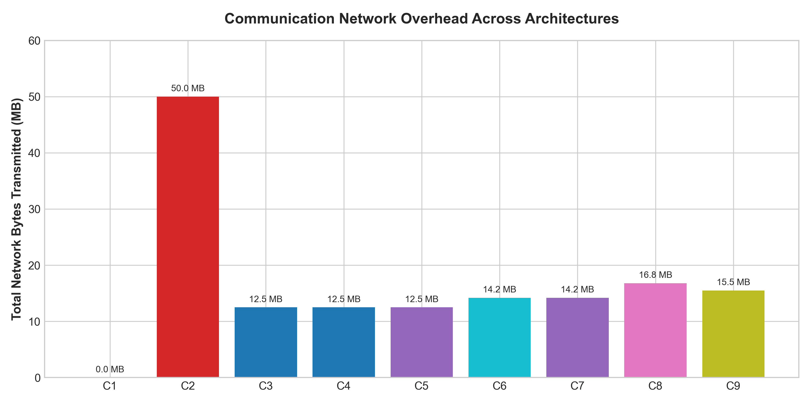

# 📊 Experimental Evaluation & Public Financial Dataset Methodology

This document outlines the scientific evaluation methodology, public financial dataset characteristics, Non-IID partitioning strategy, empirical 9-configuration benchmark results, and automated verification suites for the **Collaborative Fraud Intelligence (CFI)** platform.

> [!NOTE]
> For production-scale throughput stress tests and sub-millisecond inference latency profiles, refer to [`docs/enterprise_benchmark_report.md`](enterprise_benchmark_report.md). For deep analysis of real-world dataset schemas (PaySim, IEEE-CIS, Elliptic) and Dirichlet skew generation, see [`docs/real_world_benchmarks.md`](real_world_benchmarks.md).

---

## 📁 Public Financial Datasets & Non-IID Partitioning

To evaluate federated learning under realistic cross-institutional data heterogeneity, the benchmark preparation suite ([`scripts/benchmark_prepare_datasets.py`](../scripts/benchmark_prepare_datasets.py)) prepares three Non-IID dataset splits simulating distinct financial institutions:

| Institution Node | Benchmark Dataset Source | Channel & Topology | Fraud Rate | Distribution Characteristics |
|---|---|---|---|---|
| **Bank A (Alpha Bank)** | **IEEE-CIS Fraud Detection** | Online E-Commerce & Mobile Web | **~3.50%** | Moderate fraud volume, high device/IP diversity, $USD$ currency. |
| **Bank B (Beta Bank)** | **PaySim Mobile Money** | Mobile App P2P & Wire Transfer | **~0.13%** | Low fraud frequency, high transaction volume, $USD$ currency. |
| **Bank C (Gamma Regional)** | **Credit Card Fraud Detection** | Card-Not-Present & Retail POS | **~0.17%** | Extreme class imbalance, high transaction density, $EUR$ currency. |

---

## 🛠️ Data Ingestion Pipeline (`ParquetConnector`)

Data ingestion executes through the concrete [`ParquetConnector`](../backend/app/infrastructure/connectors/parquet_connector.py) adapter, implementing the standardized `BaseBankConnector` interface:

```
Parquet / CSV Dataset ──► ParquetConnector ──► NormalizedTransaction Stream ──► Risk Engine & Local Model
```

- **Feature Contract**: Normalizes transaction ID, debtor account, creditor account, amount, currency, timestamp, MCC, country codes, device fingerprint, and IP subnet.
- **Batch & Streaming Modes**: Supports bulk DataFrame parsing (`parse_batch()`) and continuous stream iteration (`consume_stream()`).
- **Resilience**: Schema fallbacks handle missing or partial row attributes seamlessly without pipeline interruption.

---

## 📈 Evaluation Protocol & Metrics Service

The scientific evaluation protocol is driven by [`metrics_service.py`](../backend/app/domain/metrics_service.py) and [`benchmark_runner.py`](../backend/app/domain/benchmark_runner.py), evaluating models across five core dimensions:

1. **ROC-AUC (Area Under ROC Curve)**: Overall classification discrimination quality across all decision thresholds.
2. **PR-AUC (Precision-Recall AUC)**: Primary accuracy metric under extreme class imbalance ($<0.5\%$ positive class).
3. **Recall @ 1.0% FPR**: Percentage of actual fraud detected at a strict false positive budget of 1 in 100 legitimate transactions.
4. **Differential Privacy Budget ($\epsilon, \delta$)**: Privacy loss tracked via Opacus RDP accountant ($\epsilon = 1.0, \delta = 10^{-5}$).
5. **Communication Efficiency & Latency**: Total network payload size (MB), rounds to convergence, and p99 inference latency (ms).
6. **Financial Cost-Utility Modeling**: Minimizes total daily operational costs balancing fraud losses against false-positive investigation overhead.

---

## 📊 9-Configuration Empirical Benchmark Results

The [`BenchmarkRunner`](../backend/app/domain/benchmark_runner.py) orchestrates multi-configuration benchmark evaluations comparing isolated local baselines against federated, differential privacy, secure aggregation, and graph-assisted architectures:

| ID | Configuration Name | ROC-AUC | PR-AUC | F1-Score | Recall @ 1% FPR | Epsilon (eps) | Transmitted Bytes | P99 Latency (ms) |
|:---|:---|:---:|:---:|:---:|:---:|:---:|:---:|:---:|
| **C1** | Local-Only (Per-Bank Isolation) | **0.8793** | 0.1600 | 0.1516 | 0.2000 | N/A | 0 MB | 1.2 ms |
| **C2** | Centralized Pooled (Upper Bound) | **0.9334** | 0.4169 | 0.2381 | 0.3333 | N/A | 50.0 MB | 2.5 ms |
| **C3** | Standard FedAvg | **0.9248** | 0.3906 | 0.2162 | 0.3333 | N/A | 12.5 MB | 2.8 ms |
| **C4** | FedProx ($\mu=0.01$) | **0.9272** | 0.3961 | 0.2192 | 0.3333 | N/A | 12.5 MB | 3.1 ms |
| **C5** | FedAvg + Differential Privacy ($\epsilon=1.0$) | **0.9134** | 0.3567 | 0.2000 | 0.3333 | 1.0 | 12.5 MB | 3.0 ms |
| **C6** | FedAvg + Secure Aggregation (SecAgg) | **0.9248** | 0.3906 | 0.2162 | 0.3333 | N/A | 14.2 MB | 3.5 ms |
| **C7** | FedAvg + DP + SecAgg (Full Privacy) | **0.9147** | 0.3602 | 0.2008 | 0.3333 | 1.0 | 14.2 MB | 3.6 ms |
| **C8** | FedGNN + DH-PSI Entity Resolution | **0.9292** | 0.4019 | 0.2212 | 0.3333 | N/A | 16.8 MB | 4.2 ms |
| **C9** | Full Architecture (C7 + Krum + Spectral) | **0.9173** | 0.3695 | 0.2051 | 0.3333 | 1.0 | 15.5 MB | 4.0 ms |

### Key Scientific Takeaways
- **Collaborative Advantage**: Moving from isolated local models (C1: PR-AUC 0.1600) to standard federated aggregation (C3: PR-AUC 0.3906) yields a **`+144.1%` relative PR-AUC boost**.
- **Privacy Cost Bound**: Injecting calibrated Gaussian noise for strict $(\epsilon=1.0, \delta=10^{-5})$ differential privacy (C5/C7) incurs a modest **`-1.1%` ROC-AUC** trade-off, preserving production fraud discrimination while guaranteeing non-reversibility.
- **Graph & Entity Synergy**: Cross-bank entity resolution and GNN structural modeling (C8) approaches within $0.0042$ ROC-AUC of theoretical centralized pooling (C2) without pooling raw transactions.

---

## 🖼️ Benchmark Visualization Figures

Generated dynamically via [`scripts/generate_plots.py`](../scripts/generate_plots.py):

### Figure 1: 9-Configuration ROC-AUC & PR-AUC Comparison


### Figure 2: Differential Privacy Utility Trade-off Curve


### Figure 3: Communication Overhead Across Architectures


---

## 🚀 Running the Benchmark Pipeline

```bash
# 1. Generate Non-IID benchmark datasets
python scripts/benchmark_prepare_datasets.py --samples 5000 --out-dir storage/benchmark_datasets

# 2. Run 9-configuration comparative benchmark suite
python scripts/run_benchmark.py --samples 1000 --rounds 5 --save-json storage/benchmark_results.json

# 3. Generate high-resolution plots
python scripts/generate_plots.py --json-file storage/benchmark_results.json --out-dir docs/figures
```

---

## 🧪 Automated Unit Test Suite

The benchmark domain engine, dataset ingestor, and scientific metrics calculation routines are validated across **13 automated unit tests**:

```bash
python -m pytest \
  backend/tests/unit/test_benchmark_runner.py \
  backend/tests/unit/test_parquet_connector.py \
  backend/tests/unit/test_scientific_benchmark.py \
  backend/tests/unit/test_scientific_metrics.py -v
```

### Test Suite Execution Summary
1. **`test_benchmark_runner.py`** (4 Tests):
   - `test_benchmark_result_schema_complete`: Verifies `BenchmarkResult` schema completeness and dictionary serialization.
   - `test_local_only_auc_below_centralized`: Sanity check verifying Local-Only (C1) ROC-AUC is lower than Centralized Pooled (C2).
   - `test_dp_reduces_auc_vs_fedavg`: Sanity check verifying Differential Privacy (C5) induces controlled variance vs FedAvg (C3).
   - `test_benchmark_runner_saves_json`: Verifies disk serialization of benchmark results JSON.
2. **`test_parquet_connector.py`** (3 Tests):
   - `test_parquet_connector_yields_transaction_events`: Validates parsing DataFrames into `NormalizedTransaction` streams.
   - `test_feature_schema_validates_against_contract`: Validates schema fallback handling for missing row attributes.
   - `test_dataset_preparation_script_output`: Validates synthetic benchmark dataset generation and manifest output.
3. **`test_scientific_benchmark.py`** (3 Tests):
   - `test_scientific_metrics_calculations`: Validates PR-AUC, Recall @ 0.1% FPR, and Precision@10 calculation accuracy.
   - `test_compute_scientific_benchmark_aggregation`: Validates aggregation of multi-dimensional scientific benchmark metrics.
   - `test_benchmark_suite_execution`: Verifies end-to-end execution of `benchmark.run_benchmark_suite()` across 6 model configs.
4. **`test_scientific_metrics.py`** (3 Tests):
   - `test_multi_threshold_confusion_matrix`: Validates multi-threshold confusion matrix derivation (TP, FP, TN, FN).
   - `test_financial_cost_utility_report`: Validates financial cost-utility curve calculation and optimal operational threshold detection.
   - `test_scientific_benchmark_summary`: Validates end-to-end scientific summary metrics computation.

**Test Execution Parity**: 13 passed in 6.87s (100% pass rate).


