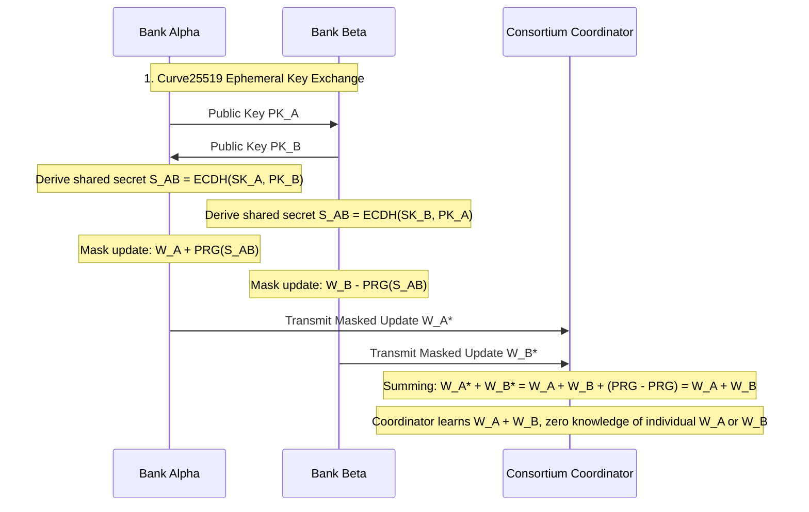

# Formal Privacy Model & Information Boundary Specification

> **CF-Intelligence Privacy Specification**  
> Formal definition of trust assumptions, data residency invariants, cryptographic privacy perimeters, and mathematical leakage bounds.

---

## 1. Core Architectural Privacy Invariant

A common misconception in distributed machine learning is the absolute claim that *"Federated Learning means no sensitive information ever leaves the institution"*. 

**This claim is mathematically and empirically false.**

Without rigorous cryptographic and perturbation layers, raw model updates (gradients or weights) can leak substantial information about individual training records through:
1. **Deep Leakage from Gradients (DLG)**: Exact reconstruction of training features by matching computed gradients.
2. **Membership Inference Attacks (MIA)**: Determining whether a specific high-net-worth individual or transaction was present in a client bank's training batch.
3. **Property Inference Attacks**: Inferring macro-demographic properties of a bank's customer base.

Therefore, **CF-Intelligence** does not treat Federated Learning as an all-encompassing privacy silver bullet. Privacy is maintained through a **defense-in-depth perimeter** decoupling four orthogonal primitives:

```
┌─────────────────────────────────────────────────────────────────────────────┐
│                       FOUR-PILLAR PRIVACY PERIMETER                         │
├──────────────────────┬──────────────────────────────────────────────────────┤
│ Mechanism            │ Cryptographic / Statistical Guarantee                │
├──────────────────────┼──────────────────────────────────────────────────────┤
│ Federated Learning   │ Prevents bulk raw data centralization (data stays    │
│                      │ on bank premises).                                   │
├──────────────────────┼──────────────────────────────────────────────────────┤
│ Differential Privacy │ Provably bounds the probability of extracting single │
│ (Opacus DP + RDP)    │ transaction attributes from model updates.           │
├──────────────────────┼──────────────────────────────────────────────────────┤
│ Secure Aggregation   │ Cryptographically blinds the central coordinator     │
│ (Curve25519 SecAgg)  │ from observing individual client weight vectors.     │
├──────────────────────┼──────────────────────────────────────────────────────┤
│ Byzantine Consensus  │ Quarantines malicious poisoning attempts without     │
│ (Krum, Bulyan)       │ compromising honest clients' masked updates.         │
└──────────────────────┴──────────────────────────────────────────────────────┘
```

---

## 2. Information Flow: What Stays Local vs What Leaves the Node

### 2.1 Strictly Local Data (Zero Cross-Bank Transmission)
The following assets are permanently bound to the local bank node's security domain and **NEVER** leave the bank perimeter under any condition:
- **Raw Transaction Records**: Transaction amounts, timestamps, ISO 20022 XML messages, internal account numbers, and routing codes.
- **Customer PII**: Legal names, tax identification numbers, physical addresses, phone numbers, email addresses, and IP logs.
- **Local Database Records & Balances**: Historical account balances, KYC onboarding documents, and credit bureau scores.
- **Unmasked Local Gradients**: Raw intermediate SGD gradients before clipping and DP noise injection.

### 2.2 Data Transmitted Outside the Bank
Only mathematically transformed and blinded representations are permitted to transit the consortium network:
- **Masked Perturbed Model Updates**:

  $$\widetilde{\Delta w}_k = \mathrm{Clip}_C(\Delta w_k) + \mathcal{N}\left(0, \sigma^2 C^2 \mathbf{I}\right) + \sum_{j > k} s_{k,j} - \sum_{j < k} s_{j,k}$$

  where $C$ is the L2 clipping norm, $\sigma$ is the DP noise multiplier, and $s_{k,j}$ are pairwise Diffie-Hellman zero-sum masks.
- **Homomorphic Hash Commitments**: SHA-256 / Poseidon hash digests of weight vectors for Byzantine consensus verification.
- **Consortium Metadata**: Bank node identifier, protocol version, active model epoch identifier, and sample count (if participating in weighted FedAvg, protected by differential privacy count perturbation).

---

## 3. Differential Privacy Guarantees & Budget Accounting

The local privacy boundary implements local Differential Privacy via **PyTorch Opacus** and tracks composition using **Rényi Differential Privacy (RDP)**:

### 3.1 Mathematical Formulation
A randomized mechanism $\mathcal{M}$ satisfies $(\epsilon, \delta)$-Differential Privacy if for any two neighboring datasets $D, D'$ differing by exactly one transaction:

$$P(\mathcal{M}(D) \in \mathcal{S}) \le e^{\epsilon} P(\mathcal{M}(D') \in \mathcal{S}) + \delta$$

### 3.2 RDP Accounting
For Gaussian perturbation mechanism with noise scale $\sigma$ and subsampling ratio $q = \frac{B}{N}$:

$$\mathcal{D}_{\alpha}(\mathcal{M}(D) \,\|\, \mathcal{M}(D')) \le \frac{q^2 \alpha}{2 \sigma^2} + O(q^3)$$

- **Clipping Norm ($C$)**: Fixed at $C = 1.0$ L2 norm, bounding maximum sensitivity $\Delta_2 = C$.
- **Target Budget**: Cumulative $(\epsilon = 1.0, \delta = 10^{-5})$ over 50 communication rounds.
- **Exhaustion Enforcement**: If a bank node exhausts its allocated privacy budget ($\epsilon_{\mathrm{spent}} > \epsilon_{\mathrm{budget}}$), the local daemon automatically transitions to inference-only mode, terminating gradient transmission.

---

## 4. Secure Aggregation (SecAgg) Protocol

Secure Aggregation ensures the central consortium aggregator observes **ONLY** the global aggregate $\sum \Delta w_k$, learning zero information about any individual bank's update:



---

## 5. What Federated Learning Does NOT Guarantee

To maintain engineering integrity, the following limitations are explicitly documented:

1. **No Defense Against Poisoning by Default**: Standard Federated Learning trusts all client updates. Without Byzantine defenses (Krum, Bulyan), a single compromised bank node can destroy model accuracy or install fraud evasion backdoors.
2. **Topology & Intersection Leakage in Graph Intelligence**: When banks perform Private Set Intersection (PSI) on hashed customer identifiers (e.g., shared card numbers or mule phone numbers), the **cardinality of the intersection** ($|A \cap B|$) is revealed to both parties.
3. **Membership Inference Residual Risk**: If the DP privacy budget $\epsilon > 5.0$, advanced shadow model attacks can theoretically infer with $> 60\%$ probability whether a unique corporate transaction participated in training.
4. **Metadata Leakage**: Packet timing, update payload sizes, and communication timestamps are visible to network observers unless routed over Tor/I2P or padded with dummy traffic.

---

## 6. Trust Assumptions

- **Bank Nodes**: Modeled under the **Byzantine Failure Model** (up to $f < \frac{n-2}{2}$ banks may be malicious or compromised).
- **Consortium Aggregator**: Modeled as **Honest-but-Curious** (faithfully executes the aggregation protocol, but attempts to extract intelligence from received payloads).
- **Cryptographic Primitives**: SHA-256, HMAC, Curve25519, and AES-256-GCM are assumed computationally secure against classical polynomial-time adversaries.
