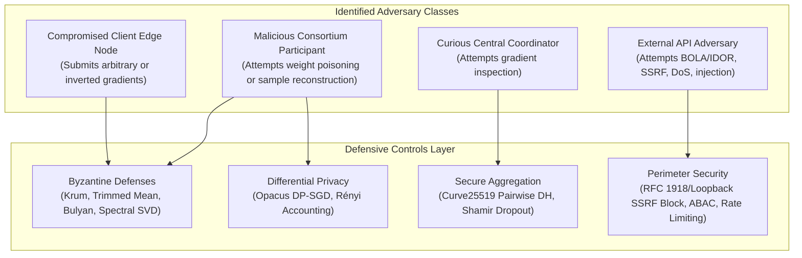

# Formal Threat Model & Adversarial Assessment
## Privacy-Preserving Collaborative Financial Crime Intelligence Platform (CF-Intelligence)

> **Canonical Specification**: The complete, 56KB multi-vector threat model and attack taxonomy is maintained at [`docs/threat_model.md`](file:///docs/threat_model.md).

---

### Executive Threat Model Summary

CF-Intelligence operates in an adversarial environment where participating banking institutions, network observers, and external API clients may attempt to undermine the system's privacy, integrity, or availability.

---

### Adversary Taxonomies & Capabilities

| Adversary Profile | Attacking Capabilities | Defense Mechanisms Applied | Guarantee / Bound |
|:---|:---|:---|:---|
| **Curious Coordinator** | Inspects aggregated and individual network payloads | Curve25519 Secure Aggregation (SecAgg) with zero-sum pairwise masking | Coordinator learns *only* $\sum \Delta w_k$; individual $\Delta w_k$ blinded |
| **Poisoned FL Client** | Injects label-flipping, sign-inversion, or backdoor triggers | Krum, Coordinate-wise Trimmed Mean, Bulyan, Spectral SVD | Tolerates up to $f < \frac{n-2}{2}$ Byzantine nodes |
| **Reconstruction Attacker** | Executes gradient inversion (DLG) to reconstruct transaction PII | PyTorch Opacus Differential Privacy (DP-SGD) | Bounded privacy loss $(\epsilon, \delta)$ with RDP accountant |
| **SSRF Webhook Exploiter** | Dispatches requests to internal microservices or cloud metadata | Perimeter WAF with DNS resolution pinning and RFC 1918 / 169.254 blocking | Hard network rejection with fail-closed architecture |
| **Cross-Tenant Intruder** | Requests transaction, case, or alert IDs belonging to rival banks | Repository-level tenant scoping and ABAC claim enforcement | Strict isolation (HTTP 403 / 404 Forbidden) |

For complete mathematical breakdown points, formal security proofs, and cryptographic assumptions, refer to the full document: [**Threat Model Specification (`docs/threat_model.md`)**](file:///docs/threat_model.md).
