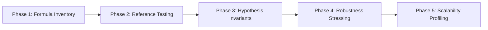

# Mathematical & Cryptographic Verification Roadmap

**Platform Target:** Collaborative Fraud Intelligence Platform  
**Subsystem:** Master Mathematical Protocol Verification  

---

## 1. Multi-Phase Verification Roadmap

### Phase 1: Formula Inventory & Mapping
- Catalog all 35 formulas across 16 subsystems.
- Map mathematical variables to codebase files, classes, and line numbers.

### Phase 2: Independent Reference Verification
- Implement pure-Python closed-form mathematical equations without production code reuse.
- Assert numerical precision within float64 machine epsilon ($\epsilon_{\text{mach}} \approx 2.22 \times 10^{-16}$).

### Phase 3: Hypothesis Property-Based Invariant Testing
- Evaluate 10 core mathematical invariants across randomized parameter spaces.
- Validate non-negativity, sum conservation, unit sphere norms, and monotonicity bounds.

### Phase 4: Robustness & Boundary Stress Testing
- Test zero-norm vectors, NaN/Inf handling, extreme float scale ($10^{-300}$ to $10^{300}$), and zero-bin smoothing.

### Phase 5: Scalability Benchmarking
- Profile execution throughput and latency scaling up to $d = 1{,}000{,}000$ vector parameters.
